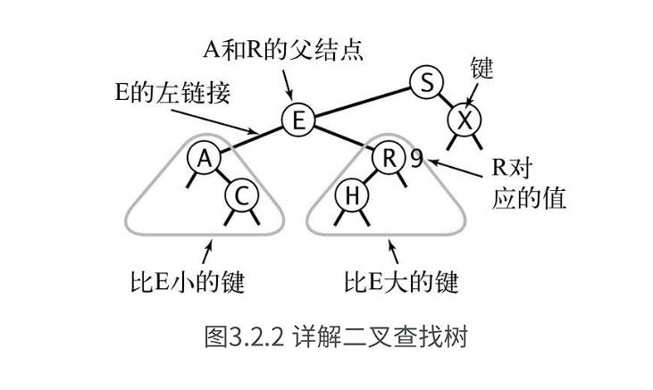

:::card
定义：一棵二叉查找树（BST）是一棵二叉树，其中每个结点都含有一个Comparable的键（以及相关联的值）且每个结点的键都大于其左子树中的任意结点的键而小于右子树的任意结点的键。
:::

# 二叉查找树

### 数据结构

对于一棵树的左右节点：size(x) = size(x.left) + size(x.right) + 1

一个Node需要的值：[ 键, 值, 左链接, 右链接, 结点计数器 ]

键的递归算法：如果树是空的，则查找未命中；如果被查找的键和根结点的键相等，查找命中，否则我们就（递归地）在适当的子树中继续查找。如果被查找的键较小就选择左子树，较大则选择右子树。当找到一个含糊被查找的键的节点（命中）或当前子树变为空才结束。

当BST为空树时，新元素会成为根节点，在非空树种，新元素一定是作为叶子节点插入。

# 二叉平衡树

为了保证查找树的平衡性，我们需要一些灵活性，因此在这里我们允许树中的一个结点保存多个键。

::: card
定义：一棵`2-3`查找树或为一棵空树，或由以下结点组成

- 2-结点，含有一个键（及其对应的值）和两条链接，左链接指向的2-3树中的键都小于该结点，右链接指向的2-3树中的键都大于该结点。

- 3-结点，含有两个键（及其对应的值）和三条链接，左链接指向的2-3树中的键都小于该结点，中链接指向的2-3树中的键都位于该结点的两个键之间，右链接指向的2-3树中的键都大于该结点

:::

一棵完美平衡的`2-3`查找树中的所有空链接到根结点的距离都应该是同样的。（根节点到黑节点相等）

### 向`2-`结点中插入新键

我们可以和二叉查找树一样先进行一次未命中的查找，然后把新结点挂在树的底部。但是这样树无法保持完美平衡性。
如果未命中的查找结束于一个`2-`结点，我们只要把这个`2-`结点替换为`3-`结点。

### 向一棵只含有一个`3-` 结点的树中插入新键
