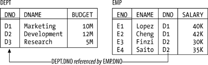
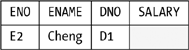
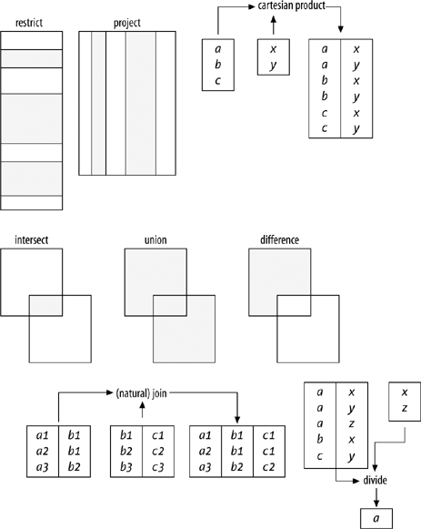
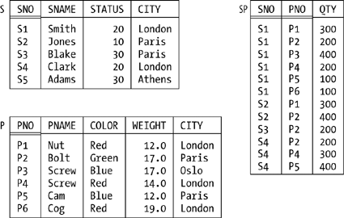
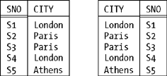
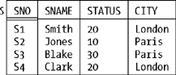

# 第一章 引言

**任何领域的专业人士都需要了解其领域的基础**。因此，如果您是一名 `数据库` 专业人士，您需要了解 `关系模型`，因为该模型是 `数据库` 领域的基础（或者至少是基础的很大一部分）。现在，每一门 `数据库` 管理课程，无论是学术性的还是商业性的，至少都会在口头上表示要教授 `关系模型`——但根据结果来看，大多数这样的教学似乎做得非常糟糕。`关系模型` 在整个 `数据库` 社区中确实没有得到很好或很广泛的理解。造成这种状况的可能原因如下：

- 该模型是在真空中教授的。也就是说，对于初学者来说，至少很难看到材料的相关性，或者很难理解它旨在解决的问题，或者两者兼而有之。
- 讲师本身并未完全理解或领会该材料的重要性。
- （实践中最可能的情况。）根本没有教授该模型本身——而是教授 `SQL` 语言或该语言的某种特定方言，例如 `Oracle` 方言。

因此，本书面向 `数据库` 专业人士，特别是商业 `数据库` 从业者，他们已经接触过 `关系模型`，但对其了解不如应有的那么多。本书绝对 _不_ 面向初学者；然而，它也不是复习课程。更具体地说：我确信您了解一些关于 `SQL` 的知识，但是——如果我的语气有些冒犯，我在此道歉——如果您关于 `关系模型` 的知识仅源于您对 `SQL` 的了解，那么恐怕您对 `关系模型` 的了解不如应有的那么好，而且您可能会知道"一些并非如此的事情"。

> **注意**
>
> `SQL` ≠ `关系模型`！

以下举例说明了一些 `SQL` 不太清楚（委婉地说）的 `关系` 问题：

- `数据库 `、` 关系` 和 `元组` 究竟是什么
- `关系` 与 `类型` 之间的区别
- `关系值` 与 `关系变量` 之间的区别
- `谓词` 和 `命题` 的相关性
- `关系值属性` 的合法性
- `完整性约束` 的关键作用

等等（这不是一个详尽的列表）。本书将讨论所有这些问题，当然还有许多其他问题。

我再说一遍：如果您关于 `关系模型` 的知识仅源于您对 `SQL` 的了解，那么您可能会知道"一些并非如此的事情"。这种状况的一个不幸后果是，您在阅读本书时可能会发现，有些事情您必须 _忘却_——而众所周知，忘却某事是很难做到的。还有一个相关点……我想礼貌地建议您不要因为认为自己已经完全熟悉某个主题的讨论就跳过它。例如，您 _确定_ 您确切知道 `关系` 术语中的 `键` 是什么吗？或者 `连接`？

## 关于术语的说明

在前一节的那个 `关系` 问题列表中，您可能立刻注意到我使用了正式术语 _`关系`_、_`元组`_,和 _`属性`_。`SQL` 当然不使用这些术语——它使用更"用户友好"的术语 _`表`_、_`行`_ 和 _`列`_ 来代替。一般来说，如果更用户友好的术语有助于使概念更容易接受，我对这种想法持同情态度。然而，在目前的情况下，在我看来，遗憾的是，它们并没有使概念更容易接受；相反，它们扭曲了它们，事实上对真正理解的事业造成了严重损害。事实是，`关系` _不是_ `表 `，` 元组` _不是_ `行 `，` 属性` _不是_ `列`。虽然在非正式语境中假装如此可能是可以接受的——事实上，我在我的许多书籍和其他著作中自己也这样做过——但我认为，只有当我们都明白更用户友好的术语只是对真理的近似，并且总体上未能捕捉到真正发生的事情的本质时，这才是可以接受的。换句话说：如果您确实了解真实情况，那么审慎地使用用户友好的术语可能是个好主意；但为了首先学习和领会那种真实情况，您确实需要掌握更正式的术语。因此，在本书中，我将大部分时间使用那些更正式的术语——当然，当我们需要它们时，我会给出精确的定义（尽管大部分不在本章，在本章我只是试图奠定一定数量的基础工作）。

关于术语的另一点：在说过 `SQL` 试图简化一组术语之后，我现在必须补充说，它尽最大努力使另一组术语复杂化。我指的是它使用术语 _`运算符`_、_`函数`_、_`过程`_、_`例程`_ 和 _`方法`_，所有这些都指本质上相同的东西（也许只有非常细微的差别）。在本书中，我将始终使用术语 _`运算符`_。

顺便谈谈 `SQL`，_`请注意，我使用术语 SQL 专指该语言的标准版本`_，而不是某种产品特定的方言——当然，除非有明确的相反声明。（我确实在前言中提到了这一点，但我知道很少有人真正阅读前言。）特别是，我对 `SQL` 的批评专门适用于标准版本。因此，如果某种特定的批评碰巧不适用于您自己最喜欢的产品，嗯，很好，我很高兴听到这个消息（为您加油）。

## 原则，而非产品

值得花一点时间来审视一下为什么正如我前面所声称的那样，您作为一名 `数据库` 专业人士需要了解 `关系模型`。原因是 `关系模型` 不是特定于产品的；相反，它关注的是 _`原则`_。我用 _`原则`_ 是什么意思？嗯，这里有一个定义（来自 _《钱伯斯二十世纪词典》_）：

> **原则：** 来源、根源、起源：基础性的东西：本质性质：理论基础：其他事物赖以建立或从中产生的基本真理

关于 `原则` 的要点是：它们 _`持久`_。相比之下，产品和技术（以及 `SQL` 语言，就此而言）一直在变化——但 `原则` 不会。例如，假设您了解 `Oracle`；事实上，假设您是 `Oracle` 的专家。但如果 `Oracle` 是您 _全部_ 的了解，那么您的知识不一定能转移到，比如说，`DB2` 或 `SQL Server` 环境（它甚至可能妨碍您在那个新环境中取得进展）。但如果您了解底层 `原则`——换句话说，如果您了解 `关系模型`——那么您拥有的知识和技能 _将_ 是可转移的：您能够在 _每个_ 环境中应用的知识和技能，而且永远不会过时。

因此，在本书中，我们将关注 `原则`，而非产品，关注基础，而非时尚。当然，我意识到有时您在现实世界中确实必须做出妥协和权衡。举一个例子，有时您可能有很好的实用主义理由不按照理论最优的方式设计 `数据库`（我在第 7 章讨论的一个问题）。再举一个例子，再次考虑 `SQL`。虽然肯定可以 _`关系地`_ 使用 `SQL`（至少在大多数情况下），但有时您会发现——因为现有的实现远非完美——这样做会有严重的性能惩罚……在这种情况下，您可能或多或少被迫做一些不"真正 `关系`"的事情（比如以某种奇怪且不自然的方式编写查询，以便让实现使用索引）。然而，我非常坚定地认为，您应该始终从 _`概念上的强势地位`_ 做出这样的妥协和权衡。也就是说：

- 当您确实必须做出这样的妥协时，您应该了解自己在做什么。
- 您应该知道理论上正确的情况是什么，并且您应该有非常好的理由偏离它。
- 您也应该记录这些理由，以便如果它们在未来某个时候消失（例如，因为您正在使用的产品的新版本在某些方面做得更好），那么可能可以撤销最初的妥协。

以下引文——归因于列奥纳多·达·芬奇（1452-1519），因此已有大约 500 年的历史！——极好地总结了这种情况：

> 那些迷恋实践而不顾理论的人，就像一个没有舵或罗盘就上船的飞行员，永远不确定自己要去哪里。_实践应该始终建立在扎实的理论知识基础上_。

（好的，我加了斜体。）

## 原始模型的回顾

您是一名 `数据库` 专业人士，所以您已经对 `关系模型` 有了一些熟悉。本节的目的是作为我们后续讨论的起点；它回顾了该模型最初定义时的一些最基本方面。请注意限定词"最初定义"！关于 `关系模型` 的一个普遍误解是，它是一个完全静态的东西。它不是。在这方面它类似于数学：数学也不是一个静态的东西，而是随着时间变化的。事实上，`关系模型` 本身可以被视为数学的一个小分支；因此，随着新定理被证明和新结果被发现，它随着时间而演变。而且，这些新贡献可以由任何有能力的人做出。再次类似于数学，`关系模型`，虽然最初由一个人发明，但已成为社区的努力，现在属于全世界。

顺便说一下，以防您不知道，那个人是 E. F. Codd，[\*](#fn2) 当时是 `IBM` 的研究员。那是在 1968 年末，受过数学训练的 Codd 首次意识到，数学学科可以用来为 `数据库` 管理领域注入一些坚实的 `原则` 和严谨性，而该领域在此之前太缺乏这些品质。他对 `关系模型` 的原始定义出现在 1969 年的一份 `IBM` 研究报告中，我将在附录 B 中对该论文多说一点。

### 结构特征

原始模型有三个主要组成部分——结构、完整性和操作——我将依次简要描述每一个。然而，请立即注意，我将给出的所有"定义"都非常宽松；我将在后续章节中在适当的时候使它们更加精确。

首先，结构。主要的结构特征当然是 `关系`[\*](#fn3) 本身，而且众所周知，通常将 `关系` 描绘成纸上的 `表`（参见图 1-1 的一个自解释示例）。`关系` 是在 _`类型`_（也称为 _`域`_）上定义的；`类型`[\*](#fn3) 基本上是一个概念上的值池，实际 `关系` 中的实际 `属性` 从中获取它们的实际值。参考图 1-1 中说明的简单的部门 - 员工数据库，例如，可能有一个名为 `DNO`（"部门编号"）的 `类型`，它是所有有效部门编号的集合。`DEPT` `关系` 中名为 `DNO` 的 `属性` 和 `EMP` `关系` 中名为 `DNO` 的 `属性` 将各自包含取自该概念池的值。（顺便说一下，`属性` 不必具有与相应 `类型` 相同的名称，而且通常它们不会。我们稍后将看到很多反例。）

==属性是定义在Types和Domain上面的。==

**图 1-1. 部门 - 员工数据库——示例值**



正如我所说，像图 1-1 中的 `表` 描绘了 _`关系`_：确切地说是 _`n 元关系`_。一个 _`n 元关系`_[\*](#fn3) 可以描绘成一个有 _`n`_ 列的 `表`；图中的列对应于 `关系` 的 _`属性`_，行对应于 _`元组`_。而且，值 _`n`_ 可以是任何非负整数。1 元 `关系` 被称为 _`一元；`_ 2 元 `关系`，_`二元；`_ 3 元 `关系`，_`三元；`_ 依此类推。

`关系模型` 还支持各种类型的 _`键`_。首先，每个 `关系` 至少有一个 _`候选键`_。[\*](#fn3) `候选键` 只是一个唯一标识符；换句话说，它是 `属性` 的组合——通常（但不总是）是只涉及一个 `属性` 的"组合"——使得 `关系` 中的每个 `元组` 对于所讨论的组合具有唯一的值。例如，在图 1-1 中，每个部门有一个唯一的部门编号，每个员工有一个唯一的员工编号，所以我们可以说 {`DNO`} 是 `DEPT` 的 `候选键`，{`ENO`} 是 `EMP` 的 `候选键`。顺便注意一下大括号：`候选键` 总是 `属性` 的 _`组合`_ 或 _`集合`_——即使该集合只包含一个 `属性`——并且通常使用大括号来括起事物的集合。

接下来，_`主键`_[\*](#fn3) 是以某种方式被 singled out 进行特殊处理的 `候选键`。如果给定的 `关系` 只有一个 `候选键`，那么说它是 `主键` 显然没有真正的区别。但如果 `关系` 有两个或更多 `候选键`，那么我们应该选择其中一个作为 `主` 键，意味着它在某种程度上"比其他键更平等"。例如，假设每个员工有一个唯一的员工编号 _和_ 一个唯一的员工姓名，因此 {`ENO`} 和 {`ENAME`} 都是 `EMP` 的 `候选键`。那么我们可能会选择 {`ENO`}，比如说，作为 `主键`。

注意我说我们 _应该_ 选择一个 `主键`。如果只有一个 `候选键`，那么没有选择也没有问题。但如果有两个或更多，那么选择一个并使其成为 `主` 键有点武断的味道（至少对我来说）；当然，有些情况下似乎没有任何好的理由做出这样的选择。在本书中，我通常 _会_ 遵循 `主键` 规范——并且在像图 1-1 这样的图中，我将通过双下划线 [\*](#fn3) 标记 `主键` `属性`——但我强调这一点，从 `关系` 的角度来看，真正重要的是 `候选键`，而不是 `主键`。部分出于这个原因，从现在开始，我将使用术语 _`键`_，无限定词，专门指 `候选键`。（如果您想知道，`主键` 相对于其他 `候选键` 享有的"特殊待遇"主要是语法性质的；它不是根本性的，也不是很重要。）

最后，_`外键`_[\*](#fn3) 是一个 `关系` 中的一组 `属性`，其值被要求匹配某个其他 `关系`（或可能在同一个 `关系` 中）中的某个 `候选键` 的值。例如，参考图 1-1，{`DNO`} 是 `EMP` 中的 `外键`，其值被要求匹配 `DEPT` 中 `候选键` {`DNO`} 的值（正如我试图通过图中适当标记的箭头所暗示的那样）。通过 _`要求匹配`_，我的意思是，如果，例如，`EMP` 包含一个 `元组`，其中 `DNO` 的值为 `D2`，那么 `DEPT` 最好也包含一个 `元组`，其中 `DNO` 的值为 `D2`；否则，`EMP` 将显示某个员工在一个不存在的部门中，并且 `数据库` 将不是"现实的忠实模型"。

### 完整性特征

_`完整性约束`_[\*](#fn3)（简称 _`约束`_）基本上只是一个必须求值为 `TRUE` 的 `布尔` 表达式。例如，在部门和员工的情况下，我们可能有一个 `约束`，大意是 `SALARY` 值必须大于零。现在，任何给定的 `数据库` 将受到许多 `约束` 的约束，但这些 `约束` 必然将用该特定 `数据库` 中的 `关系` 来表达，并且将是该 `数据库` 特有的。相比之下，`关系模型`（至少最初制定时）包括两个 _`通用`_ `完整性规则`——`通用` 的意义在于，笼统地说，它们适用于每个 `数据库`。一个与 `主键` 有关，另一个与 `外键` 有关：

**`实体完整性`**
: `主键属性` 不允许 `空值`。

**`参照完整性`**
: 不得有任何未匹配的 `外键` 值。

让我先解释第二个。通过术语 _`未匹配的外键值`_，我的意思是一个 `外键` 值，对于该值不存在相应的 `候选键` 的相等值。因此，例如，如果部门 - 员工 `数据库` 包含一个 `EMP` `元组`，其中，比如说，`DNO` 值为 `D2`，但没有相应的 `DEPT` `元组`，那么它将违反 `参照完整性`[\*](#fn3) 规则。因此，`参照完整性` 规则只是阐明了 `外键` 的语义；名称 _`参照完整性`_ 源于这样一个事实，即任何给定的 `外键` 值可以被视为对具有相应 `候选键` 相同值的那个 `元组` 的 _`引用`_。实际上，因此，该规则只是说："如果 _`B`_ 引用 _`A`_，那么 _`A`_ 必须存在。"

至于 `实体完整性`[\*](#fn3) 规则，嗯，这里我有一个问题。事实是，我完全拒绝"`空值`"的概念；也就是说，我非常强烈的意见是 _`空值在关系模型中没有位置`_。（Codd 显然不这么认为，但我有充分的理由采取我所持的立场。）因此，为了解释 `实体完整性` 规则，我需要暂时搁置怀疑，可以说（至少暂时如此），但请理解我将在第 3 章重新审视整个 `空值` 问题。

从本质上讲，`空值`[\*](#fn3) 是一个"标记"，意思是 _`值未知`_（至关重要的是，它本身不是一个值；它是一个 _`标记`_ 或 _`标志`_，重复一遍）。例如，假设我们不知道员工 `E2` 的薪水。那么，不是在 `关系` `EMP` 中该员工的 `元组` 中输入一些真实的 `SALARY` 值——我们 _不能_ 输入一个真实的值，根据定义，正是因为我们不知道该值应该是什么——我们 _`标记`_ 该 `元组` 内的 `SALARY` 位置为 `空值`：

**图 1-2.**



正如您所看到的，这个 `元组` 在 `SALARY` 位置包含 _`什么都没有`_。在本书中，我将使用如刚才所示的阴影来突出显示这样的空位置；您可以认为该阴影构成了 `空值` "标记"或标志。

因此，就 `关系` `EMP` 而言，`实体完整性` 规则笼统地说，员工可能有一个未知的姓名、部门或薪水，但 _`不`_ 能有一个未知的员工编号——因为如果员工编号未知，我们甚至不知道我们在谈论哪个员工（即哪个"实体"）。

关于 `空值`，我现在就说到这里。忘记它们，直到第 3 章。

### 操作特征

模型的操作部分包括：

- 一组 `关系运算符`，例如 `差`（或 `MINUS`），统称为 _`关系代数`_[\*](#fn3)，以及
- 一个 _`关系赋值`_[\*](#fn3) `运算符`，它允许将某个 `关系表达式` 的值，例如 _`r`_ `MINUS` _`s`_（其中 _`r`_ 和 _`s`_ 是 `关系`），赋值给某个 `关系`。

`关系赋值运算符` 从根本上说是 `关系模型` 中完成 `更新` 的方式，[\*](#fn4) 我将在后面"关系与关系变量"一节中对此多说一些。至于 `关系代数`，它由一组 `运算符` 组成，这些 `运算符` 允许从"旧" `关系` 派生"新" `关系`（说得很笼统）。更准确地说，每个 `运算符` 至少接受一个 `关系` 作为输入，并产生另一个 `关系` 作为输出；例如，`差`（或 `MINUS`）接受两个 `关系` 作为输入，并从一个中"减去"另一个，以派生另一个 `关系` 作为输出。而且输出是另一个 `关系` 这一点非常重要：这就是著名的 `关系代数` 的 _`封闭`_[\*](#fn3) 属性。`封闭` 属性使我们能够编写 _`嵌套关系表达式`_；由于每个操作的输出与输入是同类事物，一个操作的输出可以成为另一个操作的输入——这意味着，例如，我们可以取 _`r`_ 和 _`s`_ 的 `差`，将结果作为输入馈送给与某个 `关系` _`u`_ 的 `并`，将该结果作为输入馈送给与某个 `关系` _`v`_ 的 `交`，依此类推。

现在，可以定义任意数量的 `运算符`，它们符合"至少一个 `关系` 进，恰好一个 `关系` 出"的简单定义。在下面的列表中，我将简要描述通常被认为是原始八个 `运算符` 的那些（基本上是 Codd 在他最早的论文中定义的那些）；在第 5 章中，我将介绍一些额外的 `运算符` 并更详细地描述它们。图 1-2 是原始八个 `运算符` 的图形表示。_注意：_ 如果您不熟悉其中任何 `运算符`——特别是 `除`！——并且发现下面的简要描述难以理解，不要担心；我将在后面（主要在第 5 章）用大量示例进行更详细的讲解。

**`限制`**
: 返回一个 `关系`，包含指定 `关系` 中满足指定条件的所有 `元组`。例如，我们可能 `限制`[\*](#fn3) `关系` `EMP`，只保留 `DNO` 值为 `D2` 的 `元组`。

**`投影`**
: 返回一个 `关系`，包含在移除指定 `属性` 后保留在指定 `关系` 中的所有（子）`元组`。例如，我们可能 `投影`[\*](#fn3) `关系` `EMP`，只保留 `ENO` 和 `SALARY` `属性`。

**`积`**
: 返回一个 `关系`，包含所有可能的 `元组`，这些 `元组` 是两个 `元组` 的组合，每个 `元组` 来自两个指定 `关系` 中的每一个。`积` 也被称为 _`笛卡尔积`_、_`叉积`_、_`叉连接`_ 和 _`笛卡尔连接`_（事实上，它只是 `连接` 的一个特例，正如我们将在第 5 章看到的那样）。

**图 1-2. 原始关系代数（结果加阴影）**



**`交`**
: 返回一个 `关系`，包含出现在两个指定 `关系` 中的所有 `元组`。（实际上，`交`[\*](#fn3) 也是 `连接`[\*](#fn3) 的一个特例。）

**`并`**
: 返回一个 `关系`，包含出现在两个指定 `关系` 中任意一个或两个中的所有 `元组`。

**`差`**
: 返回一个 `关系`，包含出现在两个指定 `关系` 中第一个而不出现在第二个中的所有 `元组`。

**`连接`**
: 返回一个 `关系`，包含所有可能的 `元组`，这些 `元组` 是两个 `元组` 的组合，每个 `元组` 来自两个指定 `关系` 中的每一个，使得对任何给定结果 `元组` 有贡献的两个 `元组` 在两个 `关系` 的公共 `属性` 上具有公共值（并且该公共值在该结果 `元组` 中只出现一次，而不是两次）。

> **注意**
>
> 这种 `连接` 最初被称为 _`自然连接`_。然而，由于 `自然连接`[\*](#fn3) 迄今为止是最重要的 `连接` 类型，因此将无限定词的术语 _`连接`_ 专门指 `自然连接` 已成为标准做法，我将在本书中遵循这种做法。

**`除`**
: 接受两个 `关系`，一个二元 `关系` 和一个一元 `关系`，并返回一个 `关系`，该 `关系` 由二元 `关系` 的一个 `属性` 的所有值组成，这些值在另一个 `属性` 中匹配一元 `关系` 中的所有值。

最后一点来结束这个小节：正如您可能知道的，还有某种称为 _`关系演算`_[\*](#fn3) 的东西。`关系演算` 可以被视为 `关系代数` 的替代品；也就是说，我们可以同样好地说 `关系模型` 的操作部分由 `关系演算`（加上 `关系赋值`）组成，而不是说它由 `关系代数`（加上 `关系赋值`）组成。两者是等价且可互换的，在这个意义上，对于每个代数表达式，都有一个逻辑上等价的演算表达式，反之亦然。我将在附录 A 中关于演算多说一点。

### 运行示例

我将通过介绍我将用作本书其余部分大多数（如果不是全部）讨论基础的示例来结束这个简要回顾：著名的 `供应商 - 零件数据库`（参见图 1-3）。详细说明如下：

**供应商**
: `关系` `S` 表示供应商（更准确地说，是签约供应商）。每个供应商有一个供应商编号（`SNO`），这对该供应商是唯一的（因此 {`SNO`} 是 `主键`）；一个名称（`SNAME`），不一定唯一（尽管图 1-3 中的 `SNAME` 值碰巧是唯一的）；一个评级或状态值（`STATUS`）；以及一个位置（`CITY`）。

**零件**
: `关系` `P` 表示零件（更准确地说，是零件种类）。每种零件有一个零件编号（`PNO`），这是唯一的（因此 {`PNO`} 是 `主键`）；一个名称（`PNAME`）；一种颜色（`COLOR`）；一个重量（`WEIGHT`）；以及存储该类零件的位置（`CITY`）。

**供应**
: `关系` `SP` 表示供应（它显示哪些零件由哪些供应商供应）。每次供应有一个供应商编号（`SNO`），一个零件编号（`PNO`），以及一个数量（`QTY`）。为了示例起见，我假设在任何给定时间，对于给定的供应商和给定的零件，最多只有一次供应（因此 {`SNO`,`PNO`} 是 `主键`；此外，{`SNO`} 和 {`PNO`} 都是 `外键`，分别匹配 `S` 和 `P` 的 `主键`）。注意，图 1-3 中显示的 `数据库` 包括一个供应商，供应商 `S5`，没有任何供应。

**图 1-3. 供应商 - 零件数据库——示例值**



## 模型与实现

在继续之前，有一个非常重要的点我需要解释，因为它支撑着本书中的其他一切。`关系模型` 当然是一个 _`数据模型`_。然而，不幸的是，后一个术语在 `数据库` 世界中有两个截然不同的含义。第一个也是更基本的含义是这样的：

> _`定义：`_ _`数据模型`_（第一义）是对构成用户与之交互的 _`抽象机`_ 的 `数据结构 `、` 数据运算符` 等的抽象、自包含、逻辑定义。

这是我们谈论 `关系模型` 时所指的含义。而且，有了这个定义，我们可以有用（且重要）地将第一义中的 `数据模型`[\*](#fn3)[\*](#fn3) 与其 _`实现`_[\*](#fn3) 区分开来，后者可以定义如下：

> _`定义：`_ 给定 `数据模型` 的 _`实现`_ 是在真实机器上对该模型构成的 `抽象机` 组件的物理实现。

我将专门用 `关系模型` 来说明这些定义。首先，显然 enough，_`关系`_ 的概念本身是模型的一部分：用户必须知道 `关系` 是什么，他们必须知道它们由 `元组` 和 `属性` 组成，他们必须知道如何解释它们，等等。所有这些都是模型的一部分。但他们不必知道 `关系` 如何在磁盘上物理存储，或者单个数据值如何物理编码，或者存在什么索引或其他访问路径；所有这些都是实现的一部分，而不是模型的一部分。

或者考虑概念 _`连接：`_ 用户必须知道 `连接` 是什么，他们必须知道如何调用 `连接`，他们必须知道 `连接` 的结果看起来像什么，等等。同样，所有这些都是模型的一部分。但他们不必知道 `连接` 如何物理实现，或者在底层发生什么表达式转换，或者使用什么索引或其他访问路径，或者发生什么物理 I/O；[\*](#fn5) 所有这些都是实现的一部分，而不是模型。

简而言之，因此：

- 模型（第一义）是 _`用户必须知道的`_。
- 实现是用户 _`不必`_ 知道的。

（当然，我不是说用户不 _`允许`_ 了解实现；我只是说他们不必。换句话说，与实现有关的一切应该，至少潜在地，对用户隐藏。）

以下是上述定义的一些重要后果。首先，注意性能从根本上说是一个实现问题，而不是模型问题 [\*](#fn3)——尽管有极其普遍的相反误解。例如，我们经常被告知"`连接` 很慢"。但这样的评论没有意义！`连接` 是模型的一部分，模型本身不能说快或慢；只有实现才能说具有任何这样的性质。因此，我们可以合理地说，某个特定产品 _`X`_ 对某个特定 `连接` 的实现比某个其他特定产品 _`Y`_ 更快或更慢——但也仅此而已。

> **注意**
>
> 我不想在这里给人错误的印象。性能基本上是一个实现问题，这是真的；但这并不意味着如果您糟糕地使用模型，一个好的实现就会表现良好！事实上，这正是您需要了解模型的原因之一（我的意思是，以便您 _`不`_ 糟糕地使用它）。如果您编写一个像 `S JOIN SP` 这样的表达式，您有权期望实现在这方面做得很好；但如果您坚持（实际上）自己手工编码 `连接`，也许像这样：
>
> ```
> do for all tuples in S ;
>    fetch S tuple into TNO, TN, TS, TC ;
>    do for all tuples in SP with SNO = TNO ;
>       fetch SP tuple into TNO, TP, TQ ;
>       emit tuple TNO, TN, TS, TC, TP, TQ ;
>    end ;
> end ;
> ```
>
> 那么您不可能获得良好的性能。`关系系统` 不应像简单的访问方法那样使用。

其次，正如您可能意识到的，正是模型和实现在逻辑上 distinct 这一事实使我们能够实现 _`数据独立性`_[\*](#fn3)。`数据独立性`（顺便说一下，这不是一个很好的术语，但我们可能不得不接受它）意味着我们有自由改变数据物理存储和访问的方式，而不必对数据被用户感知的方式进行相应的改变。我们可能想要改变那些存储和访问细节的原因，当然是性能；而且我们可以在不必改变数据对用户看起来的方式的情况下进行这样的改变，这意味着现有的应用程序、查询等仍然可以工作。因此，非常重要的一点是，`数据独立性` 意味着 _`保护您在用户培训和应用程序上的投资`_。

正如您从上述定义中可以看到的，模型与实现之间的区别实际上只是 _`逻辑`_ 和 _`物理`_ 之间熟悉的区别的一个特例（一个非常重要的特例）。然而，遗憾的是，今天的大多数 `数据库系统`，即使是那些声称是 `关系` 的，也没有像它们应该的那样清楚地做出这些区分。作为直接后果，它们提供的 `数据独立性` 远少于它们应该提供的，也远少于 `关系系统` 理论上能够提供的。我将在下一节以及第 7 章中回到这个问题。

现在我想谈谈术语 _`数据模型`_ 的第二种含义，我敢说您非常熟悉。它可以这样定义：

> _`定义：`_ _`数据模型`_（第二义）是某个特定企业的持久数据的模型。

换句话说，第二义中的 `数据模型` 只是一个（可能有点抽象的）_`数据库设计`_。例如，我们可能会谈到某个银行、某个医院或某个政府部门的数据模型。

在解释了这两种不同的含义之后，我想提请您注意一个类比，我认为它能很好地阐明它们之间的关系：

- 第一义中的 `数据模型` 就像一种编程语言，其构造可以用来解决许多具体问题，但其本身与任何这样的具体问题没有直接联系。
- 第二义中的 `数据模型` 就像用该语言编写的一个特定程序——它使用该模型（在该术语的第一义中）提供的设施来解决某个具体问题。

顺便说一下，从上述所有内容可以得出，如果我们谈论的是第二义中的 `数据模型`，我们可以合理地用复数形式谈论"`关系模型`"或"a" `关系模型`（带不定冠词）。但如果我们谈论的是第一义中的 `数据模型`，那么 _`只有一个关系模型`_，并且它是 _`那个`_ 模型（带定冠词）。我将在第 8 章中关于这个问题多说一些。

在本书的其余部分，我将 exclusively 使用术语 _`数据模型`_——或者通常简称为 _`模型`_——在其第一义中。

## 关系的性质

现在让我们回到对基本 `关系` 概念的考察。在本节中，我想关注 `关系` 本身的一些特定性质。首先，==每个 `关系`[\*](#fn3)[\*](#fn3)[\*](#fn3)[\*](#fn3) 有一个 _`表头`_ 和一个 _`表体：`_ `表头` 是一组 `属性`（其中 _`属性`_ 是一个 `属性名：类型名` 对 [\*](#fn3)），而 `表体` 是一组符合该 `表头` 的 `元组`。==例如，在图 1-3 的供应商 `关系` 的情况下，`表头` 中有四个 `属性`，`表体` 中有五个 `元组`。因此，注意，`关系` 并不真正包含 `元组`——它包含一个 `表体`，而该 `表体` 又包含 `元组`——但为了简单起见，我们通常确实谈论得好像 `关系` 直接包含 `元组` 一样。

==表头【属性名：类型名】和表体。关系包含表体，表体包含元组==

顺便说一下，虽然严格正确地说 `表头` 由 `属性名：类型名` 对组成，但在像图 1-3 这样的图中通常省略 `类型` 名，从而假装 `表头` 只是一组 `属性` 名。例如，`STATUS` `属性` 确实有一个 `类型`（比如说 `INTEGER`），但我没有在图 1-3 中显示它。但您永远不应该忘记它在那里！

接下来，==`表头` 中的 `属性` 数量是 _`度`_（有时是 _`元数`_[\*](#fn3)），而 `表体` 中的 `元组` 数量是 _`基数`_。==例如，图 1-3 中的 `关系` `S`、`P` 和 `SP` 的度分别为 4、5 和 3，基数分别为 5、6 和 12。

接下来，==`关系` _`永不`_ 包含重复的 `元组`。==这个性质是因为 `表体` 是 `元组` 的 _`集合`_，而数学中的集合不包含重复元素。顺便说一下，`SQL` 在这里失败了：`SQL 表` 被允许包含重复的行，正如您所知，因此 `SQL 表` 通常不是 `关系`。因此，请理解，在本书中，我 _`总是`_ 使用术语"`关系`"来指 `关系`——根据定义，没有重复的 `元组`——而不是 `SQL 表`。也请理解，`关系操作` _`总是`_ 产生一个没有重复 `元组` 的结果，同样根据定义。例如，将图 1-3 的供应商 `关系` 在 `CITY` 上 `投影` 产生左边显示的结果，而 _`不是`_ 右边的结果：

**图 1-5.**


（左边的结果可以通过 `SQL` 查询 `SELECT DISTINCT S.CITY FROM S` 获得。省略 `DISTINCT` 会导致右边的非关系结果。特别注意，右边的 `表` 没有双下划线；那是因为它没有 `键`，因此 _`a fortiori`_ 没有 `主键`。）

接下来，`关系` 的 `元组` 是 _`无序`_ 的，从上到下。这个性质是因为，同样，`表体` 是一个集合，而数学中的集合对其元素没有排序。（因此，例如，{_`a,b,c`_} 和 {_`c,a,b`_} 在数学中是同一个集合，在 `关系模型` 中自然也是同样的事情。）当然，当我们在纸上将 `关系` 画成 `表` 时，我们确实必须以某种从上到下的顺序显示行，但该顺序不对应任何 `关系` 的东西。例如，在图 1-3 的供应商 `关系` 的情况下，我可以以任何顺序显示行——比如说，供应商 `S3`，然后 `S1`，然后 `S5`，然后 `S4`，然后 `S2`——并且该图仍然表示同一个 `关系`。


> **注意**
>
> `关系` 的 `元组` 无序这一事实并不意味着查询不能包括 `ORDER BY`[\*](#fn3) 规范，但它确实意味着这样的查询产生一个不是 `关系` 的结果。`ORDER BY` 对于显示结果很有用，但它本身不是一个 `关系运算符`。

以类似的方式，==`关系` 的 `属性` 也是 _`无序`_ 的，从左到右，因为 `表头` 也是一个数学集合==。同样，当我们在纸上将 `关系` 画成 `表` 时，我们必须以某种从左到右的顺序显示列，但该顺序不对应任何 `关系` 的东西。例如，在图 1-3 的供应商 `关系` 的情况下，我可以以任何从左到右的顺序显示列——比如说 `STATUS`、`SNAME`、`CITY`、`SNO`——并且该图在 `关系模型` 中仍然表示同一个 `关系`。顺便说一下，`SQL` 在这里也失败了：`SQL 表` 确实对其列有从左到右的排序（这是 `SQL 表` 通常不是 `关系` 的另一个原因）。例如，下面的图表示同一个 `关系`，但两个不同的 `SQL 表`：

**图 1-6.**



（相应的 `SQL` 查询分别是 `SELECT S.SNO, S.CITY FROM S` 和 `SELECT S.CITY, S.SNO FROM S`。顺便说一下，您可能会认为这两个 `表` 之间的区别 hardly very significant；然而，事实上，它有一些严重的后果，其中一些我将在后面的章节中触及。）

接下来，==`关系` 总是 _`规范化`_ 的（等价地，它们在 _`第一范式`_[\*](#fn3)，`1NF`）。==非正式地说，这意味着，就 `关系` 的表格图而言，在每个行和列的交叉点，我们总是只看到一个单一的值。更正式地说，这意味着每个 `关系` 中的每个 `元组` 在每个 `属性` 位置只包含一个单一的值，该值具有适当的 `类型`。我将在下一章中关于这个特定问题多说很多。

接下来，我们区分 _`基`_ 和 _`派生`_ `关系`。正如我前面解释的那样，`关系代数` 的 `运算符` 允许我们从一些给定的 `关系` 开始——也许是图 1-3 中的那些——并从那些给定的 `关系` 中获得进一步的 `关系`。==给定的 `关系` 是 `基` 关系；其他的是 `派生` 的。现在，`关系系统` 显然必须首先提供一种定义 `基关系` 的手段。==在 `SQL` 中，这个任务由 `CREATE TABLE` 语句执行（`基关系`[\*](#fn3) 的 `SQL` 对应物，当然是 `基表`）。而且 `基关系` 显然必须被命名——例如：

```
CREATE TABLE SP ... ;
```

但某些 `派生关系`——包括特别是所谓的 _`视图`_——也被命名。`视图`[\*](#fn3)（也称为 _`虚拟关系`_）是一个命名的 `关系`，其值在任何时候都是在相关时间评估某个 `关系表达式` 的结果。这里有一个 `SQL` 示例：

```
CREATE VIEW SST_PARIS AS
   SELECT S.SNO, S.STATUS
   FROM   S
   WHERE  S.CITY = 'Paris' ;
```

您可以像操作 `基关系` 一样操作 `视图`，但它们 _`不是`_ `基关系`；相反，您可以认为 `视图` 是被物化的——实际上，您可以认为 `基关系` 是在它们被引用时动态构建的——。（尽管我应该强调，认为 `视图` 在它们被引用时被物化 _`只是`_ 一种思维方式；它不是真正应该发生的事情。`视图` 真正如何工作在第 4 章中解释。）

这里有一个重要的点我需要提出。您经常会看到人们这样描述 `基关系` 和 `视图` 之间的区别：

- ==`基关系` 真正存在——也就是说，它们在 `数据库` 中物理存储。==
- `视图`，相比之下，不"真正存在"——它们只是提供了看待 `基关系` 的不同方式。

**_但关系模型对物理存储什么只字未提！_** 特别是，它 _`不`_ 说 `基关系` 被物理存储。唯一的要求是，无论 _`是`_ 物理存储什么，与那些 `基关系` 之间必须存在某种映射，以便那些 `基关系` 可以在需要时以某种方式构建（至少在概念上）。如果 `基关系` 可以以这种方式构建，那么其他一切也可以。例如，我们可能会物理存储供应商和供应的 `连接`，而不是分别存储它们；`基关系` `S` 和 `SP` 然后可以在概念上通过取该 `连接` 的适当 `投影` 来构建。换句话说，就 `关系模型` 而言，`基关系` 并不比 `视图` 更（也不更少！）"物理"。

`关系模型` 对物理存储什么只字未提这一事实当然是故意的。这个想法是给实现者自由，以他们选择的任何方式实现模型——特别是，以似乎可能产生良好性能的任何方式——而不损害 `数据独立性`[\*](#fn3)。然而，可悲的事实是，`SQL` 供应商似乎大多没有理解这一点；相反，他们将 `基表` 相当直接地映射到物理存储，[\*](#fn6) 并且（如前一节所述）因此他们的产品提供的 `数据独立性` 远少于 `关系系统` 理论上能够提供的。事实上，这种状况反映在 `SQL` 标准本身——以及大多数其他 `SQL` 文档——中，它们通常（实际上是相当普遍地）使用诸如"`表` 和 `视图`"这样的表达式。显然，任何使用这种表达式的人都认为 `表` 和 `视图` 是不同的东西，并且可能也认为"`表`"是物理的而 `视图` 不是。但关于 `视图` 的要点是，它 _`是`_ 一个 `表`（或者，正如我更愿意说的，一个 `关系`）；也就是说，我们可以对 `视图` 执行与对常规 `关系` 相同类型的操作（至少在 `关系模型` 中），因为 `视图` _`是`_"常规 `关系`"！因此，在整本书中，我将保留术语 _`关系`_ 来指 `关系`（可能是 `基关系`，可能是 `视图`，可能是查询结果，等等）；如果我（例如）专门指 `基关系`，那么我将 _`说`_ "`基关系`。" 我非常强烈地建议您也为自己采用同样的规范。不要陷入认为术语 _`关系`_ 专门指 `基关系` 的常见陷阱。

==note：关系模型不规定物理存储形式，基关系未必实体存储，视图本质也是关系，二者逻辑等价，SQL 业界固化物理区分的做法违背理论且削弱数据独立性。==

## 关系与关系变量

现在，您完全可能已经知道了我到目前为止在本章中讨论的一切；事实上，我相当希望您知道（尽管我也希望这并不意味着您觉得这些讨论无聊）。无论如何，现在我来谈谈您可能还不知道的事情。事实是，历史上在 `关系`——我的意思是 `关系` 本身——与 `关系变量` 之间存在很多混淆。

暂时忘记 `数据库` 和 `关系`；相反，考虑以下简单的编程语言示例。假设我在某个任意的编程语言中说：

```
DECLARE N INTEGER ... ;
```

那么这里的 `N` _`不是一个整数`_。相反，它是一个 _`变量`_，其 _`值`_ 是整数本身（在不同时间是不同的整数）。对吧？我相信我们可以就此达成一致。嗯，以完全相同的方式，如果我们在 `SQL` 中说：

```
CREATE TABLE T ... ;
```

那么 ==`T` 不是一个 `表`；它是一个 _`表变量`_ 或者（正如我更愿意说的，忽略各种 `SQL` 怪癖，如 `空值` 和重复行）一个 _`关系变量`_，其 _`值`_ 是 `关系` 本身（在不同时间是不同的 `关系`）。==

再次考虑图 1-3。该图显示了三个 `关系值`：即，在某个特定时间碰巧出现在 `数据库` 中的那些。但如果我们在那个不同的时间查看 `数据库`，我们可能会看到三个不同的 `关系值` 出现在它们的位置。换句话说，那个 `数据库` 中的 `S`、`P` 和 `SP` 实际上是变量：确切地说是 `关系变量`。例如，假设 `关系变量` `S` 当前具有图 1-3 中显示的值——`关系值`——并且假设我们删除雅典供应商的 `元组`（实际上只有一个）：

```
DELETE S WHERE CITY = 'Athens' ;
```

这是结果：

**图 1-7.**



在概念上，发生的事情是 `S` 的旧值已被一个新值完全替换。当然，旧值（有五个 `元组`）和新值（有四个）非常相似，但它们肯定是不同的值。事实上，刚才显示的 `DELETE` 在逻辑上等价于，并且实际上是以下 `关系赋值` 的简写：[\*](#fn7)

```
S := S WHERE NOT ( CITY = 'Athens' ) ;
```

与所有赋值一样，这里的效果是（a）右侧的 _`源表达式`_ 被求值，并且（b）该求值的结果然后被赋值给左侧的 _`目标变量`_，总体结果已经解释过。

以类似的方式，当然，熟悉的 `INSERT` 和 `UPDATE` 语句实际上也是某些 `关系赋值` 的简写。因此，正如我在"原始模型的回顾"一节中提到的那样，`关系赋值` 是 `关系模型` 中的基本 `更新运算符`，并且事实上，从逻辑上讲，它是唯一真正需要的 `更新运算符`。

因此，我们有两个不同的概念，`关系值`[\*](#fn3) 和 `关系变量`。问题是，文献历史上一直使用同一个术语，_`关系`_，来代表两者，这种做法肯定导致了混淆。因此，在本书中，我将从现在开始非常仔细地区分两者——当我指 `关系值` 时，我将用 `关系值` 来谈论，当我指 `关系变量` 时，我将用 `关系变量` 来谈论。然而，我也将大多数时候把 _`关系值`_ 简写为 _`关系`_（正如我们大多数时候把 _`整数值`_ 简写为 _`整数`_ 一样）。并且我将大多数时候把 _`关系变量`_ 简写为 _`relvar`；_ 例如，我会说供应商 - 零件 `数据库` 包含三个 _`relvar`_。

作为一个练习，您可能想回顾一下本章到目前为止的文本，看看我究竟在哪里使用了术语 _`关系`_，而我本应该使用术语 _`relvar`_ 来代替（或者同时使用）。

## 值与变量

`关系` 和 `relvar` 之间的区别实际上是一般情况下 `值` 和 `变量` 之间区别的一个特例，我想花一点时间来看看更一般的情况。（这有点离题，但我认为值得花时间，因为在这里清晰的思考可以在很多领域带来巨大的帮助。）以下是一些定义：

> _`定义：`_ _`值`_ 是一个"个体常量"：例如，个体整数 3。`值` 在时间或空间中没有位置。然而，`值` 可以通过某种编码在内存中表示，并且那些表示确实在时间和空间中有位置。事实上，同一个 `值` 的不同表示可以出现在时间和空间的任意多个不同位置，这意味着，笼统地说，任意多个不同的 `变量`——见下面的定义——可以具有相同的 `值`，在同一时间或不同时间。特别观察，根据定义，_`值不能被更新`_[\*](#fn3)；因为如果它能，那么在这样的更新之后，它将不再是那个 `值`。

> _`定义：`_ _`变量`_ 是 `值` 的表示的持有者。`变量` 确实在时间和空间中有位置。而且，当然，`变量`，与 `值` 不同，_`可以被更新；`_ 也就是说，==`变量` 的当前 `值` 可以被另一个 `值` 替换。==

请非常仔细地注意，不仅仅是像整数 3 这样的简单事物是合法的 `值`。相反，`值` 可以是任意复杂的；例如，`值` 可能是一个几何点，或者一个多边形，或者一张 X 光片，或者一个 XML 文档，或者一个指纹，或者一个数组，或者一个栈，或者一个列表，或者一个 `关系`（等等）。当然，类似的评论也适用于 `变量`。我将在接下来的两章中关于这些问题多说一些。

现在，人们可能会很难想象人们会在像 `值` 和 `变量` 之间这样明显的区别上感到困惑，但实际上在这个领域很容易陷入陷阱。作为说明，考虑以下从面向对象数据库教程中提取的内容（括号中的斜体部分是我自己的评论）：

> 我们区分 `变量`[\*](#fn3) 的声明类型与……作为 `变量` 当前值的对象的类型 [*`所以对象是一个值`*] ……我们区分对象与值 [*`所以对象毕竟不是一个值`*] ……_`变异器`_ [是一个运算符，使得] 可能观察到它对某个对象的影响 [*`所以实际上对象是一个变量`*]。

## 总结

在大多数情况下，这个初步章节的目的是告诉您我相当希望您已经知道的内容（因此您可能觉得它在技术实质上相当轻）。无论如何，只是简要回顾一下：

- 我解释了为什么我们在本书中将关注 `原则`，而非产品，以及为什么我将使用像 _`关系`_、_`元组`_ 和 _`属性`_ 这样的正式术语来代替它们更"用户友好"的 `SQL` 对应物。
- 我声称 `SQL` 和 `关系模型` 不是同一件事。我们已经看到了一些差异——例如，`SQL` 允许重复行这一事实——我们将在后面的章节中看到更多。
- 我给出了原始模型的概述，特别触及了以下概念：_`类型`_、_`n 元关系`_、_`元组`_、_`属性`_、_`候选键`_、_`主键`_、_`外键`_、_`实体完整性`_、_`参照完整性`_、_`关系赋值`_ 和 _`关系代数`_。关于代数，我提到了 _`封闭`_ 并非常简要地描述了运算符 _`限制`_、_`投影`_、_`积`_、_`交`_、_`并`_、_`差`_、_`连接`_ 和 _`除`_。
- 我讨论了 `关系` 的各种性质，引入了术语 _`表头`_、_`表体`_、_`基数`_ 和 _`度`_。`关系` 没有重复的 `元组`，没有从上到下的 `元组` 排序，也没有从左到右的 `属性` 排序。我还讨论了 _`视图`_。
- 我讨论了 _`模型`_ 与 _`实现`_、_`关系`_ 与 _`relvar`_ 以及一般情况下 _`值`_ 与 _`变量`_ 之间的区别。特别是模型与实现的讨论导致了对 _`数据独立性`_ 的讨论。

最后一点（我以前没有明确提到这一点，但我希望从我所说的一切中它是显而易见的）：总体而言，`关系模型` 本质上是 _`声明式`_ 的，而不是 _`过程式`_ 的；也就是说，只要这样的解决方案可行，我们 favor `声明式` 解决方案而不是 `过程式` 解决方案。原因很明显：_`声明式`_ 意味着系统做工作，_`过程式`_ 意味着用户做工作（所以我们谈论的是生产力，以及其他事情）。这就是为什么 `关系模型` 支持 `声明式`[\*](#fn3) 查询、`声明式` 更新、`声明式` 视图定义、`声明式` 完整性约束等等。[\*](#fn8)

## 练习

如前言中所述，您当然不必做任何练习，但我认为尝试至少其中一些是个好主意。答案，通常提供关于当前主题的更多信息，可以在网上找到：[http://oreilly.com/catalog/databaseid](http://oreilly.com/catalog/databaseid)。

### 练习 1-1

（在本章正文中重复，但在这里稍微重新措辞。）如果您还没有这样做，请再次通读本章，并识别所有我使用术语 _`关系`_ 而我本应该使用术语 _`relvar`_[\*](#fn3)[\*](#fn3)[\*](#fn3)[\*](#fn3)[\*](#fn3)[\*](#fn3)[\*](#fn3) 来代替（或者同时使用）的地方。

### 练习 1-2

E. F. Codd 是谁？

### 练习 1-3

什么是 `域`？

### 练习 1-4

您如何理解术语 _`参照完整性`_？

### 练习 1-5

本章正文中为 `关系值` 定义的术语 _`表头`_、_`表体`_、_`属性`_、_`元组`_、_`基数`_ 和 _`度`_，都可以以明显的方式解释为也适用于 `relvar`。确保您理解这个评论。

### 练习 1-6

区分术语 _`数据模型`_ 的两种含义。

### 练习 1-7

用您自己的话解释模型与实现之间的区别。

### 练习 1-8

在本章正文中，我说像图 1-1 和图 1-3 中的 `表` 不是 `关系` 本身，而是 `关系` 的 _`图片`_。这样的图片与相应的 `关系` 之间的一些具体差异点是什么？

### 练习 1-9

用您自己的话解释 _`数据独立性`_。

### 练习 1-10

（尝试这个练习而不回看本章正文。）供应商 - 零件 `数据库` 包含哪些 `relvar`？它们涉及哪些 `属性`？存在哪些 `候选` 和 `外键`？（这个练习的要点是，值得使您自己尽可能熟悉运行示例的结构，至少。当然，记住实际数据值的细节不是那么重要——尽管如果您记住了也不会有坏处。）

### 练习 1-11

"只有一个 `关系模型`。" 解释这个评论。

### 练习 1-12

以下摘自最近的一本 `数据库` 教科书："[它] 重要的是在存储的 `关系`（即 _`表`_）和虚拟的 `关系`（即 _`视图`_）之间做出区分……[我们] 将只在可以使用 `表` 或 `视图` 的地方使用 _`关系`_。当我们想要强调一个 `关系` 是存储的，而不是一个 `视图` 时，我们有时会使用术语 _`基关系`_ 或 _`基表`_。" 这段文本 betray 了关于 `关系模型` 的几个混淆或误解。识别您能识别的尽可能多。

### 练习 1-13

以下摘自另一本最近的 `数据库` 教科书："[`关系`] 模型……为每个 `关系` 和多对多关系定义了简单的 `表`。交叉引用 `键` 将 `表` 链接在一起，表示实体之间的关系。主索引和辅助索引提供基于限定条件的快速数据访问。" 这段文本旨在作为 `关系模型` 的 _`定义`_……它有什么问题？

### 练习 1-14

编写 `SQL` `CREATE TABLE` 语句来定义供应商 - 零件 `数据库` 的 `SQL` 版本。

### 练习 1-15

以下是针对供应商 - 零件 `数据库` 的典型 `SQL` `INSERT` 语句：

```
INSERT INTO SP ( SNO, PNO, QTY )
   VALUES ( SNO('S5'), PNO('P6'), QTY(250) ) ;
```

显示一个等价的 `关系赋值` 操作。_注意：_ 我在这里假设 `属性` `SNO`、`PNO` 和 `QTY` 分别是 `类型` `SNO`、`PNO` 和 `QTY` 的，并且表达式 `SNO('S5')`、`PNO('P6')` 和 `QTY(250)` 是那些 `类型` 的字面量，具有明显的解释。我将在接下来的两章中关于这样的问题多说一些。另外，我意识到我还没有详细解释 `关系赋值` 的语法，所以不要太担心给出一个语法正确的答案——尽您所能就好。

### 练习 1-16

（较难。）以下是针对供应商 - 零件 `数据库` 的典型 `SQL` `UPDATE` 语句：

```
UPDATE S
SET    STATUS = 25
WHERE  S.CITY = 'Paris' ;
```

显示一个等价的 `关系赋值` 操作。（这个练习的目的是让您思考涉及什么。我在本章中没有告诉您足够的信息来让您充分回答它。参见第 5 章的进一步讨论。）

### 练习 1-17

在本章正文中，我说 `SQL` 不直接支持 `关系赋值`。它间接支持吗？如果是，如何支持？

### 练习 1-18

从 _`实用`_ 的角度来看，您为什么认为重复的 `元组`、从上到下的 `元组` 排序和从左到右的 `属性` 排序都是非常糟糕的主意？（这些问题故意没有在本章正文中回答，这个练习可能最好作为小组讨论的基础。我们将在本书后面更仔细地看看这样的问题。）

---

<a name="fn1">\*</a> 通常发音与 couple 押韵。

<a name="fn2">\*</a> E 代表 Edgar，F 代表 Frank——但他总是用他的首字母签名。对他的朋友们，我很自豪地把自己算在其中，他是 Ted。

<a name="fn3">\*</a> 严格来说，这句话应该读作"每个 \_`relvar`\* 至少有一个 `候选键`"（参见本章后面的"关系与关系变量"一节）。类似的评论也适用于本章其他各个地方（参见本章末尾的练习 1-1）。

<a name="fn4">\*</a> 我在整本书中遵循惯例，使用通用术语"`更新`"来指集体考虑的 `INSERT`、`DELETE` 和 `UPDATE`（和 `赋值`）运算符。当我想要专门指 `UPDATE` 运算符时，我将像刚才显示的那样用全大写字母设置它。

<a name="fn5">\*</a> I/O = 输入/输出操作。

<a name="fn6">\*</a> 我说这话时完全知道今天的 `SQL` 产品提供了各种选项用于散列、分区、索引、聚簇以及以其他方式组织存储在磁盘上的数据。我仍然认为那些产品中到物理存储的映射是"相当直接的"。

<a name="fn7">\*</a> 我无法在 `SQL` 中显示这个，因为 `SQL` 不直接支持 `关系赋值`。在整本书中，我将在可能的地方用 `SQL` 显示示例——但当由于某种原因不可能时，如这里，我将使用一个或多或少自解释的（并且真正 `关系` 的）语言，称为 **`Tutorial D`** 来代替。`Tutorial D` 是 Hugh Darwen 和我在我们的书 \*Databases, Types, and the Relational Model: The Third Manifesto\*, Third Edition (Addison-Wesley, 2006) 中用来阐述 `关系` 思想的语言；您可以把它看作是 `关系模型` 的抽象构造在具体语法中的实现（遗憾的是，`SQL` 不是）。

<a name="fn8">\*</a> 当本书即将付印时，我被告知至少有一个知名的 `SQL` 产品显然使用术语"`声明式`"来意味着系统 _`不`_ 做工作！也就是说，它允许用户 `声明式` 地陈述某些事情（例如，某个 `视图` 具有某个 `键` 这一事实），但它不执行该声明所暗示的 `约束`——它只是假设用户将转而执行它。这样的术语滥用对真正理解的事业几乎没有帮助。\_`Caveat lector`\*。
