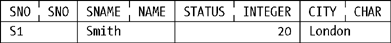
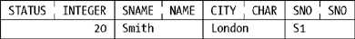
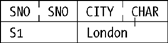
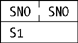
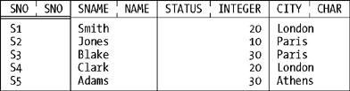
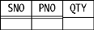
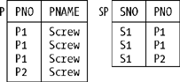
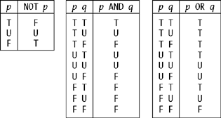
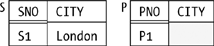

# Chapter Three. Tuples and Relations

**From the first two chapters you should have gained a pretty good understanding of** what `tuples` and `relations` are, at least from an informal point of view. Now I want to define those concepts more precisely, and I want to explore some of the consequences of those precise definitions. Perhaps I should warn you that the definitions can look a little daunting, but that's not unusual with formal definitions; the `tuple`[\*](#fn1) and `relation` concepts themselves are quite straightforward, once you've struggled through the formalism, and you should be ready to do that by now because the terminology, at least, should be reasonably familiar to you.

## What's a Tuple?

Is this a `tuple`?

**Figure Three-1.**



Well, no, of course it isn't—it's a _`picture`_ of a `tuple`, not a `tuple` as such (and note that for once I've included the `type` names as well as the `attribute` names in that picture). As we saw in Chapter 1, there's a difference between a thing and a picture of a thing, and that difference can be very important. For example, `tuples` have no left-to-right ordering to their `attributes`, and so the following is an equally good (or bad?) picture of the very same `tuple`[\*](#fn2)[\*](#fn3)[\*](#fn4):

**Figure Three-2.**



Thus, while I'll certainly be making use of pictures like these in the sections to follow, please keep in mind that they're _`only`_ pictures, and they can sometimes suggest some things that aren't true.

With that caveat out of the way, I can now say exactly what a `tuple` is:

> _`Definition:`_ Let _`T1, T2, . . . ,Tn`_ (_`n`_ ≥ 0) be `type` names, not necessarily all distinct. Associate with each _`Ti`_ a distinct `attribute` name, _`Ai;`_ each of the _`n`_ `attribute-name:type-name` combinations that results is an _`attribute`_. Associate with each `attribute` a `value` _`vi`_ of `type` _`Ti`_; each of the _`n`_ `attribute:value` combinations that results is a _`component`_. The set of all _`n`_ `components` thus defined, _`t`_ say, is a _`tuple value`_ (or just a _`tuple`_ for short) over the `attributes` _`A1, A2,..., An`_. The `value` _`n`_ is the _`degree`_ of _`t;`_ a `tuple` of degree one is _`unary`_, a `tuple` of degree two is _`binary`_, a `tuple` of degree three is _`ternary`_,..., and more generally a `tuple` of degree _`n`_ is _`n`_-ary. The set of all _`n`_ `attributes` is the _`heading`_ of _`t`_.

For example, with reference to either of the earlier pictures (of our usual `tuple` for supplier `S1`), we have:

**`Degree`**
: Four. The `heading` is also said to have degree four.

**`Type names`**
: `SNO`, `NAME`, `INTEGER`, and `CHAR`.

**`Corresponding attribute names`**
: `SNO`, `SNAME`, `STATUS`, and `CITY`.

**`Corresponding attribute values`**
: `SNO('S1')`, `NAME('Smith')`, 20, and `'London'`.

> **Note**
>
> I showed most of these `attribute values` in simplified form in the pictures (and I'll continue to make use of similar simplifications in such pictures throughout this book). However, it's strictly incorrect to say that, for example, the `SNO value` in the `tuple` we're talking about is just `'S1'` or (even sloppier) just `S1`. A `value` of `type` `SNO` is a `value` of `type` `SNO`, not a `value` of `type` `CHAR`!—and the expression `SNO('S1')` is a _`literal`_ of `type` `SNO`. (More precisely, it's _`an invocation of the SNO selector`_, as we saw in Chapter 2. A `literal` is, precisely, a `selector` invocation in which the arguments are themselves all `literals` in turn.)

**`Heading`**
: The easiest thing to do here is show another picture:

**Figure Three-3.**


Of course, this picture represents a set, and the order of `attributes` is arbitrary. Here's another picture of the same `heading`:

**Figure Three-4.**


_`Exercise:`_ How many different pictures of this same general nature could we draw to represent this `heading`? (_`Answer:`_ 4 _ 3 _ 2 \* 1 = 24.)

Now, a `tuple`[\*](#fn5) is a `value`; like all `values`, therefore, it has a `type` (as we already know from Chapter 2), and that `type`, like all `types`, has a name[\*](#fn6). In **`Tutorial D`**, such names take the form `TUPLE{`_`H`_`}`, where {_`H`_} is the `heading`. In our example, the name is:

```
TUPLE { SNO SNO, SNAME NAME, STATUS INTEGER, CITY CHAR }
```

(but the order in which the `attributes` are specified is arbitrary).

To repeat, a `tuple` is a `value`. Like all `values`, therefore, it must be returned by some `selector` invocation (a `tuple selector`[\*](#fn7) invocation, of course, if the `value` is a `tuple`). Here's a `tuple selector` invocation for our example (**`Tutorial D`** again):

```
TUPLE { SNO SNO('S1'), SNAME NAME('Smith'),
                   STATUS 20, CITY 'London' }
```

(where the order in which the `components` is specified is arbitrary). Observe that in **`Tutorial D`** each `component` is specified as just an `attribute-name:attribute-value` pair; the `attribute type` is omitted because it can always be inferred from the `type` of the `expression` denoting the `attribute value`.

> **Note**
>
> _`A remark on syntax:`_ As you can see, the keyword `TUPLE` does double duty in **`Tutorial D`**—it's used in connection with both `tuple selector` invocations and `tuple type`[\*](#fn8) names. An analogous remark applies to the keyword `RELATION` (see the upcoming section "What's a Relation?").

Finally, a word about `SQL`. Of course, `SQL` supports `rows`, not `tuples`; in particular, it supports _`row types`_, a _`row type constructor`_, and _`row value constructors`_, which are somewhat analogous to `tuple types`, the `TUPLE type generator`, and `tuple selectors`, respectively. But these analogies are loose at best. For example, this `SQL expression`:

```
ROW ( 1, 2 )
```

which is an example of a `row value constructor`, (a) has `components` that are unnamed and (b) doesn't represent the same `row` as the `row value constructor` `ROW (2,1)`. (There are other differences, too, between `SQL`'s `row` support and our `tuple` support, but they're beyond the scope of the present discussion.)

> **Note**
>
> The keyword `ROW` in an `SQL row value constructor` is optional.

## Some Important Consequences

Now I want to highlight some important consequences of the foregoing definitions. The first is: _`no tuple ever contains any nulls`_. The reason is that, by definition, every `tuple` contains a `value` (of the appropriate `type`) for each of its `attributes`, and we saw in Chapter 1 that `nulls` aren't `values`.[\*](#fn9) Of course, if no `tuple` ever contains any `nulls`, then no `relation` does either, _`a fortiori`_; so right away we have at least a formal reason for rejecting the concept of `nulls`—but I'll give some more pragmatic reasons as well, in the section "Why Nulls Are Prohibited," later in this chapter.

The next consequence is:_`every subset of a tuple is a tuple and every subset of a heading is a heading`_. For example, given our usual `tuple` for supplier `S1`, what we might call "the {`SNO`,`CITY`} `value`" within that `tuple` is itself another `tuple`:

**Figure Three-5.**



Its `heading` is as indicated, and its `type` is:

```
TUPLE { SNO SNO, CITY CHAR }
```

In the same way, the following is a `tuple` too (its `type` is `TUPLE {SNO SNO}`):

**Figure Three-6.**



So if we want to access the actual `attribute value`—`SNO('S1')` in the example—we have to _`extract`_ it somehow from its containing `tuple`. **`Tutorial D`** uses syntax of the form `SNO FROM `_`t`_ for this purpose (where _`t`_ is any `expression` that denotes a `tuple` with an `SNO attribute`). `SQL` uses dot qualification: _`t`_`.SNO`.

> **Note**
>
> We saw in Chapter 2 that a `tuple` _`t`_ and a `relation` _`r`_ that contains just that `tuple` _`t`_ aren't the same thing. Analogously, a `value` _`v`_ and a `tuple` _`t`_ that contains just that `value` _`v`_ aren't the same thing, either; in particular, they're of different `types`.

Now, I'm sure you know that the empty set is a subset of every set. It follows that a `tuple` with an empty `heading`, and therefore an empty set of `components`, is a valid `tuple`!—though it's a little hard to draw a picture of such a `tuple` on paper, and I'm not even going to try. A `tuple` with an empty `heading` has `type` `TUPLE{}` (it has no `components`); indeed, we sometimes refer to it explicitly as a _`0-tuple`_, to emphasize the fact that it is of degree zero. We also sometimes call it an _`empty tuple`_. Now, you might think such a `tuple` is unlikely to be of much use in practice; in fact, it turns out, perhaps rather surprisingly, to be of crucial importance. I'll have more to say about it in the section "TABLE_DUM and TABLE_DEE," later in this chapter.

The last "important consequence" I want to discuss here has to do with the notion of _`tuple equality`_[\*](#fn10). (Recall from Chapter 2 that the `"=" comparison operator` is defined for every `type`, and `tuple types` are no exception.) Basically, of course, two `tuples` are equal if and only if they're the very same `tuple` (just as, for example, two `integers` are equal if and only if they're the very same `integer`). But it's worth spelling out the semantics of `tuple equality` explicitly, since so much in the `relational model` depends on it—for example, `candidate keys`, `foreign keys`, and most of the `operators` of the `relational algebra` are all defined in terms of it. Here then is a precise definition:

> _`Definition:`_ `Tuples` _`t1`_ and _`t2`_ are _`equal`_ if and only if they have the same `attributes` _`A1, A2, ..., An`_—in other words, they're of the same `type`—and, for all _`i`_ (_`i`_ = 1, 2, ..., _`n`_), the `value` _`v1`_ of _`Ai`_ in _`t1`_ is equal to the `value` _`v2`_ of _`Ai`_ in _`t2`_.

Also (this might seem obvious, but it needs to be said), two `tuples` are _`duplicates`_ if and only if they're equal.

By the way, it's an immediate consequence of this definition that all `0-tuples` are duplicates of one another. For this reason, we're within our rights if we talk in terms of _`the`_ `0-tuple` instead of _`a`_ `0-tuple`, and indeed we usually do.

Observe finally that the `comparison operators` `"<"` and `">"` don't apply to `tuples` (see Exercise 3-11 at the end of the chapter).

## What's a Relation?

I'll use our usual suppliers `relation`[\*](#fn11)[\*](#fn12)[\*](#fn13)[\*](#fn14)[\*](#fn15)[\*](#fn16) as a basis for examples in this section. Here's a picture:

**Figure Three-7.**



And here's a definition:

> _`Definition:`_ Let {_`H`_} be a `tuple heading` and let _`t1, t2`_, . . . _`, tm`_ (_`m`_ ≥ 0) be distinct `tuples` with `heading` {_`H`_}. The combination, _`r`_ say, of {_`H`_} and the set of `tuples` {_`t1, t2`_, . . . _`, tm`_} is a _`relation value`_[\*](#fn17) (or just a _`relation`_ for short) over the `attributes` _`A1, A2`_, . . . _`, An`_, where _`A1, A2`_, . . . _`, An`_ are the `attributes` in {_`H`_}. The _`heading`_ of _`r`_ is {_`H`_}; _`r`_ has the same `attributes` (and hence the same `attribute names` and `types`) and the same `degree` as that `heading` does. The _`body`_ of _`r`_ is the set of `tuples` {_`t1, t2`_, . . . _`, tm`_}. The `value` _`m`_ is the _`cardinality`_ of _`r`_.

I'll leave it as an exercise to interpret the suppliers `relation` in terms of the foregoing definition. However, I will at least explain why we call such things `relations`. Basically, each `tuple` in a `relation` represents an _`n`_-ary `relationship`, in the ordinary natural-language sense, among a set of _`n`_ `values` (one `value` for each `tuple attribute`), and the full set of `tuples` in a given `relation` represents the full set of such `relationships` that happen to exist at some given time—and, mathematically speaking, that's a `relation`. Thus, the "explanation" often heard, to the effect that the `relational model` is so called because it lets us "`relate` one `table` to another," though accurate in a kind of secondary sense, really misses the basic point. The `relational model` is so called because it deals with certain abstractions that we can think of as "`tables`" but are known, formally, as `relations` in mathematics.

Now, a `relation`, like a `tuple`, is itself a `value` and has a `type`, and that `type` has a name[\*](#fn18). In **`Tutorial D`**, such names take the form `RELATION{`_`H`_`}`, where {_`H`_} is the `heading`. Here's an example:

```
RELATION { SNO SNO, SNAME NAME, STATUS INTEGER, CITY CHAR }
```

(The order in which the `attributes` are specified is arbitrary.) Also, every `relation value` is returned by some `relation selector`[\*](#fn19) invocation—for example:

```
RELATION {
   TUPLE { SNO SNO('S1'), SNAME NAME('Smith'),
                          STATUS 20, CITY 'London' } ,
   TUPLE { SNO SNO('S2'), SNAME NAME('Jones'),
                          STATUS 10, CITY 'Paris'  } ,
   TUPLE { SNO SNO('S3'), SNAME NAME('Blake'),
                          STATUS 30, CITY 'Paris'  } ,
   TUPLE { SNO SNO('S4'), SNAME NAME('Clark'),
                          STATUS 20, CITY 'London' } ,
   TUPLE { SNO SNO('S5'), SNAME NAME('Adams'),
                          STATUS 30, CITY 'Athens' } }
```

The order in which the `tuples` are specified is arbitrary.

What support does `SQL` provide for the foregoing ideas? The answer is: not much. It doesn't really have anything analogous to the concept of a `relation type`[\*](#fn20) at all; rather, an `SQL table` is considered to consist of _`rows`_ (a _`multiset`_ or _`bag`_ of `rows`, to be precise) that are of a certain _`row type`_. (It does have something it calls _`named table types`_, but this construct is very different from our `relation type`, and I'm not going to discuss it here.) It follows that `SQL` doesn't really have anything analogous to the `RELATION type generator`, either. It does, however, have something called a _`table value constructor`_ that's akin, somewhat, to a `relation selector`. Here's an example:

```
VALUES ( 1, 2 ), ( 2, 1 ), ( 1, 1 ), ( 1, 2 )
```

This `expression` evaluates to a `table` with four—not three!—`rows` and two `columns` (which have no names).

## Further Important Consequences

Most of the properties of `relations` I talked about in Chapter 1 are direct consequences of the definitions in the previous section, but there are a couple I didn't call out explicitly before, and I want to elaborate on some of the others.

The first point I didn't mention before is that _`every subset of a body is a body`_ (loosely, every subset of a `relation` is a `relation`). In particular, therefore, since the empty set is a subset of every set, a `relation` can have a `body` that consists of an empty set of `tuples` (and we call such a `relation` an _`empty relation`_[\*](#fn21)). For example, suppose there are no shipments right now. In this case, `relvar` `SP` will have as its current `value` the empty shipments `relation`, which we might draw like this:[\*](#fn22)

**Figure Three-8.**



Note that, given any particular `relation type`, there's exactly one empty `relation` of that `type`—but empty `relations` of different `types` aren't the same thing, precisely because they're of different `types`. For example, the empty suppliers `relation` isn't equal to the empty parts `relation`; their `bodies` are equal but their `headings` aren't.

The second point I deliberately didn't mention before is this. Recall from Chapter 1 that, while a `relation` can be pictured as a `table`, a `relation` _`isn't`_ a `table`. (To say it one more time, a picture of a thing is not the same as the thing.) Of course, it can be convenient to _`think`_ of a `relation` as a `table`; after all, `tables` are "user-friendly"; indeed, it's the fact that we can think of `relations`, informally, as `tables`—sometimes more explicitly as _`flat`_ or _`two-dimensional`_ `tables`—that makes `relational systems` intuitively easy to understand and use, and makes it intuitively easy to reason about the way such systems behave. In other words, it's a very nice property of the `relational model` that its basic `data structure`, the `relation`, has such an intuitively attractive pictorial representation.

Unfortunately, many people seem to have been blinded by that attractive pictorial representation into thinking that _`relations as such`_ are "`flat`" or "`two-dimensional`." But they're not. Rather, if `relation` _`r`_ has _`n`_ `attributes`, _`then each tuple in r represents a point in a certain n-dimensional space`_ (and the `relation` overall represents a set of such points). For example, each of the five `tuples` appearing in our usual sample `value` for the suppliers `relvar` `S` represents a certain point in a certain 4-dimensional space, and the `relation` overall can thus be said to be 4-dimensional. Thus, `relations` are _`n`_-dimensional, not two-dimensional As I've written elsewhere (in quite a few places, in fact): _`let's all vow never to say "flat relations" ever again`_.

Now I turn to the issues I want to elaborate on. There are three of them: duplicate `tuples`, `nulls`, and `relations` with no `attributes`. I'll discuss each in its own section.

## Why Duplicate Tuples Are Prohibited

There are numerous practical arguments in support of the position that duplicate `tuples` ("`duplicates`" for short) should be prohibited. Here I have room for just one—but I think it's a powerful one. However, it does rely on certain notions I haven't discussed yet in this book, so I need to make a couple of preliminary assumptions:

- I assume you know that `relational DBMSs` include a component called the _`optimizer`_[\*](#fn24), whose job is to try to figure out the best way to implement user queries and the like (where "best" basically means best-performing).
- I assume you also know that one of the things optimizers do is what's sometimes called _`query rewrite`_[\*](#fn25). `Query rewrite` is the process of transforming some `relational expression` _`X1`_—representing some user query, say—into another such `expression` _`X2`_, such that _`X1`_ and _`X2`_ are guaranteed to produce the same result when evaluated, but where _`X2`_ has better performance characteristics than _`X1`_ (at least, we hope it does).

Now I can present my argument. The fundamental point I want to make is that certain `expression transformations`, and hence certain optimizations, that are valid in a `relational` context are _`not`_ valid in the presence of `duplicates`. By way of example, consider the (non`relational`) `database` shown in Figure 3-1.

**Figure 3-1. A nonrelational database, with duplicates**



Before going any further, perhaps I should ask the question: what does it mean to have three `<P1,Screw>` `rows` in `table` `P` and not two, or four, or seventeen?[\*](#fn26) It must mean something, for if it means nothing, then why are the `duplicates` there in the first place? As I once heard Ted Codd say, "If something is true, saying it twice doesn't make it any more true."

So I have to assume there's some meaning attached to the duplication, even though that meaning, whatever it is, is hardly very explicit. (I note in passing, therefore, that `duplicates` contravene one of the original objectives of the `relational model`: _`explicitness`_. The meaning of the data should be as obvious and explicit as possible, since we're supposed to be talking about a shared `database`. The presence of `duplicates` implies that part of the meaning is hidden.) In other words, given that `duplicates` do have some meaning, there are presumably going to be business decisions made on the basis of the fact that, for example, there are three `<P1,Screw>` `rows` in `table` `P` and not two or four or seventeen. If not, then why are the `duplicates` there in the first place?

Now consider the following query: "Get part numbers for parts that either are screws or are supplied by supplier `S1`, or both." Here are some candidate `SQL` formulations for this query, together with the output produced in each case:

```
1  SELECT P.PNO
   FROM   P
   WHERE  P.PNAME = NAME('Screw')
   OR     P.PNO IN
        ( SELECT SP.PNO
          FROM   SP
          WHERE  SP.SNO = SNO('S1') )

   Result: P1 * 3, P2 * 1.

2   SELECT SP.PNO
   FROM   SP
   WHERE  SP.SNO = SNO('S1')
   OR     SP.PNO IN
        ( SELECT P.PNO
          FROM   P
          WHERE  P.PNAME = NAME('Screw') )

   Result: P1 * 2, P2 * 1.

3   SELECT P.PNO
   FROM   P, SP
   WHERE  ( SP.SNO = SNO('S1') AND
            SP.PNO = P.PNO )
   OR     P.PNAME = NAME('Screw')

   Result: P1 * 9, P2 * 3.

4   SELECT SP.PNO
   FROM   P, SP
   WHERE  ( SP.SNO = SNO('S1') AND
            SP.PNO = P.PNO )
   OR     P.PNAME = NAME('Screw')

   Result: P1 * 8, P2 * 4.

5   SELECT P.PNO
   FROM   P
   WHERE  P.PNAME = NAME('Screw')

   UNION  ALL
   SELECT SP.PNO
   FROM   SP
   WHERE  SP.SNO = SNO('S1')

   Result: P1 * 5, P2 * 2.

6   SELECT DISTINCT P.PNO
   FROM   P
   WHERE  P.PNAME = NAME('Screw')
   UNION  ALL
   SELECT SP.PNO
   FROM   SP
   WHERE  SP.SNO = SNO('S1')

   Result: P1 * 3, P2 * 2.

7   SELECT P.PNO
   FROM   P
   WHERE  P.PNAME = NAME('Screw')
   UNION  ALL
   SELECT DISTINCT SP.PNO
   FROM   SP
   WHERE  SP.SNO = SNO('S1')

   Result: P1 * 4, P2 * 2.

8   SELECT DISTINCT P.PNO
   FROM   P
   WHERE  P.PNAME = NAME('Screw')
   OR     P.PNO IN
        ( SELECT SP.PNO
          FROM   SP
          WHERE  SP.SNO = SNO('S1') )

   Result: P1 * 1, P2 * 1.

9   SELECT DISTINCT SP.PNO
   FROM   SP
   WHERE  SP.SNO = SNO('S1')
   OR     SP.PNO IN
        ( SELECT P.PNO
          FROM   P
          WHERE  P.PNAME = NAME('Screw') )

   Result: P1 * 1, P2 * 1.

10   SELECT P.PNO
   FROM   P
   GROUP  BY P.PNO, P.PNAME
   HAVING P.PNAME = NAME('Screw')
   OR     P.PNO IN
        ( SELECT SP.PNO
          FROM   SP
          WHERE  SP.SNO = SNO('S1') )

   Result: P1 * 1, P2 * 1.


11   SELECT P.PNO
   FROM   P, SP
   GROUP  BY P.PNO, P.PNAME, SP.SNO, SP.PNO
   HAVING ( SP.SNO = SNO('S1') AND
            SP.PNO = P.PNO )
   OR     P.PNAME = NAME('Screw')

   Result: P1 * 2, P2 * 2.

12   SELECT P.PNO
   FROM   P
   WHERE  P.PNAME = NAME('Screw')
   UNION
   SELECT SP.PNO
   FROM   SP
   WHERE  SP.SNO = SNO('S1')

   Result: P1 * 1, P2 * 1.
```

> **Note**
>
> Actually, certain of the foregoing formulations—which?—are a little suspect, because they assume that every screw is supplied by at least one supplier. But this fact has no material effect on the argument that follows.

The obvious first point is that the twelve different formulations produce nine different results—different, that is, with respect to their _`degree of duplication`_. (I make no claim, incidentally, that the twelve different formulations and the nine different results are the only ones possible; indeed, they aren't, in general.) Thus, if the user really cares about `duplicates`, he or she needs to be _`extremely`_ careful in formulating the query in such a way as to obtain exactly the desired result.

Furthermore, of course, analogous remarks apply to the system itself: because different formulations can produce different results, the optimizer too has to be extremely careful in its task of `expression transformation`. For example, the optimizer isn't free to transform, say, formulation 1 into formulation 3 or the other way around, even if it would like to. In other words, duplicate `rows` act as a significant _`optimization inhibitor`_. Here are some implications of this fact:

- The optimizer code itself is harder to write, harder to maintain, and probably more buggy—all of which combines to make the product simultaneously more expensive and less reliable, as well as late in delivery to the marketplace.
- System performance is likely to be worse than it might be.
- Users are going to have to get involved in performance issues. To be more specific, they're going to have to spend time and effort in figuring out how to formulate a given query in order to get the best performance—a state of affairs the `relational model` was expressly meant to avoid!

> **USING SELECT DISTINCT**
>
> At this point in the original draft, I said that if you find the discipline of always specifying `DISTINCT` annoying, don't complain to me-complain to the `SQL` vendors instead. But my reviewers reacted with almost unanimous horror to my suggestion that you should always specify `DISTINCT`. One wrote: "Those who really know `SQL` well will be shocked at the thought of coding `SELECT DISTINCT` by default." Well, I'd like to suggest, politely, that (a) those who are "shocked at the thought" probably know the implementa-tions well, not `SQL`, and (b) their shock is probably due to their recognition that those implementations do such a poor job of optimizing away unnecessary `DISTINCTs`. If I write `SELECT DISTINCT S.SNO FROM S ...`, that `DISTINCT` can safely be ignored. If I write `EXISTS (SELECT DISTINCT ...)` or `IN (SELECT DISTINCT ...)`, that `DISTINCT` can safely be ignored. If I write `SELECT DISTINCT SP.SNO FROM SP ... GROUP BY SP.SNO`, that `DISTINCT` can safely be ignored. If I write `SELECT DISTINCT ... UNION SELECT DISTINCT ...`, those `DISTINCTs` can safely be ignored. And so on. Why should I, as a user, have to devote time and effort to figuring out whether some `DISTINCT` is going to be a performance hit and whether it's logically safe to omit it, and to remembering all of the details of `SQL`'s inconsistent rules for when `duplicates` are automatically eliminated and when they're not? Well, I could go on. However, I decided- against my own better judgment, but in the interests of maintaining good relations (with myreviewers, I mean)-not to follow myown advice in the remainder of this book but only to request duplicate elimination explicitly whenit seemedlogically necessary to doso. It wasn't always easy to decide when that was, either. But at least now I can add my voice to those complaining to the vendors, I suppose.

The fact that `duplicates` serve as an `optimization inhibitor` is particularly frustrating in view of the fact that, in most cases, users probably _`don't`_ care how many `duplicates` appear in the result. In other words:

- Different formulations produce different results.
- But the differences are probably irrelevant from the user's point of view.
- _`But`_ the optimizer is unaware of this latter fact and is therefore prevented, unnecessarily, from performing the transformations it might like to perform.

On the basis of examples like the foregoing, I'm tempted to conclude among other things that you should always ensure that query results contain no `duplicates`—for example, by always specifying `DISTINCT` in your `SQL` queries—and thus simply forget about the whole problem. And if you follow this advice, of course, then there's no good reason for allowing `duplicates` in the first place . . . .

There's much more that could be said on this issue, but I have room for just four more points. First, the alternative to `SELECT DISTINCT` in `SQL` is `SELECT ALL`—and `SELECT ALL` is unfortunately the default. The trouble is, however, `SELECT DISTINCT` might take longer to execute than `SELECT ALL`, even if the `DISTINCT` is effectively a "no op." I don't want to discuss this one any further, except to note that the reason `SQL systems` are typically unable to optimize properly over duplicate elimination is their lack of knowledge of _`key inheritance`_ (that is, their inability to figure out the `keys` for the result of an arbitrary `relational expression`).

Second, you might object, not unreasonably, that `base tables` in practice never do include `duplicates`, and my example therefore intuitively fails. True enough; but the trouble is, `SQL` can _`generate`_ `duplicates` in query results. Indeed, different formulations of the same query can produce results with different degrees of duplication, as we've already seen, even if the input `tables` themselves have no `duplicates` at all. For example, consider the following formulations of the query "Get supplier numbers for suppliers who supply at least one part" on the usual suppliers-and-parts `database`:

```
SELECT S.SNO           |    SELECT S.SNO
FROM   S               |    FROM   S, SP
WHERE  S.SNO IN        |    WHERE  S.SNO = SP.SNO
     ( SELECT SP.SNO
       FROM   SP )
```

(Given our usual sample data values, what results do these two `expressions` produce?) So if you don't want to think of the `tables` in Figure 3-1 as `base tables` specifically, that's fine: just take them to be the output from previous queries, and the rest of the analysis goes through unchanged.

Third, there's another at least psychological argument against `duplicates` that I think is quite persuasive (thanks to Jonathan Gennick for this one): if, in accordance with the _`n`_-dimensional perspective on `relations` introduced in the previous section, you think of a `table` as a plot of points in some _`n`_-dimensional space, then duplicate `rows` clearly don't add anything; they simply amount to plotting the same point twice.

My last point is this. Suppose `table` _`T`_ does permit `duplicates`. Then we can't tell the difference between "genuine" `duplicates` in _`T`_ and `duplicates` that arise from errors in data entry on _`T!`_ For example, what happens if the person responsible for data entry unintentionally—that is, _`by mistake`_—enters the very same `row` into _`T`_ twice? (Easily done, by the way.) Is there a way to delete just the "second" `row` and not the "first"? Note that we presumably do want to delete that "second" `row`, since it shouldn't have been entered in the first place.

## Why Nulls Are Prohibited

The opening paragraph from the previous section applies equally well here (with just one tiny text substitution), so I'll basically just repeat it: There are numerous practical arguments in support of the position that `nulls` should be prohibited. Here I have room for just one—but I think it's a powerful one. But it does rely on certain notions I haven't discussed yet in this book, so I need to make a couple of preliminary assumptions:

- I assume you know that any `comparison` in which either or both of the comparands is `null` evaluates to the `UNKNOWN truth value` instead of `TRUE` or `FALSE`. The justification for this state of affairs is the intended interpretation of `null` as _`value unknown:`_ if the `value` of _`A`_ is unknown, then obviously it's unknown whether, for example, _`A`_ > _`B`_, regardless of the `value` of _`B`_ (even—perhaps especially—if the `value` of _`B`_ is unknown as well). Incidentally, it's this fact that's the source of the term _`three-valued logic`_ (`3VL`): the notion of `nulls` inevitably leads us into a `logic` in which there are three `truth values` instead of the usual two. (The `relational model`, by contrast, is based on conventional _`two-`_ valued `logic`, `2VL`.)
- I assume you also know the `3VL truth tables`[\*](#fn27) for the familiar `operators` `NOT`, `AND`, and `OR` (`T` = `TRUE`, `F` = `FALSE`, `U` = `UNKNOWN`):

  **Figure Three-10.**

  

  Observe in particular that `NOT` returns `UNKNOWN` if its input is `UNKNOWN`; `AND` returns `UNKNOWN` if one input is `UNKNOWN` and the other is either `UNKNOWN` or `TRUE`; `OR` returns `UNKNOWN` if one input is `UNKNOWN` and the other is either `UNKNOWN` or `FALSE`.

Now I can present my argument. The fundamental point I want to make is that certain `boolean expressions`—and therefore certain queries—produce results that are correct according to `three-valued logic`[\*](#fn28) but _`not`_ correct in the real world. By way of example, consider the (non`relational`) `database` shown in Figure 3-2, in which "the `CITY` is `null`" for part `P1`. Note carefully that the empty space in that figure, in the place where the `CITY value` for part `P1` ought to be, stands for _`nothing at all`_; conceptually, there's nothing—not even a string of blanks or an empty string—in that position (which means the "`tuple`" for part `P1` isn't really a `tuple`, a point I'll come back to near the end of this section).

**Figure 3-2. A nonrelational database, with a null**



Consider now the following (admittedly rather contrived) query on the `database` of Figure 3-2: "Get `SNO`-`PNO` pairs where either the supplier and part cities are different or the part city isn't Paris (or both)." Here's the obvious `SQL` formulation of this query:[\*](#fn29)

```
SELECT S.SNO, P.PNO
FROM   S, P
WHERE  S.CITY <> P.CITY
OR     P.CITY <> 'Paris'
```

Let's focus on the `boolean expression` in the `WHERE` clause (parentheses added for clarity):

```
( S.CITY <> P.CITY ) OR ( P.CITY <> 'Paris' )
```

For the only data we have in the `database`, this `expression` evaluates to `UNKNOWN OR UNKNOWN`, which reduces to just `UNKNOWN`. Now, `SQL` queries retrieve data for which the `expression` in the `WHERE clause` evaluates to `TRUE`, not to `FALSE` and not to `UNKNOWN`; in the example, therefore, nothing is retrieved at all.

But of course part `P1` does have _`some`_ corresponding city in the real world; in other words, "`the null CITY`" for part `P1` does stand for some real `value`, say _`xyz`_. Obviously, either _`xyz`_ is Paris or it isn't. If it is, then the `expression`:

```
( S.CITY <> P.CITY ) OR ( P.CITY <> 'Paris' )
```

becomes (for the only data we have):

```
( 'London' <> 'Paris' ) OR ( 'Paris' <> 'Paris' )
```

This `expression` evaluates to `TRUE`, because the first term evaluates to `TRUE`. Alternatively, if _`xyz`_ isn't Paris, the `expression` becomes (again, for the only data we have):

```
( 'London' <> xyz ) OR ( xyz <> 'Paris' )
```

This `expression` also evaluates to `TRUE`, because the second term evaluates to `TRUE`. Thus, the `boolean expression` is always `TRUE` in the real world, and the query should return the pair `S1`-`P1`, _`regardless of what real value the null stands for`_. In other words, the result that's correct according to the `logic` (that is, `3VL`) and the result that's correct in the real world are different!

By way of another example, consider the following query (I didn't lead with this example because it's even more contrived than the previous one, but in some ways it makes the point with still more force):

```
SELECT P.PNO
FROM   P
WHERE  P.CITY = P.CITY
```

The real-world answer here is obviously the set of part numbers currently appearing in `P` (in other words, the set containing just part number `P1`, given the sample data shown in Figurer 3-2). `SQL`, however, will return no part numbers at all.

To sum up: if you have any `nulls` in your `database`, you're getting wrong answers to some of your queries. What's more, you have no way of knowing, in general, just which queries you're getting wrong answers to; _`all`_ results become suspect. _`You can never trust the answers you get from a database with nulls`_. In my opinion, this state of affairs is a complete showstopper.

As with the business of `duplicates` in the previous section, there's much more that could be said on this issue, but I just want to close with a review of the _`formal`_ argument against `nulls`. Recall that, by definition, a `null` isn't a `value`. It follows that:[\*](#fn30)

- A "`type`" that contains a `null` isn't a `type` (because `types` contain `values`).
- A "`tuple`" that contains a `null` isn't a `tuple` (because `tuples` contain `values`).
- A "`relation`" that contains a `null` isn't a `relation` (because `relations` contain `tuples`, and `tuples` don't contain `nulls`).

The net is that if `nulls` are present, then we're certainly not talking about the `relational model` (I don't know what we _`are`_ talking about, but it's not the `relational model`); the entire edifice crumbles, and all bets are off.

## TABLE_DUM and TABLE_DEE

The previous two sections were perhaps a little depressing; this section, by contrast, is much more upbeat. Recall from the section "Some Important Consequences" that the empty set is a subset of every set, and hence that there's such a thing as the empty `tuple` (also called the `0-tuple`), and of course it has an empty `heading`[\*](#fn31). What I didn't point out before is that—obviously enough—a `relation` too might have an empty `heading` (a `heading` is a set of `attributes`, and there's no reason why that set shouldn't be empty). Such a `relation` is of `type` `RELATION{}`, and its `degree` is zero. It's also sometimes said to be 0-ary (or _`nullary`_), just as, for example, a `relation` of degree two is said to be binary. (By the way, _`nullary`_ here has nothing to do with `nulls`; `nulls` are still bad news, but `nullary relations` are very good news indeed. However, I prefer to avoid the term _`nullary`_, precisely because it does sound as if it had something to do with `nulls`.)

Let _`r`_ be a `relation` of degree zero, then. How many such `relations` are there? The answer: just two. First, of course, _`r`_ might be empty (meaning it contains no `tuples`)—remember there's exactly one empty `relation` of any given `type`. Second, if _`r`_ isn't empty, then the `tuples` it contains must all be `0-tuples`. But there's only one `0-tuple`!—equivalently, all `0-tuples` are duplicates of one another—and so _`r`_ cannot possibly contain more than one of them. So there are indeed just two `relations` with no `attributes`: one with just one `tuple`, and one with no `tuples` at all. For fairly obvious reasons, I'm not going to try drawing pictures of these `relations`; in fact, this is one place where the idea of thinking of `relations` as `tables` really does break down.

Now, you might well be thinking: "So what? Why on earth would I ever want a `relation` that has no `attributes` at all?" Even if they're mathematically respectable (which they are), surely they're of no _`practical`_ significance? In fact, however, it turns out they're of very great practical significance indeed: so much so, that we have pet names for them—we call them `TABLE_DUM` and `TABLE_DEE`, or `DUM` and `DEE` for short (`DUM` is the empty one, `DEE` is the one with one `tuple`).[\*](#fn32) And the reason they're so significant is their _`meanings`_, which are `FALSE` (or `NO`) for `DUM` and `TRUE` (or `YES`) for `DEE`. They have the most fundamental meanings of all.

> **Note**
>
> I'll discuss the whole notion of what `relations` in general mean in the next chapter.

By the way, a good way to remember which is which is this: `YES` and `DEE` both have an "E"; `NO` and `DUM` don't.

I haven't covered enough in this book yet to show concrete examples of `DUM` and `DEE` in action, as it were, but we'll see plenty of examples of their use in the pages ahead. Here I'll just mention one point that should make at least intuitive sense at this early juncture: `DEE` in particular plays a role in the `relational algebra` that's analogous to the role played by zero in conventional arithmetic. And we all know how important zero is; in fact, it's hard to imagine an arithmetic without zero (the ancient Romans tried, but it didn't get them very far). Well, it should be equally hard to imagine a `relational algebra` without `TABLE_DEE`.

## Summary

In this chapter I've presented precise definitions for the fundamental concepts _`tuple`_ and _`relation`_. As I said in the introductory section, those definitions can be a little daunting at first, but I hope you were able to make sense of them after having read the first two chapters. I also discussed `tuple` and `relation types`, and showed some examples of `tuple` and `relation selector invocations`. And I discussed certain important consequences of the definitions:

- No `tuple`, and therefore no `relation`, ever contains any `nulls`.
- Every subset of a `tuple` is a `tuple`, every subset of a `heading` is a `heading`, and every subset of a `body` is a `body` (and those subsets can always be empty).
- Two `tuples` are equal if and only if they're the very same `tuple`.

Other consequences already covered in earlier chapters include:

- Every `tuple` contains exactly one `value` for each of its `attributes`, and `relations` are therefore always in `first normal form`.
- The `attributes` of a `tuple`, and therefore of a `relation`, are unordered, left to right.
- The `tuples` of a `relation` are also unordered, top to bottom.
- `Relations` never contain any duplicate `tuples`.

I also gave some important pragmatic arguments in favor of prohibiting both `duplicates` and `nulls`. And I finished up by briefly introducing the very important degree-zero `relations` `TABLE_DUM` and `TABLE_DEE`; `DUM` means `NO` or `FALSE`, and `DEE` means `YES` or `TRUE`.

## Exercises

### Exercise 3-1

Define as precisely as you can the terms _`attribute`_, _`body`_, _`cardinality`_, _`degree`_, _`heading`_, _`relation`_, _`relvar`_, and _`tuple`_. Also, every `relation` and every `relvar` is of some (`relation`) `type`; define the term _`relation type`_ as precisely as you can too.

### Exercise 3-2

What's a `literal`[\*](#fn33)?

### Exercise 3-3

State as precisely as you can what it means for two `tuples` to be equal.

### Exercise 3-4

We saw in the section "What's a Tuple?" that it's strictly incorrect to say that, for example, `S1` or even `'S1'` is a supplier number ("a `value` of `type` `SNO` is a `value` of `type` `SNO`, not a `value` of `type` `CHAR`"). As a consequence, Figure 1-3 in Chapter 1 is pretty sloppy, inasmuch as it pretends that it _`is`_ correct to think of, for example, `S1` as a supplier number. Show the correct way of referring to the various `scalar values` in that figure, given the `types` specified for `attributes` in the suppliers-and-parts `database` in the introductory section in Chapter 2.

### Exercise 3-5

Write **`Tutorial D`** `tuple selector` invocations for a typical `tuple` from (a) the parts `relvar`, (b) the shipments `relvar`. Also show `SQL`'s counterparts, if any, to those `selector` invocations.

### Exercise 3-6

Write a typical **`Tutorial D`** `relation selector` invocation. Also show `SQL`'s counterpart, if any, to that `selector` invocation.

### Exercise 3-7

Does the concept of a `tuple literal` make any sense? What about a `relation literal`?

### Exercise 3-8

(This is essentially a repeat of Exercise 1-8 from Chapter 1, but you should be able to give a more comprehensive answer now.) There are many differences between a `relation` and a `table`. List as many as you can.

### Exercise 3-9

The `attributes` of a `tuple` can be of any `type` whatsoever (well, almost; can you think of any exceptions?). Give an example of (a) a `tuple` with a `tuple-valued attribute`, (b) a `tuple` with a `relation-valued attribute` (`RVA`).

### Exercise 3-10

`Tuple equality` was defined precisely in the body of the chapter—but what about `relation equality`? (I'll discuss the question of `relation comparisons` in general in Chapter 5, but you might like to take a shot at defining `relation equality` for yourself here.)

### Exercise 3-11

Why don't the `comparison operators` `"<"` and `">"` apply to `tuples`? Note that, by contrast, they do apply to `SQL rows`. How can this be? (_`Hint:`_ What's the difference between `SQL`'s rules for `row equality` and the `relational` rules for `tuple equality`?)

### Exercise 3-12

Give an example of a `relation` with (a) one `RVA`, (b) two `RVAs`. Also give two more `relations` that represent the same information as those `relations` but do not involve `RVAs`. Then give an example of a `relation` with an `RVA` such that there's no `relation` without an `RVA` that represents precisely the same information. (You might prefer to come back to this exercise after reading more about `RVAs` in Chapter 5.)

### Exercise 3-13

It's sometimes suggested that a `relation` (or `relvar`, rather) is really just a traditional computer file, with `tuples` instead of records and `attributes` instead of fields. Discuss.

### Exercise 3-14

Explain the `relations` `TABLE_DUM` and `TABLE_DEE` in your own words. Does `SQL` support them?

### Exercise 3-15

The following is a legitimate example of an `SQL row value constructor`:

```
ROW ( 1, NULL )
```

Is the `row` it represents `null` or not?

### Exercise 3-16

"`Duplicates` are a good idea in `databases` because `duplicates`[\*](#fn34) occur naturally in the real world. For example, all pennies are `duplicates` of one another." How would you respond to this argument?

### Exercise 3-17

Why are the `databases` of Figures 3-1 and 3-2 non`relational`?

### Exercise 3-18

Do you think `nulls` occur naturally in the real world?

### Exercise 3-19

`Nulls` were originally proposed as a solution to the problem of missing information. Now, it's true that information is often missing in the real world (think of such things as "Speaker to be announced" or "Present address unknown," for example). Therefore, if `nulls` are prohibited, how _`should`_ we deal with missing information inside our `database systems`? (As I'm sure you noticed, I didn't answer this question in the body of the chapter. This exercise might best serve as a basis for group discussion. I'll have a little more to say on the subject in Chapter 7.)

### Exercise 3-20

`TABLE_DEE` means `TRUE` and `TABLE_DUM` means `FALSE`. Do these facts mean we could dispense with the usual `BOOLEAN data type`? Also, `DEE` and `DUM` are `relations`, not `relvars`. Do you think it would ever make sense to define a _`relvar`_ of degree zero?

### Exercise 3-21

We saw in the body of the chapter that this `SQL expression`:

```
VALUES ( 1, 2 ), ( 2, 1 ), ( 1, 1 ), ( 1, 2 )
```

denotes a `table` with four `rows`. What does the following `SQL expression` denote?

```
VALUES ( ( 1, 2 ), ( 2, 1 ), ( 1, 1 ), ( 1, 2 ) )
```

---

<a name="fn1">\*</a> Usually pronounced to rhyme with couple.

<a name="fn2">_</a> Strictly speaking, this sentence should read "Every _`relvar`\* has at least one `candidate key`" (see the section "Relations Versus Relvars," later in this chapter). Similar remarks apply at various places elsewhere in this chapter, too (see Exercise 1-1 at the end of the chapter).

<a name="fn3">\*</a> I follow convention throughout this book in using the generic term "`update`" to refer to the `INSERT`, `DELETE`, and `UPDATE` (and `assignment`) `operators` considered collectively. When I want to refer to the `UPDATE operator` specifically, I'll set it in all caps as just shown.

<a name="fn4">\*</a> I/O = input/output operation.

<a name="fn5">\*</a> I say this knowing full well that today's `SQL` products provide a variety of options for hashing, partitioning, indexing, clustering, and otherwise organizing the data as stored on the disk. I still consider the mapping to physical storage in those products to be "fairly direct."

<a name="fn6">*</a> I can't show this in `SQL` because `SQL` doesn't directly support `relational assignment`. Throughout this book, I'll show examples in `SQL` wherever possible—but when it's not possible for some reason, as here, I'll use a more or less self-explanatory (and truly `relational`) language called **`Tutorial D`** instead. `Tutorial D` is the language Hugh Darwen and I use to illustrate `relational` ideas in our book *Databases, Types, and the Relational Model: The Third Manifesto\*, Third Edition (Addison-Wesley, 2006); you can regard it as a realization in concrete syntax of the abstract constructs of the `relational model` (which `SQL`, regrettably, is not).

<a name="fn7">_</a> As this book was going to press, I was informed that at least one well-known `SQL` product apparently uses the term "`declarative`" to mean the system _`doesn't`_ do the work! That is, it allows the user to state certain things `declaratively` (for example, the fact that a certain `view` has a certain `key`), but it doesn't enforce the `constraint` implied by that declaration—it simply assumes the user is going to enforce it instead. Such terminological abuses do little to help the cause of genuine understanding. _`Caveat lector`\*.

<a name="fn8">_</a> Finite because we're dealing with computers, which are finite by definition. Also, note that qualifier _`named;`\* `types` with different names are different `types`.

<a name="fn9">\*</a> I could have used `SQL`, but `operator` definitions in `SQL` involve a number of details that I don't want to get into here.

<a name="fn10">\*</a> Despite the fact that `SQL` often (though not always) refers to them explicitly as `null values`.

<a name="fn11">\*</a> I now revert to the convention by which we omit the `type names` from a `heading` in informal contexts. Throughout the remainder of this book, in fact, I'll feel free to regard `headings` as either including `type names` or excluding them—whichever best suits my purpose at the time.

<a name="fn12">\*</a> Indeed, I think it could be argued that one reason we hear so much about the need for "multidimensional `databases`" (for decision support applications in particular) is precisely because so many people think `relations` aren't multidimensional.

<a name="fn13">\*</a> I use `table` terminology in this section because the things we're talking about are certainly neither `relations` nor `relvars`; in particular, they have no `keys` (observe that there's no double underlining in Figure 3-1).

<a name="fn14">_</a> As an exercise, show the result of this query given our usual sample data values (see Figure 1-3 in Chapter 1). _`Note:`\* The symbol `"<>"` is `SQL` syntax for `"≠"` (and I'll add for the record that the symbols `"<="` and `">="` are `SQL` syntax for `"≤"` and `"≥"`, respectively, as you probably know).

<a name="fn15">\*</a> Remarks analogous to those that follow, though possibly a little less severe, might be made in connection with "`relations`" with `duplicates`, or top-to-bottom `tuple` ordering, or left-to-right `attribute` ordering.

<a name="fn16">*</a> Let me say a little more about these pet names. First, for the benefit of non-English speakers, I should explain that they're basically just wordplay on Tweedledum and Tweedledee, who were originally characters in a children's nursery rhyme and were subsequently incorporated into Lewis Carroll's *Through the Looking-Glass\*. Second, the names are a little unfortunate, given that these two `relations` are precisely the ones that can't reasonably be depicted as `tables`! But we've been using those names for so long now that we're probably not going to change them.
