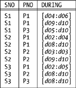

# Chapter Eight. What Is the Relational Model?

**You might think it odd for the final chapter in a book that's meant to explain the `relational model` to have as its title _What Is the `Relational Model`?_ Aren't you supposed to know by now?**

Well, yes, you are. But the point of this chapter is to serve as a kind of wrap-up for everything that's gone before; in particular, it's meant to give a precise definition, for purposes of future reference, of just what it is that constitutes the `relational model`. The trouble is, the definition I'll give is indeed precise: so precise, in fact, that I think it would have been pretty hard to understand if I'd given it in Chapter 1. (As Bertrand Russell once memorably said: _`Writing can be either readable or precise, but not at the same time`_.) Of course, I did give a definition in Chapter 1—a definition, that is, of what I there called "`the original model`"—but I frankly don't think that definition is even close to being good enough, for the following reasons among others:

- For starters, it was much too long and rambling. (Well, that was fair enough, given the intent of that preliminary chapter, but now I want a definition that's succinct as well as precise.)
- I don't really care for the idea that the model should be thought of as consisting of "`structure plus integrity plus manipulation`"; in some ways, in fact, I think it's actively misleading to think of it in such terms.
- "`The original model`" included a few things I'm not too comfortable with: for instance, `nulls` (of course!), the `entity integrity` rule, the idea of having to make one `key` `primary`, and the idea—which I didn't discuss at all in this book, because I don't agree with it—that `domains` and `types` are somehow different things. Regarding `nulls`, incidentally, I note that Codd first defined the `relational model` in 1969 and didn't introduce `nulls` until 1979; in other words, the model managed perfectly well (in my opinion, better) for some 10 years without any notion of `nulls` at all. What's more, early implementations managed perfectly well without them, too.
- The original version of the model also omitted a few things I now consider vital. For example, it excluded any mention—at least, any explicit mention—of all of the following: `predicates`, `constraints` (other than `candidate` and `foreign key constraints`), `relation variables`, `relational comparisons`, `relation type inference` and associated features, certain algebraic operators (especially `rename`, `extend`, `summarize`, `semijoin`, and `semidifference`), and the important relations `TABLE_DUM` and `TABLE_DEE`. (On the other hand, I think it could fairly be argued that these features at least weren't precluded by the original version of the model; it might even be argued in some cases that they were in fact included, in a kind of embryonic form. For example, it was certainly always intended that implementations should include support for `constraints` other than just `candidate` and `foreign key constraints`.)

Without further ado, then, let me give my own definition.

## The Relational Model Defined

The `relational model` consists of five components:

1. An open-ended collection of `scalar types`, including in particular the `type` `BOOLEAN` (`truth values`)
2. A `relation type generator` and an intended interpretation for `relations` of types generated thereby
3. Facilities for defining `relation variables` of such generated `relation types`
4. A `relational assignment` operator for assigning `relation values` to such `relation variables`
5. An open-ended collection of generic `relational operators` for deriving `relation values` from other `relation values`

The following subsections elaborate on each of these components in turn.

### Scalar Types

`Scalar types` can be either system-defined (built-in) or user-defined, in general; thus, a means must be available for users to define their own `scalar types` (this requirement is implied, partly, by the fact that the set of `scalar types` is open-ended). A means must therefore also be available for users to define their own `scalar operators`, since `types` without `operators` are useless. The only _`required`_ system-defined `scalar type` is `type` `BOOLEAN`—the most fundamental `type` of all—but a real system will surely support others as well (`INTEGER`, `CHAR`, and so on).

Support for `type` `BOOLEAN` implies support for the usual logical `operators`—`NOT`, `AND`, `OR`, and so on—as well as other `operators` (system- or user-defined) that return `boolean values`. In particular, the `equality comparison operator` `=` (`equality comparison`) _`must`_ be available in connection with every `type`, `nonscalar` as well as `scalar`, because without it we couldn't even define the `values` that constitute the `type` in question. What's more, the model prescribes the semantics of that `operator`, too. To be specific, if _`v1`_ and _`v2`_ are `values` of the same `type`, _`v1`_ = _`v2`_ evaluates to `TRUE` if _`v1`_ and _`v2`_ are the very same `value` and `FALSE` otherwise.

By the way, `SQL` fails seriously on this requirement (that `=` be supported for every `type`, with prescribed semantics). For example:

- For the built-in `types` `CHAR` and `VARCHAR`, it's possible—in fact, common—for `=` to give `TRUE` even if the comparands are distinct.
- For the built-in `type` `XML` (and the built-in `types` `BLOB` and `CLOB`, in certain products), `=` isn't defined at all.
- For user-defined `types`, `=` can be defined only when `<` is defined as well, and for some `types` `<` makes no sense; and even when `=` _`is`_ defined, the semantics are arbitrary, in the sense that they're left to the `type` definer.
- For `tables`, no comparison `operators` are defined at all.
- Last, it's quite common for `=` not to give `TRUE` even if the comparands are indistinguishable; in particular, this situation arises if both comparands are `null`.

One consequence of such deficiencies is that `SQL` violates _`The Assignment Principle`_ (see the later section "`Some Database Principles`")—ubiquitously so, in fact.

### Relation Types

The `relation type generator` allows users to specify individual `relation types` as desired: in particular, as the `type` for some `relation variable` or some `relation-valued attribute` (see Chapter 2 for further explanation). The intended interpretation for a given `relation` of a given `type` in a given context is as a set of true `propositions`; each such `proposition` constitutes an instantiation of some `predicate` that (a) corresponds to the `relation heading` and (b) is represented by a `tuple` in the `relation body`. If the context in question is some `relvar`—that is, if we're talking about the `relation` that happens to appear as the current `value` of some `relvar`—then the `predicate` in question is the `relvar predicate` for that `relvar`. If a `tuple` plausibly could appear in that `relvar` at some time but doesn't, the corresponding `proposition` is assumed to be false at that time.

Since the `equality comparison operator` `=` is available in connection with every `type`, it's available in connection with every `relation type` in particular.

### Relation Variables

As noted in the previous subsection, a particularly important use for the `relation type generator` is in specifying the `type` of a `relation variable`, or `relvar`, when that `relvar` is defined. The _`only`_ kind of variable permitted in a `relational database` is the `relvar` (in particular, `scalar` and `tuple variables` are prohibited, even though they're not prohibited—in fact, they're probably required—in programs that access such a `database`).

The statement that the `database` contains nothing but `relvars` is one possible formulation of what Codd originally called _`The Information Principle`_, though I don't think it's a formulation he ever used himself. Instead, he usually stated the principle like this:

> The entire information content of the `database` (at any given time) is represented in one and only one way: namely, as explicit `values` in `attribute` positions in `tuples` in `relations`.

I heard Codd refer to this principle on more than one occasion as the fundamental principle underlying the `relational model`. Why is it so important? The answer is bound up with the observations I made in Chapter 4 to the effect that, along with `types`, `relations` are both necessary and sufficient to represent any data whatsoever at the logical level. In other words, the `relational model` gives us exactly what we do need in this respect, and it doesn't give us anything we don't need.

I'd like to pursue this point a moment longer. In general, it's axiomatic that if we have _`n`_ different ways of representing data, then we need _`n`_ different sets of `operators`. For example, if we had `arrays` as well as `relations`, we'd need a full complement of `array operators` as well as a full complement of `relational ones`. If _`n`_ is greater than one, therefore, we have more `operators` to implement, document, teach, learn, remember, and use. But those extra `operators` add complexity, not power! There's nothing useful that can be done if _`n`_ is greater than one that can't be done if _`n`_ equals one (and in the `relational model`, of course, _`n`_ does equal one).

What's more, not only does the `relational model` give us just one construct, the `relation` itself, for representing data, but that construct is—to quote Codd himself (see the next section, "`Objectives of the Relational Model`")—_`of spartan simplicity`_: it has no ordering to its `tuples`, no ordering to its `attributes`, no duplicate `tuples`, no `pointers`, and (at least as far as I'm concerned) no `nulls`. Any contravention of these properties is tantamount to introducing another way of representing data, and therefore to introducing more `operators` as well. In fact, `SQL` is living proof of this observation; for example, `SQL` has eight different `union operators`[^1], while (as we know) the `relational model` has just one.

As you can see, _`The Information Principle`_ is certainly important—but it has to be said that its name hardly does it justice. Other names that have been proposed, mainly by Hugh Darwen or myself or both, include _`The Principle of Uniform Representation`_ and _`The Principle of Uniformity of Representation`_. (This latter is clumsy, I admit, but at least it's accurate.)

### Relational Assignment

Like the `equality comparison operator` `=`, the `assignment operator` `:=` must be available in connection with every `type`, for without it we would have no way of assigning an arbitrary `value` to a `variable` of the `type` in question—and again, `relation types` are no exception to this rule. `INSERT`, `DELETE`, and `UPDATE` shorthands are permitted and indeed useful, but strictly speaking they're only shorthands. What's more, support for `relational assignment` must include support for _`multiple`_ `relational assignment` in particular.

### Relational Operators

The "`generic `relational operators`" are the `operators`that make up the`relational algebra`, and they're therefore built-in (though there's no inherent reason why users shouldn't be allowed to define additional `operators` of their own, if desired).

Now, there seems to be a widespread misconception concerning the purpose of the `algebra`. To be specific, many people seem to think it's meant just for writing `queries`—but it's not; rather, it's for _`writing relational expressions`_. Those `expressions` in turn serve many purposes, including but certainly not limited to `query`. Here are some other important ones:

- Defining `views` and `snapshots`
- Defining the set of `tuples` to be inserted into, deleted from, or updated in some `relvar` (or, more generally, defining the set of `tuples` to be assigned to some `relvar`)
- Defining `constraints` (though here the `relational expression` is just a subexpression of some `boolean expression`, frequently though not invariably an `IS_EMPTY` invocation)

And so on (this isn't an exhaustive list).

The `algebra` also serves as a kind of yardstick against which the expressive power of database languages can be measured. Essentially, a language is said to be _`relationally complete`_ if and only if it's at least as powerful as the `algebra`, meaning its `expressions` permit the definition of every `relation` that can be defined by means of `expressions` of the `algebra`. `Relational completeness` is a basic measure of the expressive capability of a language; if a language is `relationally complete`, it means (among other things, and speaking a trifle loosely) that `queries` of arbitrary complexity can be formulated without having to resort to loops or recursion. In other words, it's `relational completeness` that allows end users—at least in principle, though possibly not in practice—to access the `database` directly, without having to go through the potential bottleneck of the IT department.

## Objectives of the Relational Model

For purposes of reference if nothing else, it seems appropriate in this chapter to document Codd's own stated `objectives` in introducing his `relational model`. The following list is based on one he gave in his paper "`Recent Investigations into Relational Data Base Systems`" (an invited paper to the 1974 IFIP Congress), but I've edited it just slightly here.

1. To provide a high degree of `data independence`
2. To provide a community view of the data of spartan simplicity, so that a wide variety of users in an enterprise, ranging from the most computer-naïve to the most computer-sophisticated, can interact with a common model (while not prohibiting superimposed user views for specialized purposes)
3. To simplify the potentially formidable job of the DBA
4. To introduce a theoretical foundation (albeit modest) into database management (a field sadly lacking in solid principles and guidelines)
5. To merge the fact-retrieval and file-management fields in preparation for the addition at a later time of inferential services in the commercial world
6. To lift database application programming to a new level—a level in which sets (and more specifically `relations`) are treated as operands instead of being processed element by element

I'll leave it to you to judge to what extent you think the `relational model` meets these `objectives`. Myself, I think it does pretty well.

## Some Database Principles

In Chapter 1, I said I was interested in principles, not products, and we've encountered several principles at various points in the book. Here I list them for purposes of reference:

**`The Information Principle`**
: The `database` contains nothing but `relvars`; equivalently, the entire information content of the `database` (at any given time) is represented in one and only one way—namely, as explicit `values` in `attribute` positions in `tuples` in `relations`.

**`The Closed World Assumption`**
: If `tuple` _`t`_ could plausibly appear in `relvar` _`R`_ at some given time but doesn't, then the `proposition` _`p`_ corresponding to _`t`_ is assumed to be false at that time.

**`The Principle of Interchangeability`**
: There must be no arbitrary and unnecessary distinctions between `base` and `virtual relvars`.

**`The Principles of Normalization`**
:

- A non-`5NF` `relvar` should be decomposed into a set of `5NF` `projections`.
- The decomposition should be `nonloss`.
- The decomposition should preserve `dependencies`.
- Every `projection` should be needed in the reconstruction process.
- Decomposition should stop as soon as all `relvars` are in `5NF`. (This one isn't as firm as the first four; indeed, there are strong arguments in favor of going all the way to `6NF`, if the system is such that it allows full `normalization` without imposing any serious penalties for doing so.)

**`The Principle of Orthogonal Design`**
: Let _`A`_ and _`B`_ be distinct `relvars` in the same `database`. Then there must not exist `nonloss decompositions` of _`A`_ and _`B`_ such that the `relvar constraints` for some `projection` of _`A`_ and some `projection` of _`B`_ in those decompositions are such as to permit the same `tuple` to appear in both of those `projections`.

**`The Assignment Principle`**
: After assignment of the `value` _`v`_ to the `variable` _`V`_, the comparison _`V`_ = _`v`_ must evaluate to `TRUE`.

**`The Golden Rule`**
: No `update operation` must ever cause any `database constraint` to evaluate to `FALSE`.

**`The Principle of Identity of Indiscernibles`**
: Let _`a`_ and _`b`_ be any two things (any two "`entities`," if you prefer); then, if there's no way whatsoever of distinguishing between _`a`_ and _`b`_, there aren't two things but only one.

> **Note:** I didn't mention _`The Principle of Identity of Indiscernibles`_ earlier in this book, but I appealed to it tacitly on many occasions. It can alternatively be stated thus: _`Every entity has its own unique identity`_. In the `relational model`, such identities are represented in the same way as everything else—namely, by means of `attribute values` (see _`The Information Principle`_, earlier in this list)—and numerous benefits accrue from this simple fact.

## The Relational Model Versus Others

To repeat something I said in Chapter 4, it's my opinion that the `relational model` is rock solid, and "`right`," and will endure. A hundred years from now, I fully expect database systems still to be based on Codd's `relational model`. Why? Because the foundations of that model—namely, set theory and predicate logic—are themselves rock solid in turn. Elements of predicate logic in particular go back well over 2,000 years, at least as far as Aristotle (384-322 BCE).

So what about other data models—the "`object-oriented model`," for example, or the "`hierarchic model`," or the `CODASYL` "`network model`," or the "`semistructured model`"? In my view, these other models just aren't in the same ballpark. Indeed, I seriously question whether they deserve to be called models at all.[^2] The hierarchic and network models in particular never really existed in the first place!--as abstract models, I mean, predating any implementations. Instead, they were invented _`after the fact`_; that is, commercial hierarchic and network products were built first, and the corresponding models were defined subsequently by a process of induction—here just a polite term for guesswork—from those products. As for the `object-oriented` and semistructured models, it's entirely possible that the same criticism applies, though it's hard to be sure. One problem is that there doesn't seem to be any consensus on what those models might consist of. It certainly can't be claimed, for example, that there's a unique, clearly defined, and universally accepted `object-oriented model`; and similar remarks apply to the semistructured model. (Actually, some people might claim there isn't a unique `relational model`, either! I'll deal with that argument a little later.)

Another important reason why I don't believe those other models really deserve to be called models at all is the following. First, I hope you agree it's undeniable that the `relational model` is indeed a model and is thus not, by definition, concerned with implementation issues. By contrast, the other models all fail, much of the time, to make a clear distinction between issues that truly are model issues and issues that are better regarded as implementation matters; at the very best, they muddy that distinction considerably (they're all much "`closer to the metal`," as it were). As a consequence, they're harder to use and understand, and they give implementers far less freedom—far less than the `relational model` does, I mean—to adopt inventive or creative approaches to questions of implementation.

So what of the claims to the effect that there are several "`relational`" models, too? For example, a recent (well, fairly recent) book[^3] has a chapter titled "`Different Relational Models`," in which we find this:

> There is no such thing as _`the relational model`_ for databases anymore [sic] than there is just one geometry.

And to bolster his argument, the author then goes to identify what he claims are six "`different `relational models`."

Now, I wrote a response to these claims soon after I first encountered them. Here's an edited version of what I said at the time:

> Of course it's true there are several different geometries (euclidean, elliptic, hyperbolic, and so forth). But is the analogy a valid one? That is, do those "`different `relational models`" differ in the same way those different geometries differ? It seems to me the answer to this question is *`no`*. Elliptic and hyperbolic geometries are often referred to, quite explicitly, as *`noneuclidean`* geometries; for the analogy to be valid, therefore, it would seem that at least five of those "`six different `relational models`" would have to be _`nonrelational`_ models, and hence, by definition, not "`relational models`" at all. (Actually, I would agree that several of those "`six different `relational models`" are indeed not relational. But then it can hardly be claimed—at least, it can't be claimed *`consistently`*—that they're "`different _`relational`_ models`.")

And I went on to say this (again somewhat edited here):

> But I have to admit that Codd did revise his own definitions of what the `relational model` was, somewhat, throughout the 1970s and 1980s. One consequence of this fact is that critics have been able to accuse Codd in particular, and `relational` advocates in general, of "`moving the goalposts`" far too much. For example, Mike Stonebraker has written[^4] that "`one can think of four different versions`" of the model:
>
> - Version 1: Defined by the 1970 CACM paper
> - Version 2: Defined by the 1981 Turing Award paper
> - Version 3: Defined by Codd's 12 rules and scoring system
> - Version 4: Defined by Codd's book

Let me interrupt myself briefly to explain the references here. They're all by Codd. The 1970 CACM paper is "`A Relational Model of Data for Large Shared Data Banks`," _`CACM 13`_, No. 6 (June 1970). The 1981 Turing Award paper is "`Relational Database: A Practical Foundation for Productivity`," _`CACM 25`_, No. 2 (February 1982). The 12 rules and the accompanying scoring system are described in Codd's _`Computerworld`_ articles "`Is Your DBMS Really Relational?`" and "`Does Your DBMS Run By The Rules?`" (October 14th and October 21st, 1985). Finally, Codd's book is _`The Relational Model For Database Management Version 2`_ (Addison-Wesley, 1990). Now back to my response:

> Perhaps because we're a trifle sensitive to such criticisms, Hugh Darwen and I have tried to provide, in our book _`Foundation for Future Database Systems: The Third Manifesto`_ (2nd edition, Addison-Wesley, 2000), our own careful statement of what we believe the `relational model` is (or ought to be!).[^5] Indeed, we'd like our _`Manifesto`_ to be seen in part as a definitive statement in this regard. I refer you to the book itself for the details; here just let me say that we see our contribution in this area as primarily one of dotting a few _`i`_'s and crossing a few _`t`_'s that Codd himself left undotted or uncrossed in his own original work. We most certainly don't want to be thought of as departing in any major respect from Codd's original vision; indeed, the whole of the _`Manifesto`_ is very much in the spirit of Codd's ideas and continues along the path that he originally laid down.

To all of the preceding points I'd now like to add another, which I think clearly refutes the author's original argument. I agree there are several different geometries. But the reason why those geometries are all different is this: _`they start from different axioms`_. By contrast, we've never changed the axioms for the `relational model`. We _`have`_ made a number of changes over the years to the model itself—for example, we've added `relational comparisons`—but the axioms (which are basically those of classical predicate logic) have remained unchanged ever since Codd's first papers. Moreover, what changes have occurred have all been, in my view, evolutionary, not revolutionary, in nature. Thus, I really do claim there's only one `relational model`, even though it has evolved over time and will presumably continue to do so. As I said in Chapter 1, the model can be seen as a small branch of mathematics; as such, it grows over time as new theorems are proved and new results discovered.

So what are those evolutionary changes? Here are some of them:

- As already mentioned, we've added `relational comparisons`.
- We've clarified the importance of the logical difference between `relations` and `relvars`.
- We have a better understanding of the nature of `relational algebra`, including the relative significance of various `operators` and an appreciation of the importance of `relations` of degree zero, and we've identified certain new `operators` (for example, `extend`).
- We also have a better understanding of `updating`, including `view updating` in particular.
- We've clarified the concept of `first normal form`; as a consequence, we've embraced the concept of `relation-valued attributes` in particular.
- We have a better understanding of the fundamental significance of `integrity constraints` in general, and we have many good theoretical results regarding certain important special cases.
- We've clarified the nature of the relationship between the model and `predicate logic`.
- Finally, we have a clearer understanding of the relationship between the `relational model` and `type theory` (more specifically, we've clarified the nature of `domains`).

## What Remains to Be Done?

All of the above is not to say we won't continue to make progress or there isn't still work to be done. In fact, I see at least four areas, somewhat interrelated, where developments are either under way or are needed: implementation, foundations, higher-level abstractions, and higher-level interfaces.

### Implementation

In some ways the message of this book can be summed up very simply:

> **Let's implement the `relational model`!**

I think it's clear from earlier chapters that it's being extremely charitable to describe `SQL` as a `relational` language, and hence that `SQL` products can be considered `relational` only to a first approximation. The truth is, the `relational model` has never been properly implemented in commercial form, and users have never really enjoyed the benefits that a truly `relational` product would bring. Indeed, that's one of the reasons why Hugh Darwen and I have been working for so long on _`The Third Manifesto`_. _`The Third Manifesto`_—the _`Manifesto`_ for short—is a formal proposal for a solid foundation for future DBMSs. And it goes without saying that what it really does, in as careful and precise a manner as the authors are capable of, is define the `relational model` and spell out some of the implications of that definition. (It also goes into a great deal of detail on the impact of `type theory` on that model; in particular, it proposes a comprehensive model of `type inheritance` as a logical consequence of that `type theory`.)

So we'd really like to see the ideas of the _`Manifesto`_ implemented properly in commercial form ("we" here meaning Darwen and myself). We believe such an implementation would serve as a solid basis on which to build so many other things—for example, "`object/relational`" DBMSs; spatiotemporal DBMSs; DBMSs used in connection with the World Wide Web; and "`rule engines`" (also known as "`business logic servers`"), which some people see as the next generation of general-purpose DBMS products. We further believe we would then have the right framework for supporting the other items that are suggested in the rest of this section as also being desirable. Personally, in fact, I would go further: I would suggest that trying to implement those items in any other kind of framework is likely to prove more difficult than doing it correctly. To quote the well-known mathematician Gregory Chudnovsky: "`If you do it the stupid way, you will have to do it again`" (from an article in _`The New York Times`_, December 24, 1997).

To repeat, I want the model to be properly implemented. And in the previous chapter, I tried to suggest that a promising new implementation technology called _`The TransRelational Model`_ looks as if it might be well suited to that task. This possibility is under active investigation.

### Foundations

There's still much interesting work to be done on theoretical foundations (it's certainly not the case that all of the foundation problems have been solved). Here are three examples:

- Let _`rx`_ be some `relational expression`. By definition, the `relation` _`r`_ denoted by _`rx`_ satisfies a `constraint` _`rc`_ that's derived from the `constraints` satisfied by the `relations` in terms of which _`rx`_ is expressed. Can that `constraint` _`rc`_ be computed?
- Can we inject more science into the database design process? In particular, can we come up with a precise characterization of the notion of redundancy?
- In the previous chapter I sketched an approach to the missing information problem based on `6NF`. What are the implications of that approach?

### Higher-Level Abstractions

One way we make progress in computer languages and applications is by _`raising the level of abstraction`_. For example, I pointed out in Chapter 4 that the familiar `KEY` and `FOREIGN KEY` specifications are really just shorthand for `constraints` that can be expressed more longwindedly using the general integrity features of any `relationally complete` language like **`Tutorial D`**. But those shorthands are _`useful:`_ quite apart from the fact that they save us some writing, they also serve to raise the level of abstraction, by allowing us to talk in terms of certain bundles of concepts that naturally belong together. In a sense, they make it easier for us to see the forest as well as the trees.

By way of another illustration, consider the `relational algebra`. I showed in Chapter 5 that many of the `operators` of the algebra—including ones we use all the time (even if we don't realize it), such as `semijoin`—are really shorthand for certain combinations of other `operators`.[^6] Indeed, there are other useful `operators` that I didn't discuss in that chapter at all, for space reasons, for which these remarks might be regarded as "`even more true`," in a sense. Again, what's really going on here is a raising of the level of abstraction (rather like macros raise the level of abstraction in a conventional programming language).

Raising the level of abstraction in the `relational` world can be regarded as a kind of building on top of the `relational model`; it doesn't change the model, but it does make it more directly useful for certain tasks. And one area where this approach looks as if it's going to prove really fruitful is temporal databases. In our book _`Temporal Data and the Relational Model`_ (Morgan Kaufmann, 2003), Hugh Darwen, Nikos Lorentzos, and I—building on original work by Lorentzos—introduce _`interval types`_ as a basis for supporting temporal data in a `relational` framework. For example, consider the "`temporal `relation`" in Figure 8-1, which shows that certain suppliers supplied certain parts during certain intervals of time (you can read *`d04`* as "`day 4`," *`d06`* as "`day 6`," and so on; likewise, you can read [*`d04`*:*`d06`*] as "`the interval from day 4 to day 6 inclusive`," and so on). `Attribute` `DURING`in that`relation`is`interval-valued`.


_Figure 8-1. A relation with an interval attribute_

Support for `interval attributes` (and hence for temporal databases) involves, among other things, support for generalized versions of the regular algebraic `operators`. For reasons that aren't important here, we call those generalized `operators` _`U_ operators`_; thus, there's a _`U_restrict`_ `operator`, a _`U_join`_ `operator`, a _`U_union`_ `operator`, and so on. But—and here comes the point—those `U_ operators` are all, in the last analysis, nothing but shorthand for certain combinations of regular algebraic `operators`. Once again, then, what's fundamentally going on is a raising of the level of abstraction.

Two more points on this topic. First, our `relational` approach to temporal data involves not just "`U_`" versions of the algebraic `operators` but also (a) "`U_`" `keys` and `foreign keys`, (b) "`U_`" comparison `operators`, and (c) "`U_`" versions of `INSERT`, `DELETE`, and `UPDATE`—but, again, all of these constructs turn out to be essentially just shorthand. Second, it also turns out that the _`Manifesto`_'s `type inheritance` model has a crucial role to play in that temporal support—so once again we see an example of the interconnectedness of all of these issues.

### Higher-Level Interfaces

There's another way in which we can build on top of the `relational model`, and that's by means of various kinds of applications that run above the `relational` interface and provide various specialized services. One example might be decision support; another might be data mining; another might be a natural-language frontend. For the users of such applications, the `relational model` obviously disappears under the covers, at least to some degree. (Though even if it does, and even if most users interact with the `database` only through some such frontend, I think database design and the like will still necessarily be based on solid `relational` principles.)

By the way, suppose it's your job to implement one of those frontend applications. Which would you prefer as a target—a `relational` DBMS or some other kind, say an `object-oriented` DBMS? And if you opt for the former, as I obviously think you should, which would you prefer—a DBMS that supports the `relational model` or one that supports `SQL`?

In case it's not clear, my point is this: we've come a long way from the early days when `SQL` was being touted as a language that end users could use for themselves, and I know many people will dismiss my numerous criticisms of `SQL` as mere carping for that very reason. Real users don't use it anyway, right? Only programmers use it. And in any case, much of the `SQL` code that's actually executed is never written by a human programmer at all but is generated by some frontend application. However, it seems to me that `SQL` is bad as a _`target`_ language for all of the same reasons that it's bad as a _`source`_ language. And it further seems to me, therefore, that my criticisms are still germane.

### So What About SQL?

`SQL` is incapable of providing the kind of firm foundation we need for future growth and development. Instead, it's the `relational model` that has to provide that foundation. In _`The Third Manifesto`_, therefore, Darwen and I reject `SQL` as such; in its place, we argue that some truly `relational` language like **`Tutorial D`** should be implemented as soon as possible. Of course, we aren't so naïve as to think that `SQL` will ever disappear. Rather, we hope that **`Tutorial D`**, or some other true `relational` language, will be sufficiently superior that it will become the database language of choice (by a process of natural selection), and `SQL` will become "`the database language of last resort.`" In fact, we see a parallel with the world of programming languages, where COBOL has never disappeared (and never will); but COBOL has become "`the programming language of last resort`" for developing applications, because better alternatives exist. We see `SQL` as a kind of database COBOL, and we would like to see some other language become available as a better alternative to it.

Of course, we do realize that `SQL` databases and applications are going to be with us for a long time—to think otherwise would be quite unrealistic—and so we do have to pay some attention to the question of what to do about today's `SQL` legacy. The _`Manifesto`_ therefore does include some specific proposals in this regard. In particular, it offers some suggestions for implementing `SQL` on top of a true `relational` language, so that existing `SQL` applications can continue to work. Detailed discussion of those proposals would be out of place here, however.

## Summary

As noted in the introduction to this chapter, the purpose of this book has been to explain the `relational model`—primarily to people, especially database practitioners, who already know something about it but realize they need to know more. Since this is the final section of the final chapter in the entire book, it seems appropriate to review here what's been covered in the book as a whole. So here goes:

- Chapter 1, _Introduction_, set the stage by describing (not very formally) the original model. As I put it in that chapter, my primary purpose was to tell you what I hoped you knew already. But I also discussed the important logical differences between `relations` and `relvars`, and between `values` and `variables` in general, and between the model and its implementation. This last in particular led to a discussion of `data independence`.
- In Chapter 2, _Relations Versus Types_, I argued that `domains` were just `types` by another name and, further, that those `types` could be of arbitrary complexity. The question as to what `types` are supported is orthogonal to the question of support for the `relational model` itself ("`Types are orthogonal to tables`").
- Chapter 3, _Tuples and Relations_, gave precise definitions for these fundamental concepts and discussed several consequences of those definitions. It also gave some pragmatic arguments for prohibiting both duplicates and `nulls`, and it introduced the important special relations `TABLE_DUM` and `TABLE_DEE`.
- Chapter 4, _Relation Variables_, was where I first considered the crucial notion of `relvar predicates`. I showed that `types` and `relations` are both necessary and sufficient to represent any data we like at the logical level. I explained the details of `candidate keys` and `foreign keys`, and I took a much closer look at `views` (also known as `virtual relvars`).
- Chapter 5, _Relational Algebra_, was the longest chapter in the book. I stressed the importance of `closure` and introduced a set of `relation type inference rules`. I described many of the most important algebraic `operators` (especially `join`, which includes both `intersect` and `product` as special cases). I gave a conceptual algorithm for evaluating `SQL SELECT - FROM - WHERE` `expressions`. I briefly discussed the relevance of the `algebra` to `optimization` and to the `update operators`, and I described `relational comparison operators`.
- In Chapter 6, _Integrity Constraints_, I explained the two basic kinds of `constraints`, `type constraints` and `database constraints`. I also briefly discussed "`possreps`," `selectors`, and `THE_ operators`. `Type constraints` are checked as part of the execution of `selector operators`; `database constraints` are checked "`at semicolons`." I also discussed `multiple assignment`, _`The Golden Rule`_, and the difference between correctness and consistency. And I claimed that `constraints` were crucial ("`I don't care how fast your system runs if I can't trust the answers it gives me`").
- Chapter 7, _Database Design Theory_, concentrated on the theory of logical database design. That theory isn't really part of the `relational model` as such but uses that model as a base on which to build. I stressed the fact that logical design is intimately bound up with `constraints` and `predicates`. A large part of design theory has to do with reducing redundancy: `normalization` reduces redundancy within `relvars`, `orthogonality` reduces it across `relvars`. I discussed `FDs`, `BCNF`, `JDs`, and `5NF`, and briefly mentioned `6NF`, elaborating on the idea that "`it's all really formalized common sense.`" Don't `denormalize`! I also discussed `orthogonality`, and I offered a few generic remarks on physical design as well.
- Finally, the present chapter, _What Is the Relational Model?_, has taken a look at some of the issues raised by the question in the title. I gave a terse, precise, and possibly not immediately understandable answer to that question, identifying five components of the model and elaborating on each in turn. I also listed Codd's `objectives` for his model. Next, I summarized the various principles—_`The Information Principle`_ and the rest—that we encountered earlier in the text. I tried to show why other "`models`" aren't in the same ballpark as the `relational model`; as far as I can tell, in fact, the `relational model` is still the only one to have been defined before implementations were attempted, and it's still the only one that rigidly excludes all implementation considerations. Last, I discussed a variety of ways in which we might continue to move this whole field forward.

## Exercises

These exercises are intended to serve as a review of the entire book, not just the present chapter. Some are repeats of exercises from earlier chapters.

### Exercise 8-1

What exactly _`is`_ the `relational model`? State as many differences as you can think of between `SQL` and the `relational model`. Why are `SQL`'s departures from the `relational model` a bad thing?

### Exercise 8-2

What's _`The Information Principle`_? How might "`row IDs`" violate it?

### Exercise 8-3

What's a `predicate`? What's the connection between `relations` and `predicates`?

### Exercise 8-4

Do you believe `relations` are "`flat`" or two-dimensional? Justify your answer.

### Exercise 8-5

What's a `join dependency`? If `relvar` _`R`_ satisfies the `FD` _`A`_ → _`B`_, what `JD` does it satisfy?

### Exercise 8-6

What's the real difference between a `domain` and a `relation`?

### Exercise 8-7

What's wrong with deferred integrity checking?

### Exercise 8-8

What's _`The Principle of Interchangeability`_?

### Exercise 8-9

What does `first normal form` really mean?

### Exercise 8-10

What's "`the final normal form`"? In what sense is it final?

### Exercise 8-11

What's the difference between a `relation` and a `relvar`?

### Exercise 8-12

What's _`The Principle of Orthogonal Design`_?

### Exercise 8-13

Would it make sense to define a `relational comparison operator`, `/` say, such that _`r`_ / _`s`_ gives `TRUE` if and only if _`r`_ and _`s`_ are disjoint (i.e., have no `tuples` in common)? Justify your answer.

### Exercise 8-14

Why is `ORDER BY` not a `relational operator`?

### Exercise 8-15

The difference between `base relvars` and `views` is that the former are physically stored and the latter aren't: true or false?

### Exercise 8-16

Why doesn't the `relational model` permit `nulls`? Or duplicates?

### Exercise 8-17

The `relational model` prescribes the data types that must be supported: true or false?

### Exercise 8-18

What's the difference between a `primary key` and a `candidate key`?

### Exercise 8-19

What's `nonloss decomposition`?

### Exercise 8-20

Should it ever be necessary to `denormalize`?

### Exercise 8-21

`Product` is a special case of `join`: true or false?

### Exercise 8-22

What's a `type constraint`? When are `type constraints` checked?

### Exercise 8-23

Can a `relation` have an `attribute` whose `values` are sets? Or arrays? Or `relations`?

### Exercise 8-24

Why do `SQL`'s updates through a cursor violate the `relational model`?

### Exercise 8-25

Can a `relation` have no `attributes` at all?

### Exercise 8-26

What does it mean to say that the `relational algebra` is closed? Why is such closure important?

### Exercise 8-27

Any given `relation` _`r`_ is identically equal to a certain `restriction` of _`r`_ and a certain `projection` of _`r`_. Explain these observations.

### Exercise 8-28

Why is "`materialized view`" a contradiction in terms?

### Exercise 8-29

What's the difference between the `relational model` and an implementation thereof?

### Exercise 8-30

What's the crucial logical difference between a `relational database` and any other kind of database? (_Hint_: Remember _`The Information Principle`_.)

### Exercise 8-31

What's the difference between a true `object/relational` DBMS and a true `relational` DBMS?

### Exercise 8-32

Does `restrict` distribute over `union`? Over `minus`?

### Exercise 8-33

Does `project` distribute over `union`? Over `minus`?

### Exercise 8-34

How does `XML` fit with the `relational model`?

### Exercise 8-35

If you `summarize` an empty `relation`, what do you get?

### Exercise 8-36

What's the `Closed World Assumption`?

### Exercise 8-37

Define the `operators` `semijoin` and `semiminus`.

### Exercise 8-38

Define (a) `BCNF`, (b) `5NF`, and (c) `6NF`. Did it ever occur to you that the last two--`4NF` too, come to that—are misnamed?

### Exercise 8-39

Is `join` commutative? Associative? Idempotent?

### Exercise 8-40

Every binary `relvar` is in `BCNF`: true or false?

### Exercise 8-41

What's the identity with respect to `join`?

### Exercise 8-42

What does it mean, formally or informally, to say an `FD` or `JD` is trivial?

### Exercise 8-43

Does a `key` that involves no `attributes` at all make any sense? What about a `foreign key`?

### Exercise 8-44

If a `3NF` `relvar` has no `keys` that involve two or more `attributes`, that `relvar` is in `5NF`: true or false?

### Exercise 8-45

Give at least three reasons why the result of a `SELECT` statement in `SQL` isn't a `relation`, in general. You can assume we're talking about an interactive environment, meaning we're not limited to "`singleton SELECTs`" (that is, `SELECTs` that retrieve at most one row).

### Exercise 8-46

`Intersect` is a special case of `join`: true or false?

### Exercise 8-47

Suppose `relation` _`r`_ is of degree three. How many distinct `projections` does _`r`_ have?

### Exercise 8-48

Suppose `relvar` _`R`_ is of degree three. What's the maximum number of `keys` _`R`_ can possibly have? What about `FDs`?

### Exercise 8-49

Are (`relational`) `cartesian product` and (`relational`) `division` inverse operations? _Subsidiary question:_ Why did I say, specifically, _`relational`_ `cartesian product`?

### Exercise 8-50

What's the `join` of _`n`_ `relations` for _`n`_ = 3? What about _`n`_ = 1? And what about _`n`_ = 0?

### Exercise 8-51

How can we do `relational comparisons` in `SQL`?

### Exercise 8-52

Does it make sense to declare `keys` for a `view`?

### Exercise 8-53

(a) Let the `FD` _`A`_ → _`B`_ be satisfied by some `relvar` _`R`_. _`A`_ and _`B`_ are sets of `attributes`, of course; so what happens if either of those sets is empty? (b) Let _`K`_ be a `key` for some `relvar` _`R`_. _`K`_ is a set of `attributes`; so what happens if that set is empty?

### Exercise 8-54

Which of the following identities are valid?

```
a. r INTERSECT s ≡ r MINUS ( r MINUS s )
b. r UNION ( r INTERSECT s ) ≡ r
c. r INTERSECT ( r UNION s ) ≡ r
d. r MATCHING r ≡ r
```

### Exercise 8-55

What do you understand by the term "`semantic optimization`"?

### Exercise 8-56

Why are `relation-valued attributes` usually contraindicated (at least in `base relvars`)?

### Exercise 8-57

"`TABLE_DEE` plays a role in the `relational algebra` analogous to that played by 0 in ordinary arithmetic." Explain this remark.

### Exercise 8-58

(a) Let _`Op`_ be a monadic `relational operator`. What happens if the sole operand to _`Op`_ is either `TABLE_DUM` or `TABLE_DEE`? (b) Let _`Op`_ be a dyadic `relational operator`. What happens if each of the operands to _`Op`_ is either `TABLE_DUM` or `TABLE_DEE`?

### Exercise 8-59

"`There's only one relational model.`" Either justify this claim or state clearly why you disagree.

### Exercise 8-60

Why is it important for database professionals to be able to answer questions like these correctly?

---

[^1]: By rights that eight ought really to be _twelve_—`SQL`'s so-called "`multiset union`," which applies to the "`multisets of rows`" that are permitted as `values` within `columns` of `tables`, supports only two of the six options that are supported for its regular table union. To make matters worse, `SQL` doesn't support the true multiset union `operator` at all; the `operator` it calls "`multiset union`" corresponds to what's called "`union plus`" in the literature. See Donald E. Knuth's _The Art of Computer Programming, Volume 2: Seminumerical Algorithms_, Third Edition (Addison-Wesley, 1997) for further explanation.

[^2]: Which is why I set them all in quotation marks. I'll drop the quotation marks from this point forward because I know how annoying they can be, but you should think of them as still being there in some virtual kind of sense.

[^3]: _Joe Celko's Data and Databases: Concepts in Practice_ (Morgan Kaufmann, 1999).

[^4]: In his introduction to Chapter 1 ("The Roots"), _Readings in Database Systems_, Second Edition (Morgan Kaufmann, 1994).

[^5]: That book is now superseded by our book _Databases, Types, and the Relational Model: The Third Manifesto_, Third Edition (Addison-Wesley, 2006), but its broad message remains unchanged.

[^6]: As a matter of fact, Darwen and I show in our _Manifesto_ that every algebraic `operator` can be expressed in terms of just two primitives, _`remove`_ (which is basically `project`) and either _`nand`_ or _`nor`_.
