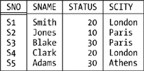
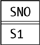
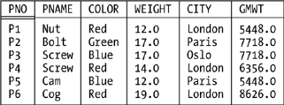
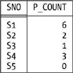
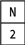
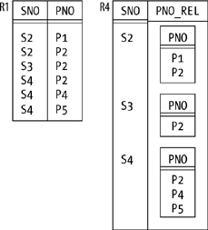

# Chapter Five. Relational Algebra

I'll begin this chapter by briefly reviewing a few important points from Chapter 1. First, I remind you that each algebraic `operator` takes at least one `relation` as input and produces another `relation` as output. Second, I remind you that the fact that the output is the same kind of thing as the input—they're all `relations`—is the _`closure`_ property of the algebra, and it's that property that lets us write nested `relational expressions`. Third, I gave outline descriptions in Chapter 1 of what I called "the original eight operators" (`restrict`, `project`, `product`, `intersect`, `union`, `difference`, `join`, and `divide`); now I want to define those operators, as well as a number of others, much more carefully. Before I can do so, however, I need to make a few general points:

- First, the operators are _`generic`_: they apply, in effect, to _`all possible relations`_. For example, we don't need one specific `join operator` to join employees and departments and another, different, `join operator` to join suppliers and shipments. (Incidentally, do you think an analogous observation applies to object-oriented systems?)
- Second, the operators are _`read-only`_: they "read" their operands and return a result, but they don't update anything. In other words, they operate on _`relations`_, not _`relvars`_.
- Of course, the previous point doesn't mean that `relational expressions` can't refer to `relvars`. For example, _`R`_ `UNION` _`S`_, where _`R`_ and _`S`_ are `relvar` names, is certainly a valid `relational expression` in **`Tutorial D`**. In the context of such an expression, however, a `relvar` name doesn't denote the corresponding `relvar` as such; rather, it denotes the `relation` that happens to be the current value of that `relvar` at that time. In other words, we can certainly use a `relvar` name to denote a `relation` operand, and such a _`relvar reference`_ thus constitutes a valid `relational expression`—but in principle we could equally well denote the very same operand by means of an appropriate `relation literal` instead. (An analogy might help clarify this point. Suppose N is a variable of type `INTEGER`, and at time _`t`_ it has the value 3. Then N+2 is certainly a valid expression, but at time _`t`_ it means exactly the same as 3+2, no more and no less.)
- Last, given that the operators of the algebra are all read-only, it follows that `INSERT`, `DELETE`, and `UPDATE` (and `relational assignment`), though they _`are`_ `relational operators`, aren't part of the algebra as such.

I also need to say something about the design of **`Tutorial D`**, because its support for the algebra differs in certain significant respects from that of `SQL` (perhaps it would be more accurate to say that its support for the algebra is—deliberately, of course—much more direct than that of `SQL`). The overriding point is that, in operations such as `UNION` or `JOIN` that need some correspondence to be established between operand `attributes`, **`Tutorial D`** does so by requiring the `attributes` in question _`to have the same names`_ (as well as, necessarily, the same types). For example, here's a **`Tutorial D`** expression for the `join` of parts and suppliers on cities:

```
P JOIN S
```

By definition, this `join` is performed on the basis of part and supplier cities, P and S having just the `CITY` `attribute` in common. Here by contrast is the same operation in `SQL` (note the last line in particular):

```
SELECT P.PNO, P.PNAME, P.COLOR, P.WEIGHT, P.CITY,
S.SNO, S.SNAME, S.STATUS
FROM   P,S
WHERE  P.CITY = S.CITY
```

_`Note`_: Actually, this example can be formulated in many different ways in `SQL`, and here are three more. As you'll observe, the second and third are a little closer to the spirit of **`Tutorial D`** (note in particular that the result of the `join` in those two formulations has a column called just CITY and _`no`_ columns called either S.CITY or P.CITY):

```
SELECT P.PNO, P.PNAME, P.COLOR, P.WEIGHT, P.CITY,
S.SNO, S.SNAME, S.STATUS
FROM   P JOIN S
ON   P.CITY = S.CITY
SELECT P.PNO, P.PNAME, P.COLOR, P.WEIGHT, CITY,
S.SNO, S.SNAME, S.STATUS
FROM   P JOIN S
USING  ( CITY )
SELECT P.PNO, P.PNAME, P.COLOR, P.WEIGHT, CITY,
S.SNO, S.SNAME, S.STATUS
FROM   P NATURAL JOIN S
```

I chose the particular formulation I did partly because it was the only one supported in `SQL` as originally defined and partly, and more importantly, because it allows me to make a number of additional points concerning differences between `SQL` and the algebra (at least as realized in **`Tutorial D`**):

- `SQL` permits (and sometimes requires) dot-qualified names. **`Tutorial D`** doesn't.
- **`Tutorial D`** sometimes needs to rename `attributes` in order to avoid what would otherwise be naming clashes or mismatches. `SQL` usually doesn't (though it does support an analog of the `RENAME operator` that **`Tutorial D`** uses for the purpose, as we'll see in the next section).
- Partly as a consequence of the previous point, **`Tutorial D`** has no need for `SQL`'s "correlation names" (in effect, it replaces `SQL`'s correlation-name concept by the idea that `attributes` occasionally need to be renamed in order to "disambiguate" what would otherwise be a syntactically invalid expression).
- In addition to either explicitly or implicitly supporting certain features of the `relational algebra`, `SQL` also explicitly supports certain features of the `relational calculus` (`EXISTS` is a case in point—see Appendix A). **`Tutorial D`** doesn't. One consequence of this difference is that `SQL` tends to be a rather redundant language, in that it often provides numerous different ways of formulating the same query (a fact that can have serious negative implications for the optimizer).
- `SQL` requires most queries to conform to its `SELECT - FROM - WHERE` template. **`Tutorial D`** has no analogous requirement. I'll have more to say on this particular issue in the section "Extend and Summarize," later in this chapter.

In what follows, I'll show most examples in both **`Tutorial D`** and `SQL`.

## More on Closure

When I say the output from each algebraic operation is another `relation`, I hope it's clear that I'm talking _`from a conceptual point of view`_. I don't mean the system actually has to materialize that output in its entirety. For example, consider the following expression (a `restriction` of a `join`—**`Tutorial D`** on the left, `SQL` on the right):

```
( P JOIN S )             |  SELECT P.*,
WHERE PNAME > SNAME   |     S.SNO, S.SNAME, S.STATUS
                      |  FROM   P, S
                      |  WHERE  P.CITY = S.CITY
                      |  AND  P.PNAME > S.SNAME
```

Clearly, as soon as a given `tuple` of the `join` is formed, the system can test that `tuple` right away against the `restriction` condition `PNAME > SNAME` (`P.PNAME > S.SNAME` in the `SQL` version) to see if it belongs in the final output and discard it if not. Thus, the intermediate result that's the output from the `join` might never exist as a fully materialized `relation` in its own right at all. (In fact, of course, the system tries very hard _`not`_ to materialize intermediate results in their entirety, for obvious performance reasons.)

The foregoing example raises another important point, however. Consider the `boolean expression` `PNAME > SNAME` in the **`Tutorial D`** version. That expression applies, conceptually, to the result of `P JOIN S`, and the `attribute` names `PNAME` and `SNAME` in that expression therefore refer to `attributes` of that result—_`not`_ to the `attributes` of those names in `relvars` P and S. But how do we know the result includes any such `attributes`? What _`is`_ the `heading` of that result? More generally, how do we know what the `heading` is for the result of _`any`_ algebraic operation? Clearly, what we need is a set of _`inference rules`_— to be more specific, _`relation type inference rules`_—such that if we know the type(s) of the input `relation`(s) for any given operation, we can infer the type of the output `relation` from that operation. In the case of `join`, for example, those rules say the output from `P JOIN S` is of this type:

```
RELATION { PNO PNO, PNAME NAME, COLOR COLOR, WEIGHT WEIGHT,
CITY CHAR, SNO SNO, SNAME NAME, STATUS INTEGER }
```

In fact, for `join`, the `heading` of the output is the _`union`_ of the `headings` of the inputs—where by _`union`_ I mean the regular set-theoretic union, not the special `relational union` I'll be discussing later in this chapter. In other words, the output has all of the `attributes` of the inputs, except that common `attributes`—just CITY in the example—appear once, not twice. Of course, those `attributes` don't have any left-to-right order, so I could equally well say that (for example) the type of the result of `P JOIN S` is this:

```
RELATION { SNO SNO, PNO PNO, SNAME NAME, PNAME NAME, CITY CHAR,
STATUS INTEGER, WEIGHT WEIGHT, COLOR COLOR }
```

Note that type inference rules of some kind are definitely needed in order to support the `closure` property fully. `Closure` says that every result is a `relation`, and `relations` have not just a `body` but also a `heading`; thus, every result must have a proper `relational heading` as well as a proper `relational body`.

The `RENAME operator` mentioned in this chapter's introduction is needed in large part to support the `relational model`'s type inference rules. `RENAME` takes one `relation` as input and returns another `relation` as output; the output `relation` is identical to the input `relation`, except that one of its `attributes` has a different name. For example (**`Tutorial D`** on the left and `SQL` on the right):

```
S RENAME ( CITY AS SCITY )  | SELECT S.SNO, S.SNAME, S.STATUS,
                            |        S.CITY AS SCITY
                            | FROM   S
```

Given our usual sample values, the result looks like this:

**Figure Five-1.**



(I won't usually bother to show results explicitly in this chapter unless I think the particular operator I'm talking about might be unfamiliar to you, as in the case at hand.)

> **Note**
>
> _`Important:`_ The foregoing example does _`not`_ change `relvar` S in the `database`! `RENAME` isn't like `SQL`'s `ALTER TABLE`; the `RENAME` invocation is only an expression (just as, for example, `P JOIN S` or N+2 are only expressions), and like any expression it simply denotes a certain value. What's more, of course, since it _`is`_ an expression, not a statement or "command," it can be nested inside other expressions. We'll see plenty of examples later.

So how does `SQL` handle this business of specifying result `attribute` names (or column names, rather)? The answer is: not very well. First of all, we saw in Chapter 3 that `SQL` doesn't really have a notion of "`relation type`" anyway (it has `row types` instead). Second, it can produce results with columns that effectively have no name at all (for example, consider `SELECT DISTINCT P.WEIGHT * 2 FROM P`). Third, it can also produce results with duplicate column names (for example, consider `SELECT DISTINCT P.CITY, S.CITY FROM P, S`). Finally, let's take another look at the example from the beginning of this section:

```
( P JOIN S )             |  SELECT P.*,
WHERE PNAME > SNAME   |     S.SNO, S.SNAME, S.STATUS
                      |  FROM   P, S
                      |  WHERE  P.CITY = S.CITY
                      |  AND  P.PNAME > S.SNAME
```

As you can see, the counterpart to **`Tutorial D`**'s `PNAME > SNAME` in the `SQL` version is `P.PNAME > S.SNAME`—which is curious, because that expression is supposed to apply to the result of the `FROM` clause, and `relvars` P and S certainly aren't part of that result! Indeed, it's quite difficult to explain how something like `P.PNAME` in the `WHERE` and `SELECT` clauses (and possibly elsewhere in the overall expression) can make any sense at all in terms of the result of the `FROM` clause. The `SQL standard` does explain it, but the machinations it has to go through in order to do so are _`much`_ more complicated than **`Tutorial D`**'s rules—so much so that I won't even try to explain them here, but will simply rely on the fact that they can be explained if necessary. I justify the omission by appealing to the fact that this book is supposed to be about the `relational model`, not `SQL`.

Now I'd like to go on to describe some other algebraic operators. Please note that I'm not trying to be exhaustive in what follows; I won't be covering "all known operators," and I won't even define all of the operators I do cover in full generality. In most cases, in fact, I'll just give a careful but somewhat informal definition and show some simple examples.

## The Original Operators

This section gives definitions for the original set of `relational operators` defined by Codd: `restrict`, `project`, `join`, `intersect`, `union`, `difference`, `product`, and `divide`.

### Restrict

Let _`bx`_ be a `boolean expression` involving zero or more `attribute` names, such that all of the `attributes` mentioned are `attributes` of the same `relation` _`r`_. Then the _`restriction`_ of _`r`_ according to _`bx`_:

```
r WHERE bx
```

is a `relation` with a `heading` the same as that of _`r`_ and a `body` consisting of all `tuples` of _`r`_ for which _`bx`_ evaluates to TRUE. For example:

```
S WHERE CITY = 'Paris'  | SELECT S.*
                        | FROM   S
                        | WHERE  S.CITY = 'Paris'
```

As an aside, I remark that `restrict` is sometimes called _`select;`_ I prefer not to use this term, however, because of the potential confusion with `SQL`'s `SELECT`.

### Project

Let `relation` _`r`_ have `attributes` _`X, Y,. . . , Z`_ (and possibly others). Then the _`projection`_ of _`r`_ on _`X, Y, . . . , Z`_:

```
r { X, Y, ..., Z }
```

is a `relation` with (a) a `heading` derived from the `heading` of _`r`_ by removing all `attributes` not mentioned in the set {_`X,Y, . . . ,Z`_} and (b) a `body` consisting of all `tuples` {_`X x,Y y, . . . ,Z z`_} such that a `tuple` appears in _`r`_ with _`X`_ value _`x, Y`_ value _`y, . . .`_., and _`Z`_ value _`z`_. For example:

```
S { SNAME, CITY, STATUS }  | SELECT DISTINCT S.SNAME,
                           |        S.CITY, S.STATUS
                           | FROM   S
```

To repeat, the result is a `relation`; thus, "duplicates are eliminated," to use the common phrase, and that `DISTINCT` in the `SQL` formulation is really needed, therefore.

By the way, **`Tutorial D`** also allows a `projection` to be expressed in terms of the `attributes` to be discarded instead of the ones to be kept. Thus, for example, the **`Tutorial D`** expressions:

```
S { SNAME, CITY, STATUS }
```

and:

```
S { ALL BUT SNO }
```

are equivalent. This feature can save a lot of writing (think of projecting a `relation` of degree 100 on 99 of its `attributes`). An analogous remark applies to `SUMMARIZE` (BY form only) and `GROUP` (see the later sections "Extend and Summarize" and "Group and Ungroup," respectively).

In concrete syntax, it turns out to be convenient to assign high precedence to the `projection operator`. In **`Tutorial D`**, for example, we take this expression:

```
S JOIN P { PNO, CITY }
```

to mean:

```
S JOIN ( P { PNO, CITY } )
```

and not:

```
( S JOIN P ) { PNO, CITY }
```

As an exercise, show the difference between these two interpretations, given our usual sample data.

### Join

Let `relations` _`r`_ and _`s`_ have `attributes` _`X1`_, _`X2`_, . . . , _`Xm`_, _`Y1`_, _`Y2`_, ..., _`Yn`_ and _`Y1`_, _`Y2`_, . . . , _`Yn`_, _`Z1`_, _`Z2`_, . . . , _`Zp`_, respectively; in other words, the _`Y`_'s (_`n`_ of them) are the common `attributes`, the _`X`_'s (_`m`_ of them) are the other `attributes` of _`r`_, and the _`Z`_'s (_`p`_ of them) are the other `attributes` of _`s`_. We can assume without loss of generality that none of the _`X`_'s has the same name as any of the _`Z`_'s, thanks to the availability of `RENAME`. Now let the _`X`_'s taken together be denoted just _`X`_, and similarly for the _`Y`_'s and the _`Z`_'s. Then the _`natural join`_ (_`join`_ for short) of _`r`_ and _`s:`_

```
r JOIN s
```

is a `relation` with (a) a `heading` that is the (set-theoretic) `union` of the `headings` of _`r`_ and _`s`_ and (b) a `body` consisting of the set of all `tuples` _`t`_ such that _`t`_ is the (set-theoretic) `union` of a `tuple` appearing in _`r`_ and a `tuple` appearing in _`s`_. In other words, the `heading` is {_`X,Y,Z`_} and the `body` consists of all `tuples` {_`X x,Y y,Z z`_} such that a `tuple` appears in _`r`_ with _`X`_ value _`x`_ and _`Y`_ value _`y`_ and a `tuple` appears in _`s`_ with _`Y`_ value _`y`_ and _`Z`_ value _`z`_. Here again is the example from the introductory section:

```
P JOIN S  | SELECT P.PNO, P.PNAME, P.COLOR, P.WEIGHT, P.CITY,
          |        S.SNO, S.SNAME, S.STATUS
          | FROM   P, S
          | WHERE  P.CITY = S.CITY
```

Now, I'm quite sure you were already familiar with what I've said so far regarding `join`, but you might not be so familiar with the following points. First of all, I remind you that the `SQL standard` allows the `join` of parts and suppliers on cities to be expressed in an alternative style that's a little closer to that of **`Tutorial D`** (and this time I deliberately replace that long list of column references in the `SELECT` clause by a simple "\*"):

```
SELECT *
FROM   P NATURAL JOIN S
```

However, not all `SQL` products actually support this syntax.

Second, and more important, _`intersection`_ is a special case of `join`. To be specific, if _`m`_ = _`p`_ = 0 (meaning there are no _`X`_'s and no _`Z`_'s, and _`r`_ and _`s`_ are thus of the same type), _`r`_ `JOIN` _`s`_ degenerates to _`r`_ `INTERSECT` _`s`_ (see the next subsection "Intersect").

Third (also important), _`cartesian product`_ is a special case of `join`, too: if _`n`_ = 0, meaning there are no _`Y`_'s and _`r`_ and _`s`_ thus have no common `attributes` at all, _`r`_ `JOIN` _`s`_ degenerates to _`r`_ `TIMES` _`s`_ (see the later subsection "Cartesian Product"). Why? Because (a) the set of `attributes` common to _`r`_ and _`s`_ in this case is the _`empty`_ set of `attributes`; (b) every possible `tuple` has the same value for the empty set of `attributes` (namely, the 0-`tuple`); thus, (c) every `tuple` in _`r`_ joins to every `tuple` in _`s`_, and so we get the `cartesian product` as stated.

Fourth, it turns out in practice that many queries that require `join` really require an extended form of that operator called _`semijoin`_. (You might not have heard of `semijoin` before, but in fact it's quite important.) Here's the definition: the _`semijoin`_ of _`r`_ with _`s`_ is the `join` of _`r`_ and _`s`_, projected back on to the `attributes` of _`r`_. By way of example, consider the query "Get suppliers who supply at least one part":

```
S SEMIJOIN SP  | SELECT DISTINCT S.*
               | FROM   S, SP
               | WHERE  S.SNO = SP.SNO
```

As you can see, this query can be thought of as asking for just those suppliers that match at least one shipment. **`Tutorial D`** therefore provides a more user-friendly spelling for `SEMIJOIN` that allows the query to be expressed thus:

```
S MATCHING SP
```

Now observe what happens to _`r`_ `JOIN` _`s`_ if _`p`_ = 0 (meaning the `heading` of _`s`_ is a subset of that of _`r--`_ equivalently, every `attribute` of _`s`_ is an `attribute` of _`r`_). As I hope you can see, _`r`_ `JOIN` _`s`_ degenerates to _`r`_ `MATCHING` _`s`_ in this case. Likewise, if _`m`_ = 0, _`r`_ `JOIN` _`s`_ degenerates to _`s`_ `MATCHING` _`r`_ (note that _`r`_ `MATCHING` _`s`_ and _`s`_ `MATCHING` _`r`_ are different, in general).

Fifth, `join` is fundamentally a _`dyadic`_ operator, meaning it takes two operands. However, it's possible, and useful, to support an _`n`_-adic or prefix version of the operator (and **`Tutorial D`** does), according to which we can write expressions of the form:

```
JOIN { r, s, ..., w }
```

to join any number of `relations` _`r, s, . . . ,w`_. For example, the `join` of parts and suppliers could alternatively be expressed as follows:

```
JOIN { P, S }
```

What's more, we can use this syntax to ask for "`joins`" of just a single `relation`, or even of no `relations` at all! The `join` of a single `relation`, `JOIN{`_`r`_`}`, is just _`r`_ itself; this case is perhaps not of much practical importance. Perhaps surprisingly, however, the `join` of no `relations` at all, `JOIN{}`, is very important indeed!—and the result is `TABLE_DEE`. (Recall that `TABLE_DEE` is the unique `relation` with no `attributes` and one `tuple`.) Why is the result `TABLE_DEE`? Well, consider the following:

- In ordinary arithmetic, 0 is the _`identity`_ with respect to "+"; that is, for all numbers _`x`_, the expressions _`x`_ + 0 and 0 + _`x`_ are both identically equal to _`x`_. As a consequence, _`the sum of no numbers is 0`_. (To see that this claim is reasonable, consider a piece of code that computes the sum of _`n`_ numbers by initializing the sum to 0 and then iterating over those _`n`_ numbers. What happens if _`n`_ = 0?)
- In like manner, 1 is the identity with respect to "_"; that is, for all numbers _`x`_, the expressions _`x`\* _ 1 and 1 _ _`x`_ are both identically equal to _`x`_. As a consequence, the product of no numbers is 1.
- In the `relational algebra`, _`TABLE_DEE is the identity with respect to JOIN;`_ that is, the `join` of any `relation` _`r`_ with `TABLE_DEE` is simply _`r`_. As a consequence, the `join` of no `relations` is `TABLE_DEE`.

If you're having difficulty with this idea, don't worry about it too much for now. But if you come back to reread this section later, I suggest you try to convince yourself then that _`r`_ `JOIN TABLE_DEE` and `TABLE_DEE JOIN `_`r`_ are indeed both identically equal to _`r`_. It might help if I point out that the `joins` in question are actually `cartesian products` (right?).

### Intersect

Let `relations` _`r`_ and _`s`_ be of the same type. Then the _`intersection`_ of those `relations`, _`r`_ `INTERSECT` _`s`_, is a `relation` of the same type, with a `body` consisting of all `tuples` _`t`_ such that _`t`_ appears in both _`r`_ and _`s`_. For example:

```
S { CITY }    | SELECT DISTINCT S.CITY
INTERSECT   | FROM   S
P { CITY }  | INTERSECT
            | SELECT DISTINCT P.CITY
            | FROM   P
```

(Actually we don't need those `DISTINCT`s in the `SQL` version, but I prefer to include them for explicitness. See the upcoming discussion of `union`.)

As we've already seen, `intersect` is really just a special case of `join`. **`Tutorial D`** and `SQL` both support it, however, if only for psychological reasons. **`Tutorial D`** also supports an _`n`_-adic or prefix form, but I'll skip the details here.

### Union

Again, let `relations` _`r`_ and _`s`_ be of the same type. Then the _`union`_ of those `relations`, _`r`_ `UNION` _`s`_, is a `relation` of the same type, with a `body` consisting of all `tuples` _`t`_ such that _`t`_ appears in _`r`_ or _`s`_ or both. For example:

```
S { CITY } UNION P { CITY }  | SELECT DISTINCT S.CITY
                             | FROM   S
                             | UNION  DISTINCT
                             | SELECT DISTINCT P.CITY
                             | FROM   P
```

As with `projection`, it's worth noting explicitly in connection with `union` that "duplicates are eliminated." In the `SQL` version, however, that `DISTINCT` after the keyword `UNION` is _`not`_ strictly needed; although `UNION` provides the same options as `SELECT` does (`DISTINCT` versus `ALL`), the default for `UNION` is `DISTINCT`, not `ALL`. (It's the other way around for `SELECT`, as you'll recall from Chapter 3.) As a consequence, the `DISTINCT`s following the two `SELECT`s aren't needed, either, though of course they're not wrong. Analogous remarks apply to `intersection` (also to `difference`, which we'll get to in a moment).

**`Tutorial D`** also supports _`disjoint union`_ (`D_UNION`), a version of `union` that requires its operands to be `disjoint`, which means they have no `tuples` in common. For example:

```
S { CITY } D_UNION P { CITY }
```

Given our usual sample data, this expression will produce a runtime error because supplier cities and part cities aren't `disjoint`. An `SQL` counterpart might look like this:

```
SELECT *
FROM ( SELECT S.CITY FROM S
UNION
SELECT P.CITY FROM P ) AS POINTLESS
WHERE  NOT EXISTS
( SELECT S.CITY FROM S
INTERSECT
SELECT P.CITY FROM P )
```

There's a difference, though: if supplier cities and part cities aren't `disjoint`, the `SQL expression` won't fail at run time, but will simply return an empty result. I should also mention that not all `SQL` products allow subqueries (as they're called) to be nested inside the `FROM` clause in the manner shown, though the `SQL standard` does.

> **Note**
>
> The correlation name _`POINTLESS`_ in the foregoing expression is indeed pointless—notice that it's never referenced!—but it's required by the standard's syntax rules.

**`Tutorial D`** also supports _`n`_-adic or prefix forms of both `UNION` and `D_UNION`. I'll skip the details here.

### Difference

Again let `relations` _`r`_ and _`s`_ be of the same type. Then the _`difference`_ between those `relations`, _`r`_ `MINUS` _`s`_ (in that order), is a `relation` of the same type, with a `body` consisting of all `tuples` _`t`_ such that _`t`_ appears in _`r`_ and not _`s`_. For example:

```
S { CITY } MINUS P { CITY }  | SELECT S.CITY
                             | FROM   S
                             | EXCEPT
                             | SELECT P.CITY
                             | FROM   P
```

Recall now that there's an operator related to `join` called `semijoin`. Well, it turns out there's a _`semidifference`_ operator, too, but in this case the operators aren't simply "related"—rather, regular `difference` is _`a special case`_ of `semidifference` ("all differences are semidifferences," you might say). And if `semijoin` is in some ways more important than `join`, a similar remark applies here also, but with even more force—in practice, most queries that require `difference` really require `semidifference`. Here's the definition: the _`semidifference`_ between _`r`_ and _`s`_ is the `difference` between _`r`_ and _`r`_ `MATCHING` _`s;`_ that is, _`r`_ `SEMIMINUS` _`s`_ is equivalent to _`r`_ `MINUS` (_`r`_ `MATCHING` _`s`_). By way of example, consider the query "Get suppliers who supply no parts at all":

```
S SEMIMINUS SP  | SELECT S.*
                | FROM   S
                | EXCEPT
                | SELECT S.*
                | FROM   S, SP
                | WHERE  S.SNO = SP.SNO
```

**`Tutorial D`** also provides a more user-friendly spelling that allows this query to be expressed thus:

```
S NOT MATCHING SP
```

To see that regular `difference` is a special case of `semidifference`, consider what happens if _`r`_ and _`s`_ are of the same type (I'll leave the details as an exercise).

### Cartesian Product

I include this operator mainly for completeness; as we've seen, it's really just a special case of `join`, and as a matter of fact **`Tutorial D`** doesn't support it directly—but let's suppose it did, just for the sake of discussion. Clearly, then, the operands must have no common `attribute` names (what would happen otherwise?), and the result `heading` is the set-theoretic `union` of the input `headings`. Here's an example:

```
( S RENAME ( CITY AS SCITY ) )
TIMES
( P RENAME ( CITY AS PCITY ) )
```

`SQL` analog:

```
SELECT S.SNO, S.SNAME, S.STATUS, S.CITY AS SCITY
P.PNO, P.PNAME, P.COLOR, P.WEIGHT, P.CITY AS PCITY
FROM   S, P
```

### Divide

As promised in the introduction to this chapter, I'll give a precise definition of this operator here, but for several reasons I don't want to discuss it in much detail. The most important of those reasons is that any query that can be formulated in terms of `divide` can alternatively, and I think more simply, be formulated in terms of _`relational comparisons`_ (I'll discuss `relational comparisons` later in this chapter). You might therefore want to skip the following discussion, at least on a first reading.

Another reason I don't want to get into too much detail is that there are several different "`divide`" operators anyway! That is, there are, unfortunately, several different operators all called "`divide,`" and I certainly don't want to explain all of them. Instead, I'll limit my attention here to the original and simplest one, which can be defined as follows. Let `relations` _`r`_ and _`s`_ be such that the `heading` of _`s`_ is a subset of the `heading` of _`r`_. Then the _`division`_ of _`r`_ by _`s, r`_ `DIVIDEBY` _`s`_, is shorthand for the following:

```
r { X } MINUS ( ( r { X } TIMES s ) MINUS r ) { X }
```

_`X`_ here is the (set-theoretic) difference between the `heading` of _`r`_ and that of _`s`_. Thus, for example, the expression:

```
SP { SNO, PNO } DIVIDEBY P { PNO }
```

(given our usual sample data values) yields:

**Figure Five-2.**



(loosely, supplier numbers for suppliers who supply all parts; I'll explain the reason for that qualifier "loosely" in the section "Relational Comparisons," later in this chapter). Here's an `SQL` analog:

```
SELECT DISTINCT SPX.SNO
FROM   SP AS SPX
WHERE  NOT EXISTS
( SELECT P.PNO
FROM   P
WHERE  NOT EXISTS
( SELECT SPY.SNO
FROM   SP AS SPY
WHERE  SPY.SNO = SPX.SNO
AND  SPY.PNO = P.PNO ) )
```

By the way, have you ever wondered why `divide` is called divide? The reason is that if _`r`_ and _`s`_ are `relations` with no common `attributes`, and we form the `cartesian product` _`r`_ `TIMES` _`s`_ and then divide the result by _`s`_, we get back to _`r;`_ in other words, `cartesian product` and `divide` are inverses of each other, in a sense.

### Which Operators Are Primitive?

As I've more or less said already, not all of the operators we've been discussing are primitive—several of them can be defined in terms of others. One possible primitive set (not the only one) is that consisting of `restrict`, `project`, `join`, `union`, and `semidifference`. _`Note:`_ You might be surprised not to see `rename` in this list. In fact, however, `rename` isn't primitive, though I haven't covered enough groundwork yet to show why not. What this example shows, however, is that there's a difference between being primitive and being useful! I certainly wouldn't want to be without our useful `rename` operator, even if it isn't primitive.

## Evaluating SQL Expressions

In addition to `natural join`, Codd originally defined an operator he called _`theta`_-join, where _`theta`_ denoted any of the usual scalar comparison operators ("=", "≠", "<", and so on). The operator isn't primitive; in fact, it's equivalent to a `restriction` of a `cartesian product`. Here by way of example is a **`Tutorial D`** formulation of the "`not equals`"-join of suppliers and parts on cities (so _`theta`_ here is "≠"):

```
( ( S RENAME ( CITY AS SCITY )
TIMES
( P RENAME ( CITY AS PCITY ) )
WHERE SCITY ≠ PCITY
```

Note that the result has two "`city`" `attributes`, SCITY and PCITY. An `SQL` analog:

```
SELECT S.SNO, S.SNAME, S.STATUS, S.CITY AS SCITY,
P.PNO, P.PNAME, P.COLOR, P.WEIGHT, P.CITY AS PCITY
FROM   S, P
WHERE  S.CITY <> P.CITY
```

We can think of this `SQL expression` as being implemented in three steps, as follows:

1. The `FROM` clause is executed and yields the `cartesian product` of tables S and P. (If we were doing this relationally, we would have to rename the city `attributes` _`before`_ that `cartesian product` is computed. `SQL` gets away with renaming them afterward because its tables have a left-to-right ordering to their columns, meaning it can distinguish the two city columns by their ordinal position. For simplicity, let's ignore this detail.)
2. Next, the `WHERE` clause is executed and yields a `restriction` of that `cartesian product` by eliminating rows in which the two city values are equal.
3. Finally, the `SELECT` clause is executed and yields a `projection` of that `restriction` on the columns specified in the `SELECT` clause. (Of course, the `SELECT` clause is doing some renaming as well in this particular example—and later we'll see that it also provides functionality similar to that of the `relational extend` operator. What's more, it generally doesn't eliminate duplicates, unless `DISTINCT` is specified. But I want to ignore all of these details too, for simplicity.)

At least to a first approximation, then, the `FROM` clause corresponds to a `cartesian product`, the `WHERE` clause to a `restriction`, and the `SELECT` clause to a `projection`, and the overall `SELECT - FROM - WHERE` expression represents a `projection` of a `restriction` of a `cartesian product`. It follows that I've just given a loose, but reasonably formal, definition of the _`semantics`_ of `SQL`'s `SELECT - FROM - WHERE` expressions; equivalently, I've given a _`conceptual algorithm`_ for evaluating such expressions. Of course, there's no implication that the implementation has to use exactly that algorithm in order to implement such expressions; _`au contraire`_, it can use any algorithm it likes, just so long as whatever algorithm it does use is guaranteed to give the same result as the conceptual one. And there are often good reasons—usually performance reasons—for using a different algorithm, thereby (for example) executing the clauses in a different order or otherwise rewriting the original query. However, the implementation is free to do such things _`only if it can be proved that the algorithm it does use is logically equivalent to the conceptual one`_. Indeed, one way to characterize the job of the system optimizer is to find an algorithm that's guaranteed to be equivalent to the conceptual one but performs better.

## Extend and Summarize

As you might have noticed, the algebra as I've described it so far has no conventional computational capabilities. Now, `SQL` does; for example, we can write queries along the lines of `SELECT A+B AS . . .` or `SELECT SUM(C) AS . . .` (and so on). However, as soon as we write that "+" or that SUM, we've gone beyond the bounds of the `relational algebra` as originally defined. So we need to add some new operators to the algebra in order to provide this kind of functionality. That's what `extend` and `summarize` are for. Loosely, `extend` supports computation "`across tuples,`" and `summarize` supports computation "`down attributes.`" Let's take a closer look.

### Extend

I'll start with an example, since this operator might be new to you. Suppose part weights are given in pounds, and we want to see those weights in grams. There are 454 grams to a pound, and so we can write:

```
EXTEND P ADD              | SELECT P.*,
( WEIGHT * 454 AS GMWT )  |    ( P.WEIGHT * 454 ) AS GMWT
                          | FROM   P
```

Given our usual sample values, the result looks like this:

**Figure Five-3.**



> **Note**
>
> _`Important:`_ `Relvar` P is _`not`_ changed in the `database`! `EXTEND` is _`not`_ an `SQL`-style `ALTER TABLE`; the `EXTEND expression` is just an expression, and like any expression it simply denotes a value.

To continue with the example, consider now the query "`Get part number and gram weight for parts with gram weight greater than 7000 grams.`" Here's a **`Tutorial D`** formulation:

```
( ( EXTEND P
ADD ( WEIGHT * 454 AS GMWT ) )
WHERE GMWT > 7000.0 ) { PNO, GMWT }
```

`SQL` analog:

```
SELECT P.*, ( P.WEIGHT * 454 ) AS GMWT
FROM   P
WHERE  ( P.WEIGHT * 454 ) > 7000.0
```

As you can see, the expression `P.WEIGHT * 454` appears twice in the `SQL` formulation, and we have to hope the implementation will be smart enough to recognize that it need evaluate that expression just once per `tuple` instead of twice. In **`Tutorial D`**, by contrast, the expression appears only once.

The problem this example illustrates is that `SQL`'s `SELECT - FROM - WHERE` template is simply too rigid. What we need to do, as the **`Tutorial D`** formulation makes clear, is perform a `restriction` of an `extension`; in `SQL` terms, we need to apply the `WHERE` clause to the result of the `SELECT` clause, as it were. But the `SELECT - FROM - WHERE` template forces the `WHERE` clause to apply to the result of the _`FROM`_ clause, not the `SELECT` clause. To put it another way: in many respects, it's the whole point of the algebra that (thanks to `closure`) `relational operations` can be combined in arbitrary ways; but `SQL`'s `SELECT - FROM - WHERE` template effectively means that queries _`must`_ be expressed as a `cartesian product`, followed by a `restrict`, followed by some combination of `project` and/or `extend` and/or `rename`—and many queries just don't fit this pattern.

Incidentally, you might be wondering why I didn't formulate the `SQL query` like this:

```
SELECT P.*, ( P.WEIGHT * 454 ) AS GMWT
FROM   P
WHERE  GMWT > 7000.0
```

(The change is in the last line.) The reason is that GMWT is the name of a column of _`the final result`_; table P has no such column, the `WHERE` clause thus makes no sense, and the expression fails on a syntax error.

Actually, the `SQL standard` does allow the query under discussion to be formulated in a style that's a little closer to that of **`Tutorial D`**:

```
SELECT TEMP.PNO, TEMP.GMWT
FROM ( SELECT P.PNO, ( P.WEIGHT * 454 ) AS GMWT
FROM P ) AS TEMP
WHERE  TEMP.GMWT > 7000.0
```

As noted earlier, however, not all `SQL` products allow nested subqueries to appear in the `FROM` clause in this manner.

Here now is a definition. Let _`r`_ be a `relation`. Then the _`extension:`_

```
EXTEND r ADD ( exp AS X )
```

is a `relation` with (a) `heading` equal to the `heading` of _`r`_ extended with `attribute` _`X`_, and (b) `body` consisting of all `tuples` _`t`_ such that _`t`_ is a `tuple` of _`r`_ extended with a value for `attribute` _`X`_ that is computed by evaluating _`exp`_ on that `tuple` of _`r`_. `Relation` _`r`_ must not have an `attribute` called _`X`_, and _`exp`_ must not refer to _`X`_. Observe that the result has `cardinality` equal to that of _`r`_ and `degree` equal to that of _`r`_ plus one. The type of _`X`_ in that result is the type of _`exp`_.

### Summarize

Again I'll start with an example (the query is "`For each supplier, get the supplier number and a count of the number of parts that supplier supplies`"):

```
SUMMARIZE SP PER ( S { SNO } ) ADD ( COUNT () AS P_COUNT )
```

Given our usual sample values, the result looks like this:

**Figure Five-4.**



Note the `tuple` for supplier S5 in particular; the PER specification indicates that the `summarizing` is to be done "`per the projection of S on SNO,`" which means it produces a result with five `tuples` (one for each `tuple` in that `projection`). By contrast, the following `SQL expression` (which might be thought to be equivalent to the **`Tutorial D`** formulation):

```
SELECT SP.SNO, COUNT(*) AS P_COUNT
FROM   SP
GROUP  BY SP.SNO
```

produces a result containing `tuples` for suppliers S1, S2, S3, and S4 only. The reason is, of course, that it extracts supplier numbers from SP, and supplier S5 doesn't appear in SP at all. An `SQL expression` that _`is`_ equivalent to the **`Tutorial D`** formulation is:

```
SELECT S.SNO, TEMP.P_COUNT
FROM   S, LATERAL ( SELECT COUNT(*) AS P_COUNT
FROM   SP
WHERE  SP.SNO = S.SNO ) AS TEMP
```

As I've already pointed out, however, not all `SQL` products support this kind of expression.

> **Note**
>
> The standard requires the keyword LATERAL here because the subquery refers "laterally" to another element in the same `FROM` clause.

Here now is the definition. Let _`r`_ and _`s`_ be `relations` such that _`s`_ is of the same type as some `projection` of _`r`_, and let the `attributes` of _`s`_ be _`A1, A2, . . ., An`_. Then the _`summarization:`_

```
SUMMARIZE r PER ( s ) ADD ( summary AS X )
```

is a `relation` with (a) `heading` equal to the `heading` of _`s`_ extended with `attribute` _`X`_, and (b) `body` consisting of all `tuples` _`t`_ such that _`t`_ is a `tuple` of _`s`_ extended with a value for `attribute` _`X`_. That _`X`_ value is computed by evaluating _`summary`_ over all `tuples` of _`r`_ that have the same value for `attributes` _`A1, A2, . . . , An`_ as `tuple` _`t`_ does. `Relation` _`s`_ must not have an `attribute` called _`X`_, and _`summary`_ must not refer to _`X`_. Observe that the result has `cardinality` equal to that of _`s`_ and `degree` equal to that of _`s`_ plus one. The type of _`X`_ in that result is the type of _`summary`_.

What "`summaries`" are supported? Well, the set is open-ended but certainly includes the usual `COUNT`, `SUM`, `AVG`, `MAX`, and `MIN`. Here's an example involving `MAX` and `MIN`:

```
SUMMARIZE SP PER ( SP { SNO } ) ADD ( MAX ( QTY ) AS MAXQ ,
MIN ( QTY ) AS MINQ )
```

This example illustrates two further points:

- It's possible to perform "`multiple summarizations`" within a single `SUMMARIZE`. (I didn't mention the point earlier, but analogous remarks apply to `RENAME` and `EXTEND` as well.)
- The PER operand in this example isn't just "`of the same type as`" some `projection` of the `relation` to be summarized, it actually is such a `projection`. In such cases the expression can be simplified slightly, as here:

```
SUMMARIZE SP BY { SNO } ADD ( MAX ( QTY ) AS MAXQ ,
MIN ( QTY ) AS MINQ )
```

Other legal "`summaries`" include `COUNTD`, `SUMD`, and `AVGD` (where "`D`" stands for "`distinct`" and means "`eliminate redundant duplicate values before summarizing`"); `AND`, `OR`, and `XOR` (for `attributes` of type `BOOLEAN`); `INTERSECT`, `UNION`, and `D_UNION` (for `relation-valued attributes`); and so on.

By the way, `COUNT` and the rest here are _`not`_ _`aggregate operators`_, though most of them do have the same names as `aggregate operators` (`SQL` confuses these two notions, with unfortunate results). An _`aggregate operator`_ invocation is a scalar expression, and it returns a scalar value. Here's an example:

```
VAR N INTEGER ;
N := COUNT ( S WHERE CITY = 'London' ) ;
```

`Summaries`, by contrast, are merely operands to `SUMMARIZE` invocations; they have no meaning outside that context, and in fact can't be used outside that context.

Here's one more `SUMMARIZE` example ("`How many suppliers are there in London?`"):

```
SUMMARIZE ( S WHERE CITY = 'London' ) ADD ( COUNT () AS N )
```

Again, this example illustrates two points:

- This `SUMMARIZE` has no PER specification. By default, therefore, the `summarizing` is done _`per TABLE_DEE—`_ that is, the expression shown is shorthand for:

```
SUMMARIZE ( S WHERE CITY = 'London' )
PER ( TABLE_DEE ) ADD ( COUNT () AS N )
```

I remind you again that `TABLE_DEE` is the `relation` that has no `attributes` and one `tuple` (and is thus certainly of the same type as "`some projection of`" every possible `relation`!—namely, the `projection` of the `relation` in question on the empty set of `attributes`). The output from this `SUMMARIZE` therefore has _`one`_ `attribute` and one `tuple`, and given our usual sample data values it looks like this:

**Figure Five-5.**



- I said a moment ago that `aggregate operator` invocations and `summaries` were different things, and you might be wondering what the difference is between the `SUMMARIZE` example under discussion and the `COUNT operator` invocation we saw a few paragraphs back:

```
COUNT ( S WHERE CITY = 'London' )
```

The overriding difference is, of course, that `SUMMARIZE` returns a `relation` and `aggregate operators` return a scalar. For further discussion, see Exercise 5-11 at the end of this chapter.

## Group and Ungroup

Recall from Chapter 2 that `relations` with _`relation-valued attributes`_ (`RVAs` for short) are legal. Figure 5-1 shows `relations` R1 and R4 from Figures 2-1 and 2-2 in that chapter; R4 has an `RVA` and R1 doesn't, but the two `relations` clearly convey the same information.

**Figure 5-1. Relations R1 and R4 from Figures 2-1 and 2-2 in Chapter 2**



Of course, we need a way to map between `relations` without `RVAs` and `relations` with them, and that's the purpose of the `GROUP` and `UNGROUP` operators. I don't want to go into a lot of detail on those operators here; let me just say that, given `relations` R1 and R4 as shown in Figure 5-1, respectively, the expression:

```
R1 GROUP ( { PNO } AS PNO_REL )
```

will produce R4, and the expression:

```
R4 UNGROUP ( PNO_REL )
```

will produce R1. `SQL` has no direct counterpart to these operators.

By the way: if R4 includes exactly one `tuple` for supplier number S _`x`_, say, and if the `PNO_REL value` in that `tuple` is empty, then the result of the foregoing `UNGROUP` will contain no `tuple` at all for supplier number S _`x`_. For further details, I refer you to my book _An Introduction to Database Systems_, Eighth Edition (Addison-Wesley, 2004) or the book _Databases, Types, and the Relational Model: The Third Manifesto_, Third Edition (Addison-Wesley, 2006), by Hugh Darwen and myself.

And by the way again: you might be wondering what operations on `relations` with `RVAs` look like. Well, operations on _`any`_ `relation`, when they refer to some `attribute` _`A`_ of that `relation` of type _`T`_, say, typically involve what we might call "`suboperations`" on values of that `attribute` _`A`_ that are, precisely, operations that have been defined in connection with that type _`T`_. So if _`T`_ is a `relation type`, those "`suboperations`" are operations that have been defined in connection with `relation types`—which is to say, they're essentially the `relational operations` (`join` and the rest) described in the present chapter! See Exercises 5-27 through 5-30 at the end of this chapter.

## Expression Transformation

I've now covered all of the algebraic operators I want to discuss in any detail, but there are some related topics that merit attention in this chapter. The first is the possibility of transforming a given `relational expression` into another, logically equivalent expression. I mentioned this possibility in Chapter 3, in the section "Why Duplicate Tuples Are Prohibited," where I explained that such transformations are one of the things the optimizer does; in fact, such transformations constitute one of the two great ideas at the heart of `relational optimization` (the other, beyond the scope of this book, is the use of "`database statistics`" to do what's called _`cost-based optimizing`_). In this section, I want to say a little more about the process of _`expression transformation`_ (or _`query rewrite`_, as it's sometimes called). I'll start with a trivial example. Consider the following expression (the query is "`Get suppliers who supply part P2, together with the corresponding quantities`"):

```
( ( S JOIN SP ) WHERE PNO = PNO('P2') ) { ALL BUT PNO }
```

Suppose there are 100 suppliers and 1,000,000 shipments, of which 500 are for part P2. If the expression is simply evaluated by brute force, as it were, without any optimization at all, the sequence of events is:

1. _`Join S and SP:`_ This step involves reading the 100 supplier `tuples`; reading the 1,000,000 shipment `tuples` 100 times each, once for each of the 100 suppliers; constructing an intermediate result consisting of 1,000,000 `tuples`; and writing those 1,000,000 `tuples` back out to the disk. (I'm assuming for simplicity that `tuples` are physically stored as such, and I'm also assuming I can take "`number of tuple I/O's`" as a reasonable measure of performance. Neither of these assumptions is realistic, but this fact doesn't materially affect my argument.)
2. _`Restrict the result of Step 1:`_ This step involves reading 1,000,000 `tuples` but produces a result containing only 500 `tuples`, which I'll assume can be kept in main memory.
3. _`Project the result of Step 2:`_ This step involves no `tuple I/O's` at all, so we can ignore it.

The following procedure is equivalent to the one just described, in the sense that it produces the same final result, but is obviously much more efficient:

1. _`Restrict SP to just the tuples for part P2:`_ This step involves reading 1,000,000 shipment `tuples` but produces a result containing only 500 `tuples`, which can be kept in main memory.
2. _`Join S and the result of Step 1:`_ This step involves reading 100 supplier `tuples` (once only, not once per P2 shipment, because all the P2 shipments are in memory). The result contains 500 `tuples` (still in main memory).
3. _`Project the result of Step 2:`_ Again we can ignore this step.

The first of these two procedures involves a total of 102,000,100 `tuple I/O's`, whereas the second involves only 1,000,100; thus, it's clear that the second procedure is over 100 times faster than the first. It's also clear that we'd like the implementation to use the second procedure rather than the first! If it does, then it is (in effect) transforming the original expression:

```
( S JOIN SP ) WHERE PNO = PNO('P2')
```

(I'm ignoring the final `projection` now, since it isn't really relevant to the argument) into the expression:

```
S JOIN ( SP WHERE PNO = PNO('P2') )
```

These two expressions are logically equivalent, but they have very different performance characteristics, as we've seen. If the system is presented with the first expression, therefore, we'd like it to transform it into the second before evaluating it—and of course it can. The point is that the `relational algebra`, being a high-level formalism, is subject to various formal _`transformation laws`_; for example, there's a law that says a `join` followed by a `restriction` can be transformed into a `restriction` followed by a `join` (I was using that particular law in the example). _`And a good optimizer will know those laws`_, and will apply them—because, of course, the performance of a query shouldn't depend on the specific syntax used to express that query in the first place. (Of course, it's an immediate consequence of the fact that not all of the algebraic operators are primitive that certain expressions can be transformed into others—for example, an expression involving `intersect` can be transformed into one involving `join` instead—but there's much more to it than that, as we'll quickly see.)

Now, there are many possible transformation laws, and this isn't the place for an exhaustive discussion. All I want to do is highlight a few important cases and key points. First, the law mentioned in the previous paragraph is actually a special case of a more general law, called the _`distributive`_ law. In general, the monadic operator _`f distributes`_ over the dyadic operator _`g`_ if _`f(g(a,b))`_ = _`g(f(a),f(b))`_ for all _`a`_ and _`b`_. In ordinary arithmetic, for example, SQRT (square root) distributes over multiplication, because:

```
SQRT ( a * b ) = SQRT ( a ) * SQRT ( b)
```

for all _`a`_ and _`b`_ (take _`f`_ as SQRT and _`g`_ as "_"); thus, a numeric expression optimizer can always replace either of these expressions by the other when doing numeric expression transformation. As a counterexample, SQRT does _`not`_ distribute over addition, because the square root of _`a+b`_ is not equal to the sum of the square roots of _`a`_ and _`b`\*, in general.

In `relational algebra`, `restrict` distributes over `intersect`, `union`, and `difference`. It also distributes over `join`, provided the `restriction` condition consists at its most complex of the AND of two separate conditions, one for each of the two `join` operands. In the case of the example discussed above, this requirement was satisfied—in fact, the `restriction` condition was very simple and applied to just one of the operands—and so we were able to use the distributive law to replace the expression with a more efficient equivalent. The net effect was that we were able to "`do the restriction early.`" Doing restrictions early is almost always a good idea, because it serves to reduce the number of `tuples` to be scanned in the next operation in sequence, and probably reduces the number of `tuples` in the output from that operation too.

Here are some other specific cases of the distributive law, this time involving `projection`. First, `project` distributes over `intersect` and `union`, though not `difference`. Second, it also distributes over `join`, so long as all of the joining `attributes` are included in the `projection`. These laws can be used to "`do projections early,`" which again is usually a good idea, for reasons similar to those given earlier for restrictions.

Two more important general laws are the laws of _`commutativity`_ and _`associativity`_:

- The dyadic operator _`g`_ is _`commutative`_ if _`g(a,b)`_ = _`g(b,a)`_ for all _`a`_ and _`b`_. In ordinary arithmetic, for example, addition and multiplication are commutative, but division and subtraction aren't. In `relational algebra`, `intersect`, `union`, and `join` are all commutative, but `difference` and `division` aren't. So, for example, if a query involves a `join` of two `relations` _`r`_ and _`s`_, the commutative law tells us it doesn't matter which of _`r`_ and _`s`_ is taken as the "`outer`" `relation` and which the "`inner.`" The system is therefore free to choose (say) the smaller `relation` as the "`outer`" one in computing the `join`.
- The dyadic operator _`g`_ is _`associative`_ if _`g(a,g(b,c))`_ = _`g(g(a,b),c)`_ for all _`a, b, c`_. In arithmetic, addition and multiplication are associative, but subtraction and division aren't. In `relational algebra`, `intersect`, `union`, and `join` are all associative, but `difference` and `division` aren't. So, for example, if a query involves a `join` of three `relations` _`r, s`_, and _`u`_, the associative and commutative laws together tell us we can join the `relations` pairwise in any order we like. (They also tell us it's legitimate to define an _`n`_-adic or prefix version of the operator, as **`Tutorial D`** does.) The system is thus free to decide which of the various possible sequences is most efficient.

Observe that all of these transformations can be performed without any regard for either actual data values or actual storage structures (indexes and the like) in the `database` as physically stored. In other words, such transformations represent optimizations that are virtually guaranteed to be good, regardless of what the `database` looks like physically.

## Relational Comparisons

In Chapter 2, I mentioned the fact that the equality comparison operator "`=`" applies to every type. In particular, therefore, it applies to _`relation`_ types; that is, given two `relations` _`r`_ and _`s`_ of the same `relation type` _`T`_, we must at least be able to test whether those two `relations` are equal. Other comparisons might be useful, too; for example, we might want to test whether _`r`_ is a subset of _`s`_ (meaning every `tuple` in _`r`_ is also in _`s`_), or whether _`r`_ is a _`proper`_ subset of _`s`_ (meaning every `tuple` in _`r`_ is also in _`s`_, but _`s`_ contains at least one `tuple` that isn't in _`r`_).

Now, I must immediately explain that these operators aren't `relational operators` as such—that is, they're not part of the `relational algebra`—because their result is a truth value, not a `relation`. But it's convenient to discuss them in this chapter, and I will. Here's a simple example:

```
S { CITY } = P { CITY }
```

The left comparand is the `projection` of suppliers on CITY, the right comparand is the `projection` of parts on CITY, and the comparison returns TRUE if these two projections are equal, FALSE otherwise. In other words, the comparison (which is, of course, a `boolean expression`) means: "`Is the set of supplier cities equal to the set of part cities?`"

Here's another example:

```
S { SNO } ⊃ SP { SNO }
```

_`Explanation:`_ The symbol "`⊃`" here means "`is a proper superset of.`" The meaning of this comparison (considerably paraphrased) is: "`Are there any suppliers who supply no parts at all?`"

Other useful `relational comparison operators` include "`⊇`" ("`is a superset of`"), "`⊆`" ("`is a subset of`"), and "`⊂`" ("`is a proper subset of`").

The obvious place where `relational comparisons` are useful is in connection with restrictions. Let's look at some examples. Consider first the query "`Get suppliers who supply all parts.`" Here's a possible formulation:

```
WITH ( SP RENAME ( SNO AS X ) ) AS R :
S WHERE ( R WHERE X = SNO ) { PNO } = P { PNO }
```

_`Explanation:`_ The expression WITH . . . AS R is effectively equivalent to an assignment that assigns the value of the expression `SP RENAME (SNO AS X)` to some temporary, system-generated `relvar` R; after that assignment, the value of R is a `relation` that's identical to the current value of `relvar` SP, except that `attribute` SNO has been renamed as X. (The purpose of introducing the names R and X is simply to avoid a naming conflict that would subsequently arise otherwise.) Then, for a given supplier S _`x`_, say, in `relvar` S, the expression:

```
( R WHERE X = SNO ) { PNO }
```

evaluates to a `relation` with one `attribute` (PNO), giving part numbers for all parts supplied by supplier S _`x`_. Note in particular that if supplier S _`x`_ supplies no parts, that `relation` will contain no `tuples`. Finally, that degree-one `relation` is tested for equality with the `relation` that's the `projection` of P on PNO. Clearly, that test will give TRUE if and only if the set of part numbers for parts supplied by S _`x`_ is equal to the set of part numbers in `relvar` P. The overall result thus contains precisely those `tuples` from `relvar` S that represent suppliers who supply all of the parts mentioned in `relvar` P.

Of course, we can write the entire query as a single expression if we like:

```
S WHERE ( ( SP RENAME ( SNO AS X ) ) WHERE X = SNO ) { PNO } = P { PNO }
```

But using WITH to introduce names for the results of subexpressions often helps to simplify the job of formulating complicated queries. Here's a definition: if _`rx`_ is a `relational expression` that mentions some `relvar` _`R`_, then WITH _`ry`_ AS _`R: rx`_, where _`ry`_ is another `relational expression`, is also a `relational expression`. Of course, _`rx`_ might be a WITH expression, too, like this:

```
WITH ry AS R1 : WITH rz AS R2 : rx
```

This latter expression can be abbreviated to just:

```
WITH ry AS R1, rz AS R2 : rx
```

We'll see plenty of examples of this abbreviated form later.

By the way, the foregoing example ("`Get suppliers who supply all parts`") is very similar to one that's often used to illustrate the use of the `relational divide operator`. To be specific, the expression:

```
SP { SNO, PNO } DIVIDEBY P { PNO }
```

(which I gave as an example of `divide` in the earlier section "The Original Operators") is often characterized as a `relational` formulation of the query "`Get supplier numbers for suppliers who supply all parts.`" But it isn't! Rather, it is a `relational` formulation of the query "`Get supplier numbers for suppliers who *supply at least one part and in fact* supply all parts.`" (If you're wondering what the logical difference is here, see Exercise 5-25 at the end of this chapter.) In my opinion, the formulation involving a `relational comparison` is not only easier to understand than the `divide` formulation—it also has the advantage of being _`correct`_.

Here's another example. The query is: "`Get pairs of supplier numbers, S x and S y say, such that S x and S y supply exactly the same set of parts each.`" This query is very difficult without `relational comparisons`! Here it is:

```
WITH ( SP RENAME ( SNO AS SX ) ) { SX, PNO } AS R1 ,
( SP RENAME ( SNO AS SY ) ) { SY, PNO } AS R2 ,
R1 { SX } AS R3 ,
R2 { SY } AS R4 ,
( R1 JOIN R4 ) AS R5 ,
( R2 JOIN R3 ) AS R6 ,
( R1 JOIN R2 ) AS R7 ,
( R3 JOIN R4 ) AS R8 ,
SP { PNO } AS R9 ,
( R8 JOIN R9 ) AS R10 ,
( R10 MINUS R7 ) AS R11 ,
( R6 JOIN R11 ) AS R12 ,
( R5 JOIN R11 ) AS R13 ,
R12 { SX, SY } AS R14 ,
R13 { SX, SY } AS R15 ,
( R14 UNION R15 ) AS R16 ,
R7 { SX, SY } AS R17 :
R17 MINUS R16
```

But with `relational comparisons` it's fairly straightforward:

```
WITH ( S RENAME ( SNO AS SX ) ) { SX } AS RX ,
( S RENAME ( SNO AS SY ) ) { SY } AS RY :
( RX JOIN RY ) WHERE ( SP WHERE SNO = SX ) { PNO } =
( SP WHERE SNO = SY ) { PNO }
```

As an aside, I remark that appending "`AND SX < SY`" to the `WHERE` clause here would produce a slightly tidier result; to be specific, it would (a) eliminate pairs of the form (S _`x`_,S _`x`_) and (b) ensure that the pairs (S _`x`_,S _`y`_) and (S _`y`_,S _`x`_) don't both appear.

One particular comparison that's often needed in practice is an "`=`" comparison between a given `relation` _`r`_ and an empty `relation` of the same type—in other words, a test to see whether _`r`_ is empty. So let me introduce the following shorthand:

```
IS_EMPTY ( rx )
```

This expression is defined to return TRUE if the `relation` _`r`_ denoted by the `relational expression` _`rx`_ is empty and FALSE otherwise. I'll be relying heavily on this construct in the next chapter.

Another common requirement is to be able to test whether a given `tuple` _`t`_ appears in a given `relation` _`r:`_

```
t
∊
rx
```

This expression is defined to be shorthand for the `relational comparison`:

```
RELATION { t } ⊆ rx
```

The left operand here is a `relation selector` invocation, and it returns a `relation` containing just the specified `tuple` _`t`_. The comparison thus returns TRUE if _`t`_ appears in the `relation` _`r`_ denoted by the `relational expression` _`rx`_ and FALSE otherwise ("`∊`" is the _`set membership`_ operator; the expression _`t`_ ∊ _`r`_ can be read as "_`t`_[appears] in _`r`_"). In fact, as you've probably realized, the "`∊`" operator is essentially `SQL`'s `IN` operator—except that the left operand of `SQL`'s `IN` is usually a scalar, not a row, which means there's some kind of coercion going on. Be that as it may, `SQL` certainly doesn't support any `relational comparisons` apart from this rather special one. (Well, it does support `NOT IN`; so does **`Tutorial D`**, in the form of "`∉`".)

## More on Relational Assignment

The assignment operator "`:=`" resembles the equality comparison operator "`=`" in that it applies to every type, and `relation types` are no exception. `Relational assignment` in particular resembles "`=`" and the other comparison operators from the previous section in another respect as well: it isn't part of the `relational algebra`. Why not? Because its target must be, very specifically, a `relvar`, not a `relation` (`relvars` aren't part of the `relational algebra` either—there's no notion of updating in the `relational algebra` as such, and "`variable`" _`means`_ "`updatable`"). Nevertheless, I want to say a little more about _`relational assignment`_ in this chapter; to be specific, I want to examine the `INSERT`, `DELETE`, and `UPDATE` shorthands a little more closely. As you know, these operators _`are`_ just shorthand for certain `relational assignments`—but now I'm in a position to explain just what the "`longhand`" versions look like, in terms of appropriate algebraic operators. I'll do this by showing some simple examples.

First, `relational assignment` in general looks like this:

```
R := rx
```

_`R`_ here is a `relvar` and _`rx`_ is a `relational expression` of the same type as _`R`_. The effect is to assign the `relation` _`r`_ that's denoted by the expression _`rx`_ to the `relvar` _`R`_ (and I remind you from the exercises in Chapter 2 that after the assignment, the boolean expression _`R`_ = _`r`_ is required to evaluate to TRUE: _`The Assignment Principle`_). Here's a simple example:

```
S := RELATION { TUPLE { SNO SNO('S1'), SNAME NAME('Smith'),
STATUS 20, CITY 'London' } ,
TUPLE { SNO SNO('S2'), SNAME NAME('Jones'),
STATUS 10, CITY 'Paris'  } ,
TUPLE { SNO SNO('S3'), SNAME NAME('Blake'),
STATUS 30, CITY 'Paris'  } ,
TUPLE { SNO SNO('S4'), SNAME NAME('Clark'),
STATUS 20, CITY 'London' } ,
TUPLE { SNO SNO('S5'), SNAME NAME('Adams'),
STATUS 30, CITY 'Athens' } } ;
```

(As we saw in Chapter 3, the expression on the right here is another `relation selector` invocation; in fact, it's a `relation literal`.)

Now I can turn to `INSERT`, `DELETE`, and `UPDATE`. Let `relvar` PQ be defined as follows:

```
VAR PQ BASE RELATION { PNO PNO, QTY QTY } KEY { PNO } ;
```

Here's a possible `INSERT` on this `relvar`:

```
INSERT PQ ( SUMMARIZE SP PER ( P { PNO } )
ADD ( SUM ( QTY ) AS QTY ) ) ;
```

And here's the "`longhand`" assignment equivalent:

```
PQ := PQ UNION ( SUMMARIZE SP PER ( P { PNO } )
ADD ( SUM ( QTY ) AS QTY ) ) ;
```

In other words, the `INSERT` works by forming the `union`, _`pq`_ say, of the old value of `relvar` PQ and the `relation` denoted by the `SUMMARIZE` invocation, and then assigning that `relation` _`pq`_ to `relvar` PQ. (By the way, I'm assuming here that it's not an error to insert a `tuple` that already exists in the target. If it is, that `UNION` in the expansion should be replaced by `D_UNION`.)

Next, a `DELETE` example:

```
DELETE S WHERE CITY = 'Athens' ;
```

Longhand equivalent:

```
S := S WHERE NOT ( CITY = 'Athens' ) ;
```

Finally, an `UPDATE` example:

```
UPDATE P WHERE CITY = 'London'
( WEIGHT := 2 * WEIGHT , CITY := 'Oslo' ) ;
```

Longhand equivalent:

```
P := WITH ( P WHERE CITY = 'London' ) AS R1 ,
( EXTEND R1 ADD ( 2 * WEIGHT AS NEW_WEIGHT,
'Oslo' AS NEW_CITY ) ) AS R2 ,
R2 { ALL BUT WEIGHT, CITY } AS R3,
R3 RENAME { NEW_WEIGHT AS WEIGHT, NEW_CITY AS CITY } AS R4,
P MINUS R1 AS R5 :
R5 UNION R4;
```

This one needs a little more explanation. First, R1 is the set of `tuples` to be updated (loosely speaking—see the section Chapter 4). Next, we extend each `tuple` in R1 with the applicable new WEIGHT and CITY values; that's R2. Then we throw away the old WEIGHT and CITY values (that's R3). Finally, we rename NEW_WEIGHT and NEW_CITY as WEIGHT and CITY, respectively (that's R4); then we identify the set of `tuples` not to be updated (that's R5), and assign the `union` of R5 and R4 to `relvar` P. Notice the use of the "`multiple`" forms of `EXTEND` and `RENAME` in this example.

## The ORDER BY Operator

The last topic I want to address in this chapter is `ORDER BY`. `ORDER BY` is yet another operator that's not part of the `relational algebra`; as I pointed out in Chapter 1, in fact, it isn't a `relational operator` at all, because it produces a result that isn't a `relation` (it does take a `relation` as input, but it produces something else—namely, a _`sequence of tuples`_— as output). Of course, I'm not saying `ORDER BY` isn't useful; however, I _`am`_ saying it can't legally or sensibly appear in a `relational expression`. By definition, therefore, the following expressions, though legal, aren't `relational expressions` as such:

```
S MATCHING SP        | SELECT DISTINCT S.*
ORDER ( ASC SNO )  | FROM   S, SP
                   | WHERE  S.SNO = SP.SNO
                   | ORDER  BY S.SNO ASC
```

That said, I'd like to point out that for a couple of reasons `ORDER BY` (just ORDER, in **`Tutorial D`**) is actually a rather strange operator. First, it effectively works by sorting `tuples` into some specified sequence—and yet "`<`" and "`>`" aren't defined for `tuples` (see Exercise 3-11 in Chapter 3). Second, it's not a _`function`_. All of the operators of the `relational algebra`—in fact, all read-only operators, in the usual sense of that term—_`are`_ functions, meaning there's always just one possible output for any given input. By contrast, `ORDER BY` can produce several different outputs from the same input. As an illustration of this point, consider the effect of the operation `ORDER BY CITY` on our usual suppliers `relation`. Clearly, this operation can return any of four distinct results, corresponding to the following sequences (I'll show just the supplier numbers, for simplicity):

```
S5, S1, S4, S2, S3
S5, S4, S1, S2, S3
S5, S1, S4, S3, S2
S5, S4, S1, S3, S2
```

_`A note on SQL:`_ It would be remiss of me not to mention in passing that most of the algebraic operators have analogs in `SQL` that also aren't functions. This state of affairs is due to the fact that, as indicated in the exercises in Chapter 2, `SQL` allows the comparison _`v1`_ = _`v2`_ to evaluate to TRUE even if _`v1`_ and _`v2`_ are distinct. For example, consider the character strings 'Paris' and 'Paris ' (note the trailing space in the latter); these values are clearly distinct, and yet `SQL` sometimes regards them as equal. As a consequence, certain queries give what the standard calls "`possibly nondeterministic results.`" Here's a simple example:

```
SELECT DISTINCT S.CITY FROM S
```

If one supplier has CITY value 'Paris' and Paris 'another ' (wait, the text says 'Paris' and 'Paris ' respectively), then the result will include either or both of 'Paris' and 'Paris ', but which result we get might be undefined. We could even legitimately get one result on one day and another on another, even if the `database` hasn't changed at all in the interim. You might like to meditate on some of the implications of this state of affairs.

## Summary

Almost inevitably, this has been the longest chapter in the book. Even so, I haven't covered "`all known`" algebraic operators, nor have I explained every last detail of the ones I did cover; but I hope I _`have`_ covered enough to give you a good sense of what the algebra is all about. To review briefly, here's a list of the operators I did discuss: `rename`, `restrict`, `project` (including the `ALL BUT` form), `join`, `semijoin` (`MATCHING`), `intersection`, `union`, `disjoint union` (`D_UNION`), `difference`, `semidifference` (`NOT MATCHING`), `product`, `divide`, `theta-join` (including `equijoin`), `extend`, `summarize`, `group`, and `ungroup`. I also discussed certain nonalgebraic operators: `relational comparisons`, `INSERT`, `DELETE`, and `UPDATE` (and `relational assignment`), and `ORDER BY`. Other topics I covered include:

- _`Closure:`_ I explained the need for a set of `relation type inference rules`, so that we always know the type of the result of any given `relational expression`.
- _`Primitive operators:`_ I showed that many of the operators are in fact shorthand for certain combinations of others. In particular, `intersect` and `product` are special cases of `join`, and `difference` is a special case of `semidifference`.
- _`Join:`_ I also showed that—thanks to the fact that `join` is both commutative and associative—it was possible to define an _`n`_-adic or prefix version of the operator (where _`n`_ is any integer greater than or equal to zero). The `join` of no `relations` at all is `TABLE_DEE`.
- _`SQL expressions:`_ I gave a conceptual algorithm for evaluating `SQL SELECT - FROM - WHERE` expressions. I also suggested that the `SELECT - FROM - WHERE` template is sometimes too rigid.
- _`Summaries versus aggregate operators:`_ I stressed the point (without getting into too much detail) that these are logically distinct constructs.
- _`Expression transformation:`_ I briefly explained the distributive, commutative, and associative laws and described their role in optimization ("`query rewrite`").
- _`WITH:`_ I discussed the use of WITH in simplifying expression formulation by allowing names to be introduced for the results of subexpressions.

## Exercises

### Exercise 5-1.

From a `relational` perspective, what's wrong (if anything) with the following `SQL expressions`?

```
a. SELECT * FROM S, SP
b. SELECT S.SNO, S.CITY FROM S
c. SELECT SP.SNO, SP.PNO, 2 * SP.QTY FROM SP
d. SELECT P.PNO FROM P
e. SELECT S.SNO FROM S, SP
f. SELECT S.SNO FROM S ORDER BY S.CITY DESC
```

### Exercise 5-2.

`Closure` is important in the `relational model` for the same kind of reason that numeric closure is important in ordinary arithmetic. In arithmetic, however, there's one situation where the `closure` property breaks down, in a sense—namely, division by zero. Is there any analogous situation in the `relational algebra`?

### Exercise 5-3.

Given the usual suppliers-and-parts `database`, what's the value of the expression `JOIN{S,SP,P}`? What's the corresponding `predicate`? _`Warning:`_ There's a trap here; in fact, some might even argue that the trap is such that it makes `join` (as I've defined it in the body of this chapter) a rather dangerous operation. What do you think of that argument?

### Exercise 5-4.

Why do you think the `project operator` is so called?

### Exercise 5-5.

Given our usual sample values for the suppliers-and-parts `database`, what values do the following expressions denote? In each case, give an informal interpretation of the expression in natural language.

```
a. S SEMIJOIN ( SP WHERE PNO = PNO('P2') )
b. P NOT MATCHING ( SP WHERE SNO = SNO('S2') )
c. S { CITY } MINUS P { CITY }
d. ( S { SNO, CITY } JOIN P { PNO, CITY } ) { ALL BUT CITY }
e. JOIN { ( S RENAME ( CITY AS SC ) ) { SC } ,
( P RENAME ( CITY AS PC ) ) { PC } }
```

### Exercise 5-6.

`Union`, `intersection`, `product`, and `join` are all both commutative and associative. Verify these claims. Also verify that `semijoin` is associative but not commutative.

### Exercise 5-7.

In what circumstances (if any) are _`r`_ `SEMIJOIN` _`s`_ and _`s`_ `SEMIJOIN` _`r`_ equivalent?

### Exercise 5-8.

Which of the algebraic operators (if any) have a definition that doesn't rely on `tuple equality`?

### Exercise 5-9.

The `SQL FROM` clause `FROM t1, t2, . . . , tn` (where each _`ti`_ is an expression denoting a `table`) returns the `cartesian product` of its arguments. But what if _`n`_ = 1? What's the `cartesian product` of just one `table`? And by the way, what's the product of _`t1`_ and _`t2`_ if _`t1`_ and _`t2`_ both contain duplicate rows?

### Exercise 5-10.

Show that `rename` isn't primitive.

### Exercise 5-11.

Distinguish between a "`summary`" and an `aggregate operator`. What do the `SQL` analogs of these constructs look like?

### Exercise 5-12.

Give an expression involving `EXTEND` instead of `SUMMARIZE` that's logically equivalent to the following:

```
SUMMARIZE SP PER ( S { SNO } ) ADD ( COUNT () AS NP )
```

### Exercise 5-13.

Given our usual sample values for the suppliers-and-parts `database`, what values do the following expressions denote? In each case, give an informal interpretation of the expression in natural language.

```
a. EXTEND S ADD ( 'Supplier' AS TAG )
b. EXTEND ( P JOIN SP ) ADD ( WEIGHT * QTY AS SHIPWT )
c. EXTEND P ADD ( WEIGHT * 454 AS GMWT, WEIGHT * 16 AS OZWT )
d. EXTEND S
ADD ( COUNT ( ( SP RENAME ( SNO AS X ) ) WHERE X = SNO )
AS NP )
e. SUMMARIZE S BY { CITY } ADD ( AVG ( STATUS ) AS AVG_STATUS )
```

### Exercise 5-14.

Which of the following expressions are equivalent?

```
a. SUMMARIZE r PER ( r { } ) ADD ( COUNT () AS CT )
b. SUMMARIZE r ADD ( COUNT () AS CT )
c. SUMMARIZE r BY { } ADD ( COUNT () AS CT )
d. EXTEND TABLE_DEE ADD ( COUNT ( r ) AS CT )
```

### Exercise 5-15.

Simplifying just slightly, an `aggregate operator` invocation in **`Tutorial D`** takes the form:

```
<agg op name> ( <relation exp> [, <attribute name> ] )
```

If the _`<agg op name>`_ is `COUNT`, the _`<attribute name>`_ is irrelevant and must be omitted; otherwise, it can be omitted if and only if the _`<relation exp>`_ denotes a `relation` of degree one, in which case the sole `attribute` of the result of that _`<relation exp>`_ is assumed by default. Here are a couple of examples:

```
SUM ( SP WHERE SNO = SNO('S1'), QTY )
SUM ( ( SP WHERE SNO = SNO('S1') ) { QTY } )
```

Note the difference between these two expressions: the first gives the total of _`all`_ shipment quantities for supplier S1, and the second gives the total of all _`distinct`_ shipment quantities for supplier S1. How does the scheme just outlined differ from its `SQL` counterpart?

### Exercise 5-16.

In **`Tutorial D`**, if the argument to an `aggregate operator` invocation happens to be an empty set, `COUNT` returns zero and so does `SUM`; `MAX` and `MIN` return, respectively, the lowest and the highest value of the applicable type; `AND` and `OR` return TRUE and FALSE, respectively; and `AVG` raises an exception (I ignore **`Tutorial D`**'s other `aggregate operators` here deliberately). What does `SQL` do in these circumstances and why?

### Exercise 5-17.

Let `relation` R4 from Figure 5-1 denote the current value of some `relvar` _`R`_. If R4 has the meaning described in Chapter 2, give the `predicate` for that `relvar` _`R`_.

### Exercise 5-18.

Let _`r`_ be the `relation` denoted by the following expression:

```
SP GROUP ( { } AS X )
```

What does _`r`_ look like, given our usual sample value for SP? Also, what does the following expression yield?

```
r UNGROUP ( X )
```

### Exercise 5-19.

Without using the `IS_EMPTY` shorthand, write a **`Tutorial D`** expression that returns TRUE if the current value of the parts `relvar` P is empty and FALSE otherwise. Also show an `SQL` analog of that expression.

### Exercise 5-20.

Write **`Tutorial D`** and/or `SQL` expressions for the following queries on the suppliers-and-parts `database`:

1. Get all shipments.
2. Get supplier numbers for suppliers who supply part P1.
3. Get suppliers with status in the range 15 to 25 inclusive.
4. Get part numbers for parts supplied by a supplier in London.
5. Get part numbers for parts not supplied by any supplier in London.
6. Get city names for cities in which at least two suppliers are located.
7. Get all pairs of part numbers such that some supplier supplies both of the indicated parts.
8. Get the total number of parts supplied by supplier S1.
9. Get supplier numbers for suppliers with a status lower than that of supplier S1.
10. Get supplier numbers for suppliers whose city is first in the alphabetic list of such cities.
11. Get part numbers for parts supplied by all suppliers in London.
12. Get supplier-number/part-number pairs such that the indicated supplier does not supply the indicated part.
13. Get suppliers who supply at least all parts supplied by supplier S2.
14. Get supplier numbers for suppliers who supply at least all parts supplied by at least one supplier who supplies at least one London part.

### Exercise 5-21.

Prove the following statements (making them more precise, where necessary):

1. A sequence of restrictions against a given `relation` can be transformed into a single restriction.
2. A sequence of projections against a given `relation` can be transformed into a single projection.
3. A restriction of a projection can be transformed into a projection of a restriction.

### Exercise 5-22.

`Union` is said to be _`idempotent`_, because _`r`_ `UNION` _`r`_ is identically equal to _`r`_ for all _`r`_. (Is this true in `SQL`?) As you might expect, idempotence can be useful in expression transformation. Which other `relational operators` (if any) are idempotent?

### Exercise 5-23.

Let _`r`_ be a `relation`. What does the expression _`r`_{ } mean? What does it return?

### Exercise 5-24.

The following boolean expression:

```
x > y AND y > 3
```

(which might be part of a query) is clearly equivalent to—and can therefore be transformed into—the following:

```
x > y AND y > 3 AND x > 3
```

The equivalence is based on the fact that the comparison operator "`>`" is _`transitive`_. The transformation is worth making if _`x`_ and _`y`_ are from different `relations`, because it enables the system to perform an additional restriction (using _`x`_ > 3) before doing the greater-than join implied by _`x`_ > _`y`_. As we saw in the body of the chapter, doing restrictions early is generally a good idea; having the system _`infer`_ additional "`early`" restrictions, as here, is also a good idea. Do you know of any commercial products that actually perform this kind of optimization?

### Exercise 5-25.

Consider the following expressions:

```
a. WITH ( P WHERE COLOR = 'Purple' ) AS PP ,
( SP RENAME ( SNO AS X ) ) AS T :
S WHERE ( T WHERE X = SNO ) { PNO } ⊇ PP { PNO }
b. WITH ( P WHERE COLOR = 'Purple' ) AS PP :
S JOIN ( SP { SNO, PNO } DIVIDEBY PP { PNO } )
```

These are both attempts at formulating the query "`Get suppliers who supply every purple part.`" Given our usual sample data values, show the result returned in each case. Which result (and which formulation), if either, do you regard as correct? Justify your answer.

### Exercise 5-26.

Consider the restriction _`r`_ `WHERE` _`bx`_. In the body of the chapter, I said that every `attribute` mentioned in the `restriction` condition _`bx`_ must be an `attribute` of _`r`_, but I also mentioned that _`bx`_ was subject to certain further limitations. One of those limitations is that, strictly speaking, _`bx`_ is supposed to consist of just a single term of the form _`x Op y`_, where each of _`x`_ and _`y`_ is either an `attribute` of _`r`_ or a literal and _`Op`_ is a comparison operator that makes sense for _`x`_ and _`y`_. But a real language will allow `WHERE` clauses to contain `boolean expressions` of arbitrary complexity, just as long as the only "`free variables`" (see Appendix A) in that expression are `attributes` of _`r`_. Show that it's legitimate to extend the definition of `restrict` in such ways—that is, show that such extensions are really just shorthand for something we already know is legitimate.

### Exercise 5-27.

Here are two simple expressions involving `relation` R4 from Figure 5-1 in the body of the chapter. What queries do they represent?

```
( R4 WHERE TUPLE { PNO PNO('P2') } ∈ PNO_REL ) { SNO }
( ( R4 WHERE SNO = SNO('S2') ) UNGROUP ( PNO_REL ) ) { PNO }
```

### Exercise 5-28.

Given our usual sample values for the suppliers-and-parts `database`, what does the following expression denote?

```
EXTEND S
ADD ( ( ( SP RENAME ( SNO AS X ) ) WHERE X = SNO ) { PNO }
AS PNO_REL )
```

### Exercise 5-29.

Let the `relation` returned by the expression in the previous exercise be kept as a `relvar` called SSP. What do the following updates do?

```
INSERT SSP RELATION
{ TUPLE { SNO SNO('S6'),
PNO_REL RELATION { TUPLE { PNO PNO('P5') } } } } ;
UPDATE SSP WHERE SNO = SNO('S2')
( INSERT PNO_REL RELATION { TUPLE { PNO PNO('P5') } } ) ;
```

### Exercise 5-30.

Using `relvar` SSP from the previous exercise, write expressions for the following queries:

- Get pairs of supplier numbers for suppliers who supply exactly the same set of parts.
- Get pairs of part numbers for parts supplied by exactly the same set of suppliers.

### Exercise 5-31.

A _`quota query`_ is a query that specifies a desired limit, or quota, on the `cardinality` of the result: for example, the query "`Get the three heaviest parts,`" for which the specified quota is three. Give **`Tutorial D`** and `SQL` formulations of this query.

---

_(Footnotes have been preserved in structure but stripped of `<a>` tags as requested.)_
