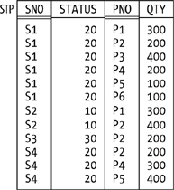
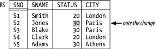
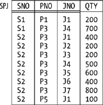
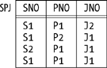
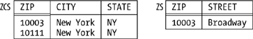
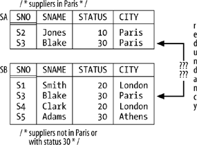
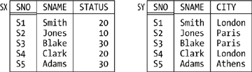
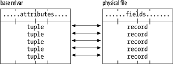
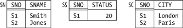

# 第七章 数据库设计理论

**数据独立性的目标直接意味着逻辑和物理**数据库设计是不同的学科：逻辑设计关注数据库对用户呈现的样子，而物理设计关注逻辑设计如何映射到物理存储。本章的主要重点是逻辑设计，在进一步说明之前，我将使用不加限定的术语*设计*特指逻辑设计。

我首先要强调的一点是：回想一下，`relvar` _R_ 的"那个"`relvar` 约束可以看作是系统对 _R_ 的 `predicate` 的近似；也要回想一下，_R_ 的 `predicate` 是 _R_ 的预期解释或含义。由此可知，`constraints` 和 `predicates` 与逻辑设计业务高度相关！事实上，逻辑设计本质上正是尽可能仔细地确定 predicates，然后将这些 predicates 映射到 `relvars` 和 `constraints` 的过程。当然，这些 predicates 必然是非正式的（它们是一些人喜欢称之为"业务规则"的东西）；相比之下，`relvar` 和 `constraint` 定义必然是正式的。

顺便说一句，上述情况解释了我为什么不太喜欢 `entity/relationship (E/R) modeling` 和类似的图形化方法。E/R 图和类似图片的问题在于，它们完全无法表示除了少数相当专门的 `constraints` 之外的所有约束。因此，虽然使用这样的图在高层次抽象上阐明整体设计可能是可以的，但认为这样的图实际上*就是*完整的设计是误导性的，在某些方面甚至是相当危险的。*恰恰相反：*设计是 `relvars`（图确实显示了这一点）_加上 constraints_（图没有显示这一点）。

我还需要事先说明另一个一般性观点。回想第 4 章，`views` 应该看起来和感觉起来就像基本 `relvars`（我不是指定义为简单简写的视图，我指的是以某种方式使用户与"真实"数据库隔离的视图）。事实上，一般来说，任何给定用户交互的不是一个只包含基本 `relvars`（"真实"数据库）的数据库，而是可能与一个包含基本 `relvars` 和 `views` 混合的所谓*用户数据库*交互。当然，该用户数据库应该对该用户来说看起来和感觉起来像真实数据库……因此，本章要讨论的所有设计原则同样适用于这样的用户数据库，而不仅仅是真实数据库。

我觉得有必要再做一点介绍性说明。本章早期草稿的几位审稿人似乎认为我试图教授的是初级数据库设计。但我不是。您是数据库专业人员，所以您应该已经熟悉设计基础。因此，本章的目的不是解释实践中实际执行的设计过程；相反，目的是通过从可能不熟悉的角度审视您已经知道的某些设计方面来加强这些方面，并探讨您可能还不知道的某些其他方面。我不打算花很多时间涵盖应该熟悉的领域。因此，例如，我故意不会详细讨论 `second normal form` 和 `third normal form`，因为它们是传统设计智慧的一部分，在这样性质的书中不需要任何阐述（无论如何，它们本身并不是那么重要，除非作为通往 `Boyce/Codd normal form` 的垫脚石，我*将*在本章讨论它）。

## 设计理论的地位

设计理论本身不是 `relational model` 的一部分；相反，它是建立在该模型之上的独立理论。（将其视为整体关系理论的一部分是合适的，但要重申，它不是模型本身的一部分。）然而，它确实依赖于某些基本概念——例如，运算符 `projection` 和 `join`——这些*是*模型的一部分。

还有一件事：我谈论的设计理论并没有真正告诉您如何做设计！相反，它告诉您如果不以"明显"的方式设计数据库会出现什么问题。例如，考虑供应商和零件。明显的设计是我在这本书中一直假设的设计；我的意思是，三个 `relvars` 是必要的，属性 `STATUS` 属于 `relvar` S，属性 `COLOR` 属于 `relvar` P，属性 `QTY` 属于 `relvar` SP，等等，这是"明显"的。但为什么这些东西是明显的？好吧，假设我们尝试不同的设计；例如，假设我们将 `STATUS` 属性从 `relvar` S 移到 `relvar` SP（直观上这是错误的位置，因为状态与供应商有关，而不是与装运有关）。图 7-1 显示了这个修订后的装运 `relvar`（我将其称为 `STP` 以避免混淆）的示例值。



_图 7-1. Relvar STP—示例值_

看一眼图就足以显示这种设计的问题：它是*冗余的*，在某种意义上，供应商 S1 的每个元组都告诉我们 S1 的状态是 20，供应商 S2 的每个元组都告诉我们 S2 的状态是 10，依此类推。设计理论告诉我们，不以明显的方式设计数据库会导致这种冗余，它还告诉我们这种冗余的后果。换句话说，设计理论基本上就是关于减少冗余的，我们很快就会看到。由于这些原因，设计理论被描述为——可能有点不客气——_坏例子的良好来源_。此外，它还受到批评，理由是它毕竟只是常识。我将在下一节回到这个批评。

为了更积极地看待问题，设计理论可用于检查通过其他方法产生的设计是否违反任何正式的设计原则。然而…… sad fact 是，虽然那些正式的设计原则确实构成了设计学科的科学部分，但有许多设计方面它们根本没有涉及。*数据库设计在很大程度上仍然是主观的；*我将在本章描述的正式原则代表了在主要是艺术努力中的那一小部分科学。

所以我想考虑设计的科学部分。具体来说，我想研究两个广泛的主题，`normalization` 和 `orthogonality`。现在，我假设您已经对其中第一个了解很多，至少。特别是，我假设您知道：

- 有几种不同的 `normal forms`（第一、第二、第三，等等）。
- 粗略地说，如果 `relvar` _R_ 在 (_n_+1)st `normal form` 中，那么它肯定在 _n_ th `normal form` 中。
- `relvar` 可能在 _n_ th `normal form` 中而不在 (_n_+1)st `normal form` 中。
- 从设计角度来看，`normal form` 越高越好。
- 这些想法都依赖于某些 `dependencies`（在这个上下文中，只是 `integrity constraints` 的另一个术语）。

我想简要阐述最后一点。我已经说过，一般来说 `constraints` 与设计过程高度相关。然而，事实证明，我们在这里谈论的特定 `constraints`——所谓的 `dependencies`——享有某些 `constraints` 一般不具备的正式属性（据我们所知）。我在这里不能深入探讨这个问题；然而，基本观点是可以为这样的 `dependencies` 定义某些 `inference rules`，正是这些 `inference rules` 的存在使得开发我将要描述的设计理论成为可能。

重申一下，我假设您已经对这些事情有所了解。然而，正如上一节所指出的，我想关注您可能不太熟悉的主题方面；我想强调更重要的部分而淡化其他部分，更一般地说，我想从可能与您习惯的略有不同的角度审视整个主题。

## 函数依赖和 Boyce/Codd 范式

众所周知，`second normal form` (2NF)、`third normal form` (3NF) 和 `Boyce/Codd normal form` (BCNF) 的概念都依赖于 `functional dependency` 的概念。以下是一个精确的定义：

> _定义：_ 设 _A_ 和 _B_ 是 `relvar` _R_ 标题的子集。那么 `relvar` _R_ 满足 `functional dependency` (`FD`) _A_ → _B_ 当且仅当，在 _R_ 的每个合法值关系中，每当两个元组对 _A_ 有相同的值时，它们对 _B_ 也有相同的值。

`FD` _A_ → _B_ 读作"_B_ 函数依赖于 _A_"，或"_A_ 函数决定 _B_"，或更简单地，"_A_ 箭头 _B_"。

举例来说，假设有一个 `integrity constraint` 规定，如果两个供应商在同一个城市，那么他们必须有相同的状态（见图 7-2，其中我将供应商 S2 的状态从 10 改为 30 以符合这个假设的新约束）。那么 `FD`：

```
{ CITY } → { STATUS }
```

被供应商 `relvar` S 的这种修订形式——我们称之为 `RS`——所满足。顺便注意一下大括号；我使用大括号是为了强调 `FD` 的两侧都是属性的*集合*，即使（如示例中）所讨论的集合只涉及单个属性。



_图 7-2. 修订后的供应商 relvar RS—示例值_

如示例所示，某个 `relvar` _R_ 满足给定 `FD` 的事实构成了上一章意义上的数据库 `constraint`；更确切地说，它构成了对该 `relvar` _R_ 的（单 `relvar`）`constraint`。例如，示例中的 `FD` 等价于以下 `Tutorial D` `constraint`：

```
CONSTRAINT RSC COUNT ( RS { CITY } ) = COUNT ( RS { CITY, STATUS } ) ;
```

顺便说一句，这里有一件有用的事情要记住：如果 `relvar` _R_ 满足 `FD` _A_ → _B_，它必然满足 `FD` _A'_ → _B'_，对于 _A_ 的所有超集 _A'_ 和 _B_ 的所有子集 _B'_。换句话说，您总是可以在左侧添加属性或从右侧减去它们，您得到的仍然是有效的 `FD`。

在这一点上，我需要介绍几个术语。第一个是 _`superkey`_。基本上，`superkey` 是 `key` 的超集（当然不一定是真超集）；等价地（参考第 4 章中 _`key`_ 的正式定义），`relvar` _R_ 标题的子集 _SK_ 是 _R_ 的 `superkey` 当且仅当它具有唯一性属性但不一定具有不可约性属性。因此，每个 `key` 都是 `superkey`，但大多数 `superkeys` 不是 `keys`；例如，{SNO,CITY} 是 `relvar` S 的 `superkey` 但不是 `key`。特别要注意的是，`relvar` _R_ 的标题总是 _R_ 的 `superkey`。

> _注意_
>
> _重要：_ 如果 _SK_ 是 _R_ 的 `superkey` 且 _A_ 是 _R_ 标题的任何子集，_R_ 必然满足 `FD` _SK_ → _A_——因为如果 _R_ 的两个元组对 _SK_ 有相同的值，那么根据定义它们就是完全相同的元组，因此它们*显然*对 _A_ 有相同的值。（我确实在第 4 章提到了这一点，但在那里我是用 `keys` 而不是 `superkeys` 来谈论的。）

另一个新术语是 _`trivial FD`_。基本上，如果 `FD` 不可能被违反，那么它就是 _trivial_ 的。例如，以下 `FDs` 都被任何包含名为 `SNO`、`STATUS` 和 `CITY` 属性的 `relvar` 平凡地满足：

```
{ CITY, STATUS } → { CITY }
{ SNO, CITY }    → { CITY }
{ CITY }         → { CITY }
{ SNO }          → { SNO }
```

例如，在第一种情况下，如果两个元组对 `CITY` 和 `STATUS` 有相同的值，它们肯定对 `CITY` 有相同的值。事实上，`FD` 是 trivial 的当且仅当左侧是右侧的超集（同样，不一定是真超集）。当然，我们在做数据库设计时通常不考虑 trivial `FDs`，因为它们，嗯，是 trivial 的；但是当我们试图在这些事情上做到正式和精确时，我们需要考虑*所有* `FDs`，包括 trivial 的和 nontrivial 的。

在精确地确定了 `FD` 的概念之后，我现在可以说 `Boyce/Codd normal form` (BCNF) 是关于 `FDs` 的*那个* `normal form`——当然，我也可以精确地定义它：

> _定义：_ `Relvar` _R_ 在 `BCNF` 中当且仅当，对于 _R_ 满足的每个 nontrivial `FD` _A_ → _B_，_A_ 是 _R_ 的 `superkey`。

换句话说，在 `BCNF` `relvar` 中，唯一的 `FDs` 要么是 trivial 的（我们显然不能摆脱这些），要么是"从 `superkeys` 出来的箭头"（我们也不能摆脱这些）。或者正如一些人喜欢说的那样：_每个事实都是关于键、整个键且仅仅是关于键的事实——_ 但我必须立即补充说，这种非正式的描述，尽管直观上令人满意，但并不是真正准确的，因为它除其他外假设只有一个 `key`。

我需要稍微阐述一下上一段。当我谈论"摆脱"某些 `FD` 时，我担心我又有点 sloppy 了。例如，图 7-2 的修订版供应商 `relvar` `RS` 满足 `FD` {SNO} → {STATUS}；但是如果我们将其分解——我们马上就会这样做——成 `relvars` `SNC` 和 `CS`（其中 `SNC` 有属性 `SNO`、`SNAME` 和 `CITY`，`CS` 有属性 `CITY` 和 `STATUS`），那个 `FD` 在某种意义上"消失"了，因此我们确实"摆脱了它"。但是说 `FD` 消失了是什么意思呢？发生的事情是它变成了一个多 `relvar` `constraint`（即，涉及两个或多个 `relvars` 的 `constraint`）。所以 `constraint` 当然仍然存在——它只是不再是 `FD` 了。类似的评论适用于我在本章中对短语"摆脱"的所有使用。

最后，正如我假设您知道的，`normalization` 学科说，如果 `relvar` _R_ 不在 `BCNF` 中，它应该被分解成更小的、在 `BCNF` 中的那些（其中"更小"基本上意味着具有更少的属性）。例如：

- `Relvar` `STP`（见图 7-1）满足 `FD` {SNO} → {STATUS}，这既不是 trivial 的也不是"从 `superkey` 出来的箭头"——{SNO} 不是 `STP` 的 `superkey`——因此该 `relvar` 不在 `BCNF` 中（当然它遭受冗余，正如我们前面看到的）。所以我们将其分解成 `relvars` `SP` 和 `SS`，比如说，其中 `SP` 有属性 `SNO`、`PNO` 和 `QTY`（像往常一样），`SS` 有属性 `SNO` 和 `STATUS`。（作为练习，显示对应于图 7-1 中 `STP` 值的 `relvars` `SP` 和 `SS` 的示例值；说服自己 `SP` 和 `SS` 在 `BCNF` 中，并且分解消除了冗余。）
- 类似地，`relvar` `RS`（见图 7-2）满足 `FD` {CITY} → {STATUS}，因此应该被分解成，比如说，`SNC`（具有属性 `SNO`、`SNAME` 和 `CITY`）和 `CS`（具有属性 `CITY` 和 `STATUS`）。（作为练习，显示对应于图 7-2 中 `RS` 值的 `SNC` 和 `CS` 的示例值；说服自己 `SNC` 和 `CS` 在 `BCNF` 中，并且分解消除了冗余。）

### 无损分解

我们知道，如果某个 `relvar` 不在 `BCNF` 中，它应该被分解成更小的、在 `BCNF` 中的那些。当然，重要的是分解必须是 _`nonloss`_（也称为 _`lossless`_）：我们必须能够回到我们开始的地方——分解不能丢失任何信息。再次考虑 `relvar` `RS`（见图 7-2），及其 `FD` {CITY} → {STATUS}。假设我们要分解那个 `relvar`，不是像以前那样分解成 `relvars` `SNC` 和 `CS`，而是分解成 `relvars` _`SNS`_ 和 `CS`，如图 7-3 所示。（`Relvar` `CS` 在两个分解中是相同的，但 `SNS` 有属性 `SNO`、`SNAME` 和 `STATUS`，而不是 `SNO`、`SNAME` 和 `CITY`。）那么我希望很清楚（a）`SNS` 和 `CS` 都在 `BCNF` 中，但（b）分解不是 nonloss 而是"lossy"——例如，我们无法判断供应商 S2 是在巴黎还是雅典，因此我们丢失了信息。


_图 7-3. Relvars SNS 和 CS—示例值_

究竟是什么使得某些分解是 nonloss 而其他的是 lossy？嗯，注意分解过程，正式地，*是一个取 `projections` 的过程；*到目前为止我们所有示例中的所有"更小" `relvars` 都是原始 `relvar` 的 `projections`。换句话说，分解运算符正是 `relational algebra` 的 `projection` 运算符。

> _注意_
>
> 我又 sloppy 了。像所有代数运算符一样，`projection` 真正适用于 `relations`，而不是 `relvars`。但我们经常说类似 _relvar CS 是 relvar RS 的 projection_ 这样的话，而我们真正想表达的是 _在任何给定时间 relvar CS 的值关系是 relvar RS 在该时间的值关系的 projection_。我希望这很清楚！

继续。当我们说某个分解是 nonloss 时，我们真正想表达的是 _如果我们再次 `join` 那些 `projections`，我们就会回到原始的 `relvar`_。特别要注意的是，参考图 7-3，`relvar` `RS` _不等于_ 其 `projections` `SNS` 和 `CS` 的 `join`，这就是为什么分解是 lossy 的。相比之下，参考图 7-2，它*等于* 其 `projections` `SNC` 和 `CS` 的 `join`；那个分解确实是 nonloss 的。

再说一遍，分解运算符是 `projection`，重组运算符是 `join`。位于 `normalization` 理论核心的正式问题是这样的：

> 设 _R_ 是一个 `relvar`，_R1_, _R2_, . . . _, Rn_ 是 _R_ 的 `projections`。为了使 _R_ 等于那些 `projections` 的 `join`，必须满足什么条件？

Ian Heath 在 1971 年证明了以下定理，为这个问题提供了一个重要的、尽管是部分的答案：

> 设 _A_, _B_, 和 _C_ 是 `relvar` _R_ 标题的子集，使得 _A_, _B_, 和 _C_ 的（集合论）并集等于那个标题。设 _AB_ 表示 _A_ 和 _B_ 的（集合论）并集，_AC_ 也类似。如果 _R_ 满足 `FD` _A_ → _B_，那么 _R_ 等于其在 _AB_ 和 _AC_ 上的 `projections` 的 `join`。

举例来说，再次考虑 `relvar` `RS`（图 7-2）。那个 `relvar` 满足 `FD` {CITY} → {STATUS}。因此，取 _A_ 为 {CITY}，_B_ 为 {STATUS}，_C_ 为 {SNO,SNAME}，`Heath's theorem` 告诉我们 `RS` 可以 nonloss 分解成其在 {CITY,STATUS} 和 {CITY,SNO,SNAME} 上的 `projections`——正如我们已经知道的那样。

> _注意_
>
> 如果您想知道为什么我说 Heath 定理只对原始问题提供了部分答案，让我用前面的例子来解释。基本上，定理确实告诉我们图 7-2 的分解是 nonloss 的；然而，它没有告诉我们图 7-3 的分解是 lossy 的。也就是说，它给出了分解是 nonloss 的*充分*条件，但不是*必要*条件。（Heath 定理的更强形式，给出了必要和充分条件，由 Ron Fagin 在 1977 年证明，但细节超出了当前讨论的范围。参见本章末尾的练习 7-18。）

顺便提一下，我指出在他证明他的定理的论文中，Heath 还给出了他所谓的"第三" `normal form` 的定义，那实际上是 `BCNF` 的定义。由于那个定义比 Boyce 和 Codd 自己的定义早了大约三年，在我看来 `BCNF` 按理应该被称为 _Heath_ `normal form`。但它不是。

最后一点：从本小节的讨论可以得出，我前面显示的 `relvar` `RS` 的 `constraint`：

```
CONSTRAINT RSC COUNT ( RS { CITY } ) = COUNT ( RS { CITY, STATUS } ) ;
```

可以替代地表达如下：

```
CONSTRAINT RSC
RS = JOIN { RS { SNO, SNAME, CITY }, RS { CITY, STATUS } } ;
```

（"在任何时候，`relvar` `RS` 等于其在 {SNO,SNAME,CITY} 和 {CITY,STATUS} 上的 `projections` 的 `join`"；我在这里使用 `JOIN` 的前缀版本。）

### 但这不都是常识吗？

我前面提到，`normalization` 理论受到批评，理由是它基本上只是常识。例如，再次考虑 `relvar` `STP`（见图 7-1）。那个 `relvar` _显然_ 设计得很糟糕；冗余是明显的，后果也很明显，任何称职的人工设计者都会"自然地"将那个 `relvar` 分解成其 `projections` `SP` 和 `SS`，如前面所讨论的，即使那个设计者对 `BCNF` 一无所知。但是这里的"自然地"是什么意思？设计者在选择那个"自然"设计时应用了什么*原则*？

答案是：它们正是 `normalization` 的原则。也就是说，称职的设计者已经在他们的大脑中有了那些原则，可以说，即使他们从未正式研究过它们并且不能给它们命名。所以是的，那些原则*是*常识——但它们是*形式化*的常识。（常识可能是常见的，但要确切地说出它是什么并不容易！）`normalization` 理论所做的就是以精确的方式说明常识的某些方面由什么组成。在我看来，那是 `normalization` 理论的真正成就：它将某些常识原则形式化，从而为将这些原则机械化（即，将它们纳入机械设计工具）的可能性打开了大门。`normalization` 的批评者通常忽略了这一点；他们相当正确地声称，这些想法真的只是常识，但他们通常没有意识到，以精确和正式的方式说明常识意味着什么是一个重要的成就。

### 1NF, 2NF, 3NF

`BCNF` 以下的 `normal forms` 主要是历史兴趣；事实上，正如引言部分所指出的，我甚至不想费心在这里给出定义。我只提醒您，_所有_ `relvars` 至少在 `1NF` 中，即使是有 `relation-valued attributes` (`RVAs`) 的那些。然而，从设计角度来看，有 `RVAs` 的 `relvars` 通常——尽管不总是——是不推荐的。当然，这并不意味着您永远不应该有 `RVAs`（特别是，包含 `RVAs` 的查询结果没有问题）；它只是意味着我们通常不希望 `RVAs` "被设计到数据库中"，可以说（而且我们总是可以消除它们，这要归功于 `relational algebra` 的 `UNGROUP` 运算符的可用性）。我不想在这里详细讨论这个问题；让我只说，有 `RVAs` 的 `relvars` 看起来非常像旧的、非关系系统如 `IMS` 中发现的层次结构，因此所有过去与层次结构相关的老问题再次出现。以下是为了参考而列出的一些问题的简要列表：

- 根本问题是层次结构是不对称的。因此，虽然它们可能使某些任务"容易"，但它们肯定使其他任务困难。（参见第 5 章末尾的练习 5-27、5-29 和 5-30，以说明这一点。）
- 因此，查询也是不对称的，而且比它们的对称对应物更复杂。
- `integrity constraints` 也是如此。
- 更新也是如此，但更甚。
- 没有关于如何选择"最佳"层次结构的指导。
- 即使是像组织结构图这样的"自然"层次结构，通常最好还是用非层次设计来表示。

然而，重申一下，`RVAs` 偶尔可以是 OK 的，即使在基本 `relvars` 中。参见本章末尾的练习 7-14。

## 连接依赖和第五范式

`Fifth normal form` (5NF) 是——在本节后面我将解释的某种特殊意义上——"最终的 `normal form`"。事实上，正如 `BCNF` 是关于 _`functional dependencies`_ 的*那个* `normal form`，`fifth normal form` 是关于所谓的 _`join dependencies`_ 的*那个* `normal form`：

> _定义：_ 设 _A_, _B_, . . . _, Z_ 是 `relvar` _R_ 标题的子集。那么 _R_ 满足 _`join dependency`_ (`JD`)
>
> ```
> ☼{ A, B, ..., Z }
> ```
>
> 当且仅当 _R_ 的每个合法值关系等于其在 _A_, _B_, . . . _, Z_ 上的 `projections` 的 `join`。

`JD` ☼{_A_,_B_, . . . _,Z_} 读作"星号 _A_, _B_, . . . _, Z_"。从这个定义产生的要点：

- 立即得出，_R_ 可以 nonloss 分解成其在 _A_, _B_, . . . _, Z_ 上的 `projections` 当且仅当它满足 `JD` ☼{_A_,_B_, . . . _,Z_}。
- 同样立即得出，每个 `FD` 都是一个 `JD`，因为（正如我们从上一节知道的）如果 _R_ 满足某个 `FD`，那么它可以 nonloss 分解成某些 `projections`（换句话说，它满足某个 `JD`）。

作为后一点的示例，再次考虑 `relvar` `RS`（图 7-2）。那个 `relvar` 满足 `FD` {CITY} → {STATUS}，因此可以 nonloss 分解成其 `projections` `SNC`（在 `SNO`、`SNAME` 和 `CITY` 上）和 `CS`（在 `CITY` 和 `STATUS` 上）。由此得出 `relvar` `RS` 满足 `JD` ☼{SNC,CS}——如果您允许我暂时使用名称 `SNC` 和 `CS` 来指代那个 `relvar` 标题的适用子集以及 `projections` 本身。

现在，我们在上一节看到，总是有"从 `superkeys` 出来的箭头"；也就是说，某些 _`functional dependencies`_ 是由 `superkeys` 隐含的，我们永远不能摆脱它们。更一般地说，事实上，某些 _`join` dependencies_ 是由 `superkeys` 隐含的，我们也不能摆脱那些。具体来说，`JD` ☼{_A_,_B_, . . . _,Z_} 是 _由 `superkeys` 隐含的_ 当且仅当 _A_, _B_, . . . _, Z_ 中的每一个都是相关 `relvar` _R_ 的 `superkey`。例如，考虑我们通常的供应商 `relvar` S。{SNO} 是那个 `relvar` 的 `superkey`（实际上是一个 `key`）这一事实除其他外意味着该 `relvar` 满足这个 `JD`：

```
☼ { SN, SS, SC }
```

其中 `SN` 是 {SNO,SNAME}，`SS` 是 {SNO,STATUS}，`SC` 是 {SNO,CITY}（注意这些中的每一个都是 S 的 `superkey`）。而且确实，我们可以在想要时将 S nonloss 分解成其在 `SN`、`SS` 和 `SC` 上的 `projections`——尽管我们是否真的想要这样做是另一回事。

我们还在上一节看到，某些 `FDs` 是 _trivial_ 的。正如您现在可能预期的那样，某些 `JDs` 也是 trivial 的。具体来说，`JD` ☼{_A_,_B_, . . . _,Z_} 是 _trivial_ 的当且仅当 _A_, _B_, . . . _, Z_ 中至少有一个等于相关 `relvar` _R_ 的整个标题。例如，以下是 `relvar` S 满足的许多 trivial `JDs` 之一：

```
☼ { S, SN, SS, SC }
```

我在这里暂时使用名称 S 来指代 `relvar` S 的所有属性的集合——标题——（当然，对应于 `relvar` S 的 _identity_ `projection`）。我希望很明显，任何 `relvar` 总是可以 nonloss 分解成给定的 `projections` 集合，如果那个集合中的一个 `projection` 是相关的 _identity `projection`_。（尽管在这种情况下谈论"分解"有点牵强，因为那个"分解"中的一个 `projection` 与原始 `relvar` 相同；我的意思是，这里没有多少"分解"在进行！）

在精确地确定了 `JD` 的概念之后，我现在可以给出 `5NF` 的精确定义：

> _定义：_ `Relvar` _R_ 在 `5NF` 中当且仅当 _R_ 满足的每个 nontrivial `JD` 都是由 _R_ 的 `superkeys` 隐含的。

换句话说，`5NF` `relvar` 满足的唯一 `JDs` 是我们不能摆脱的；如果一个 `relvar` 满足任何*其他* `JDs`，那么它不在 `5NF` 中（因此遭受冗余问题），因此可能需要分解。

### 5NF 的意义

我相信您注意到，在前面对不在 `5NF` 中（因此可以有利地 nonloss 分解）的 `relvar` 的讨论中，我没有显示一个在 `BCNF` 中但不在 `5NF` 中的 `relvar` 的示例。我没有这样做的原因是：虽然不仅仅是简单 `FDs` 的 `JDs` 确实存在，（a）那些 `JDs` 在实践中往往是不寻常的，而且（b）它们也往往有点复杂，差不多是定义使然。因为它们很复杂，我决定不立即给出示例（然而，我将在下一小节给出一个）；因为它们不寻常，无论如何从实际角度来看它们并不是那么重要。让我详细阐述一下。

首先，如果您是数据库设计者，您当然需要了解 `JDs` 和 `5NF`；它们是您工具包中的工具，可以说，而且（在其他条件相同的情况下）您通常应该努力确保数据库中的所有 `relvars` 都在 `5NF` 中。但是实践中出现的大多数 `relvars`（不是全部），如果它们至少在 `BCNF` 中，也在 `5NF` 中；也就是说，在实践中找到一个在 `BCNF` 中但不在 `5NF` 中的 `relvar` 是相当罕见的。事实上，有一个定理解决了这个问题：

> 设 _R_ 是一个 `BCNF` `relvar` 并且 _R_ 没有复合 `keys`（即，没有由两个或更多属性组成的 `keys`）。那么 _R_ 在 `5NF` 中。

这个定理相当有用。它说的是，如果您能达到 `BCNF`（这足够容易）并且您的 `BCNF` `relvar` 中没有任何复合 `keys`（这经常是这样，但不总是），您就不必担心一般 `JDs` 和 `5NF` 的复杂性——您知道无需进一步考虑这个问题，该 `relvar` simply _在_ `5NF` 中。

顺便提一下，为了准确起见，我指出上述定理实际上适用于 `3NF`，而不是 `BCNF`；也就是说，它真正说的是一个没有复合 `keys` 的 _`3NF`_ `relvar` 必然在 `5NF` 中。但是每个 `BCNF` `relvar` 都在 `3NF` 中，而且无论如何 `BCNF` 比 `3NF` 重要得多，从实用角度来看。

所以 `5NF` 作为一个概念，从实际角度来看可能并不是那么重要。但是从理论角度来看它*非常*重要，因为（正如我在本节开头所说）它是"最终的 `normal form`"，而且——这实际上是同一回事——它是关于一般 `join dependencies` 的*那个* `normal form`。因为如果 `relvar` _R_ 在 `5NF` 中，唯一的 nontrivial `JDs` 是由 `superkeys` 隐含的那些。因此，唯一的 nonloss 分解是每个 `projection` 都在某个 `superkey` 的属性上的那些；换句话说，每个这样的 `projection` 包括 _R_ 的某个 `key`。因此，相应的"重组" `joins` 都是一对一的，并且没有冗余被或可以通过分解消除。

让我用另一种方式表达这一点。说 `relvar` _R_ 在 `5NF` 中是说 _R_ 的进一步 nonloss 分解成 `projections`，虽然可能是可能的，但肯定不会消除任何冗余。_然而，非常仔细地注意，说 R 在 5NF 中并不是说 R 是无冗余的_。有许多种类的冗余是 `projection` 本身无力移除的——这说明了我在"设计理论的地位"一节中早些时候提出的观点，即有许多设计理论根本没有涉及的问题。举例来说，考虑图 7-4，它显示了一个 `relvar` `SPJ` 的示例值，该 `relvar` 在 `5NF` 中但仍然遭受冗余。例如，供应商 S2 供应零件 P3 这一事实出现了几次；零件 P3 供应给项目 J4 这一事实也是如此——`JNO` 代表 _project number_——项目 J1 由供应商 S2 供应这一事实也是如此。（`relvar` `predicate` 是 _Supplier SNO supplies part PNO to project JNO in quantity QTY_，唯一的 `key` 是 {SNO,PNO,JNO}。）这个 `relvar` 满足的唯一 nontrivial `join dependency` 是这个 _`functional` dependency_：

```
{ SNO, PNO, JNO } → { QTY }
```

这是一个"从 `superkey` 出来的箭头"。换句话说，`QTY` 依赖于 `SNO`、`PNO` 和 `JNO` 的全部三个，并且它不能出现在少于全部三个的 `relvar` 中。因此，没有 nonloss 分解可以移除冗余。

我在这里还需要提出几点。首先，我以前没有提到这一点，但您可能知道 `5NF` 总是可以实现的；也就是说，总是可以将非 `5NF` `relvar` 分解成 `5NF` `projections`。



_图 7-4. 5NF relvar SPJ—示例值_

其次，每个 `5NF` `relvar` 当然在 `BCNF` 中；所以说 _R_ 在 `BCNF` 中当然不排除 _R_ 也在 `5NF` 中的可能性。然而，非正式地，将 _R_ 在 `BCNF` 中的陈述解释为意味着 _R_ 在 `BCNF` 中 _且不在任何更高的 normal form 中_ 是非常常见的。我在本章中*没有*遵循这种做法（并且将继续不这样做）。

第三，因为它是"最终的 `normal form`"，`5NF` 有时被称为 _`projection/join normal form`_ (`PJ/NF`)，以强调这一点，只要我们将自己限制在 `projection` 作为分解运算符和 `join` 作为重组运算符，它就是*那个* `normal form`。但我应该立即补充说，可以考虑其他运算符，因此可能考虑其他 `normal forms`。特别是，可以并且期望定义（a）`projection` 和 `join` 运算符的广义版本，因此（b）`join dependency` 的广义形式，因此（c）一个新的"第六" `normal form`，`6NF`。事实证明，这些发展在与支持时态数据方面特别重要，它们在 Hugh Darwen、Nikos Lorentzos 和我自己的书 _Temporal Data and the Relational Model_（Morgan Kaufmann, 2003）中有详细讨论。然而，我在这里想做的只是给出一个适用于"常规"（即，非时态）`relvars` 的 `6NF` 定义。以下是：

> _定义：_ `Relvar` _R_ 在 `6NF` 中当且仅当它根本不满足任何 nontrivial `JDs`。

特别要注意的是，如果"常规" `relvar` 由单个 `key` 加上最多一个额外属性组成，那么它在 `6NF` 中。我们通常的装运 `relvar` `SP` 在 `6NF` 中，`relvar` `SPJ`（见图 7-4）也是如此；相比之下，我们通常的供应商和零件 `relvars` S 和 P 在 `5NF` 中但不在 `6NF` 中。

> _注意_
>
> `6NF` `relvar` 有时被称为 _`irreducible`_，因为它根本不能通过 `projection` nonloss 分解。任何 `6NF` `relvar` 必然在 `5NF` 中。

为了结束本小节，观察从以上所有可以得出，任何"全键"或由 `key` 加上一个额外属性组成的 `relvar`，因为它在 `6NF` 中，肯定在 `BCNF` 中。然而，这*不*意味着这样的 `relvars` 总是设计良好！例如，如果 `relvar` `RS`（见图 7-2）满足 `FD` {CITY} → {STATUS}，`RS` 在 {SNO,STATUS} 上的 `projection` 在 `BCNF` 中——事实上，它在 `6NF` 中——但它肯定设计得不好。（参见后面"为 Normalization 欢呼两次"一节中关于 _`dependency preservation`_ 的讨论，以获得更详细的解释。）

### 更多关于 5NF

考虑图 7-5，它显示了上一小节中 `relvar` `SPJ` 简化版本的示例值。假设那个简化版本满足 `join dependency` ☼{SP,PJ,SJ}，其中 `SP`、`PJ` 和 `SJ` 分别代表 {SNO,PNO}、{PNO,JNO} 和 {SNO,JNO}。那个 `JD` 从直观角度来看意味着什么？答案如下：



_图 7-5. 简化的 relvar SPJ—示例值_

- `JD` 意味着 `relvar` 等于 `SP`、`PJ` 和 `SJ` 的 `join`，因此可以 nonloss 分解成其 `projections` `SP`、`PJ` 和 `SJ`。（注意现在我用名称 `SP`、`PJ` 和 `SJ` 来指代 `projections` 本身，而不是指代 `relvar` `SPJ` 标题的相应子集；我希望我这种 punning 不会混淆您。）
- 由此得出，以下 `constraint` 被满足：

  ```
  IF <s,p> ∈ SP AND <p,j> ∈ PJ AND <s,j> ∈ SJ THEN <s,p,j> ∈ SPJ
  ```

  因为如果 _<s,p>_、_<p,j>_ 和 _<s,j>_ 分别出现在 `SP`、`PJ` 和 `SJ` 中，那么 _<s,p,j>_ 肯定出现在 `SP`、`PJ` 和 `SJ` 的 `join` 中，而且那个 `join` 应该等于 `SPJ`（这就是 `JD` 所说的）。以图 7-5 的示例值为例，元组 <S1,P1>、<P1,J1> 和 <S1,J1> 分别出现在 `SP`、`PJ` 和 `SJ` 中，元组 <S1,P1,J1> 出现在 `SPJ` 中。（我使用我希望能自解释的元组简写符号，我提醒您符号"∈"可以读作"出现在"。）

- 现在，元组 _<s,p>_ 显然出现在 `SP` 中当且仅当元组 _<s,p,z>_ 出现在 `SPJ` 中对于某个 _z_。同样，元组 _<p,j>_ 出现在 `PJ` 中当且仅当元组 _<x,p,j>_ 出现在 `SPJ` 中对于某个 _x_，元组 _<s,j>_ 出现在 `SJ` 中当且仅当元组 _<s,y,j>_ 出现在 `SPJ` 中对于某个 _y_。所以前面的 `constraint` 逻辑上等价于这个：

  ```
  IF for some x, y, z <s, p, z> ∈ SPJ AND <x, p, j> ∈ SPJ AND <s, y, j> ∈ SPJ
  THEN <s, p, j> ∈ SPJ
  ```

  参考图 7-5，例如，元组 <S1,P1,J2>、<S2,P1,J1> 和 <S1,P2,J1> 都出现在 `SPJ` 中，因此元组 <S1,P1,J1> 也出现。

所以原始 `JD` 等价于前面的 `constraint`。但是那个 `constraint` 在现实世界术语中意味着什么？嗯，这里有一个具体的说明。假设 `relvar` `SPJ` 包含告诉我们以下三个都是真命题的元组：

1. Smith 供应扳手给某个项目。
2. 某人供应扳手给曼哈顿项目。
3. 某物由 Smith 供应给曼哈顿项目。

那么 `JD` 说 `relvar` 必须包含一个告诉我们以下也是真命题的元组：

4. Smith 供应扳手给曼哈顿项目。

现在，命题 1、2 和 3 通常*不*隐含命题 4。如果我们只知道命题 1、2 和 3 为真，那么我们知道 Smith 供应扳手给*某个*项目（比如说，项目 _z_），*某个*供应商（比如说，供应商 _x_）供应扳手给曼哈顿项目，Smith 供应*某个*零件（比如说，零件 _y_）给曼哈顿项目——但我们不能有效地推断 _x_ 是 Smith 或 _y_ 是扳手或 _z_ 是曼哈顿项目。像这样的错误推断是有时被称为 _`connection trap`_ 的示例。然而，在当前的情况下，`JD` 的存在告诉我们 _没有 trap_；也就是说，在这个特定情况下，我们*可以*有效地从命题 1、2 和 3 推断命题 4。

现在观察 `constraint` 的 _cyclic nature_（"IF _s_ 连接到 _p_ 且 _p_ 连接到 _j_ 且 _j_ 又连接回 _s_，THEN _s_ 和 _p_ 和 _j_ 都必须直接连接，在它们都必须一起出现在同一个元组中的意义上"）。正是如果这样的 cyclic `constraint` 发生，我们才可能有一个在 `BCNF` 中但不在 `5NF` 中的 `relvar`。然而，根据我的经验，这样的 cyclic `constraints` 在实践中非常罕见——这就是为什么我在上一小节中说我认为它们从实际角度来看不是很重要。

我将以关于 _`fourth` normal form_ (4NF) 的简短评论结束本节。在"5NF 的意义"小节中，我说如果您是数据库设计者，您需要了解 `JDs` 和 `5NF`。事实上，您还需要了解 _`multi-valued` dependencies_ (`MVDs`) 和 `fourth normal form`。然而，我提到这些概念只是为了完整性；像 `2NF` 和 `3NF` 一样，它们主要是历史兴趣。我只会为了记录而指出：

- `MVD` 是涉及不超过两个 `projections` 的 `JD`（在实践中，通常正好两个）。
- `relvar` 在 `4NF` 中当且仅当它满足的每个 nontrivial `MVD` 都是由某个 `superkey` 隐含的。

关于 `MVD` 是 trivial 或由某个 `superkey` 隐含意味着什么的细节超出了本讨论的范围（参见本章末尾的练习 7-19）——但是让我至少指出，从这些定义可以得出，反复 nonloss 分解成正好两个 `projections` 足以带我们至少到 `4NF`。相比之下，上一小节中的 `JD` 涉及三个 `projections`，我相信您注意到了。事实上，我们可以说，为了达到 `5NF`，分解成 _n_ `projections`（其中 _n_ > 2）是必要的，仅当所讨论的 `relvar` 满足 _n_-way cyclic `constraint`：等价地，仅当它满足涉及 _n_ `projections` 的 `JD` 而不是涉及更少的那个。

## 为 Normalization 欢呼两次

`Normalization` 远非万灵药，正如我们可以通过考虑它的 `goals` 是什么以及它如何与它们相比较而轻松看到。以下是那些目标：

- 实现一个"好"的现实世界表示的设计——一个直观上易于理解并且是未来增长的良好基础
- 减少冗余
- 从而避免某些 `update anomalies`
- 简化某些 `integrity constraints` 的陈述和执行

我将依次考虑每一个。

_现实世界的良好表示：_ `Normalization` 在这方面做得很好。我在这里没有批评。

_减少冗余：_ `Normalization` 是这个问题的好开始，但只是开始。一方面，它是一个 nonloss 分解的过程，而且（正如我们已经看到的），并非所有冗余都可以通过 nonloss 分解移除；事实上，有一些种类的冗余，本章到目前为止还没有讨论，`normalization` 根本没有涉及。另一方面，减少冗余的目标可能与另一个目标冲突，之前也没有讨论过——即，_`dependency preservation`_ 的目标。让我解释一下。考虑以下 `relvar`（属性 `ZIP` 表示 ZIP Code 或邮编）：

```
ADDR { STREET, CITY, STATE, ZIP }
```

为了示例起见，假设这个 `relvar` 满足以下 `FDs`：

```
{ STREET, CITY, STATE } → { ZIP }
{ ZIP }                 → { CITY, STATE }
```

这些 `FDs` 中的第二个意味着 `relvar` 不在 `BCNF` 中。但是如果我们应用 `Heath's theorem` 并将其分解成 `BCNF` `projections` 如下：

```
ZCS { ZIP, CITY, STATE }
KEY { ZIP }
ZS { ZIP, STREET }
KEY { ZIP, STREET }
```

那么 `FD` {STREET,CITY,STATE} → {ZIP}，它肯定被原始 `relvar` 满足，"消失"了！（它被 `ZCS` 和 `ZS` 的 `join` 满足，但显然，不被那些 `projections` 中的任何一个单独满足。）因此，`relvars` `ZCS` 和 `ZS` 不能独立更新。例如，假设那些 `projections` 当前具有如图 7-6 所示的值；那么尝试将元组 <10111,Broadway> 插入 `ZS` 将违反"缺失的" `FD`。然而，这个事实不能在检查 `projection` `ZCS` 以及 `projection` `ZS` 的情况下确定。正是由于这种原因，`dependency preservation` 目标说：_不要将 dependencies 拆分到 projections 中_。然而，`ADDR` 示例表明，遗憾的是，这个目标和分解成 `BCNF` `projections` 的目标有时会冲突。



_图 7-6. Projections ZCS 和 ZS—示例值_

_避免 `update anomalies`：_ 这一点实际上只是前一点（"减少冗余"）的另一种说法。众所周知，不完全规范化的设计可能会受到某些 `update anomalies` 的影响，正是由于它们带来的冗余。例如，在 `relvar` `STP` 中（再次参见图 7-1），供应商 S1 可能在一个元组中显示状态为 20，在另一个元组中显示状态为 25。（当然，这个"`update anomaly`"只有在 `integrity` 做得不够完美的情况下才会出现。也许表征 `update anomaly` 问题的更好方式是：如果设计完全规范化，防止这种 anomalies 所需的 `constraints` 更容易陈述，并且可能更容易执行，比如果它不是那样。参见下一段。）

_简化 constraints 的陈述和执行：_ 作为一个一般观察，某些 `constraints` 隐含其他的是很清楚的。作为一个 trivial 的示例，如果数量必须小于或等于 5000，它们肯定必须小于或等于 6000（说得有点松散）。现在，如果 constraint _A_ 隐含 constraint _B_，那么陈述和执行 _A_ 将有效地"自动"陈述和执行 _B_（事实上，_B_ 实际上根本不需要陈述）。而且 `normalization` 到 `5NF` 提供了一种非常简单的方式来陈述和执行某些重要的 `constraints`：基本上，我们要做的就是定义 `keys` 并执行它们的唯一性——我们无论如何都要这样做——然后所有 `JDs`（以及所有 `MVDs` 和所有 `FDs`）将有效地被自动陈述和执行，因为它们都将由那些 `keys` 隐含。所以 `normalization` 在这个领域也做得相当好。

另一方面……以下是 `normalization` 不是万灵药的更多原因。首先，`JDs` 不是唯一种类的 `constraint`，`normalization` 对任何其他都没有帮助。其次，给定一组特定的 `relvars`，通常会有几种可能的分解成 `5NF` `projections`，而且几乎没有或没有正式指导告诉我们在这种情况下选择哪一个。第三，有许多设计问题 `normalization` 根本没有涉及。例如，是什么告诉我们应该只有一个供应商 `relvar` 而不是一个用于伦敦供应商，一个用于巴黎供应商，等等？它肯定不是经典理解的 `normalization`。

话虽如此，我必须明确表示，我不想让我在本节中的评论被视为攻击。我坚信，任何不完全规范化的设计都是*强烈不推荐的*。事实上，我想以一个论点——一个*逻辑*论点，而且您可能以前没有见过的——来结束本节，支持您应该*"denormalize" 仅作为最后手段* 的立场。也就是说，您应该只有在所有其他提高性能的策略都以某种方式未能满足要求时，才从完全规范化的设计中退却。顺便说一句，注意我在这里遵循通常的假设，即 `normalization` 有性能影响。在当前的 SQL 产品中确实如此；但这是我想稍后回来的另一个主题（参见"关于物理设计的一些评论"一节）。无论如何，这里是论点。

我们都知道 `denormalization` 对更新不好（逻辑上不好，我的意思是；它使更新更难制定，而且可能危及数据库的 `integrity`）。似乎不那么广为人知的是，`denormalization` 对检索也可能不好；也就是说，它可能使某些查询更难制定（等价地，它可能使它们更容易错误地制定——意思是，如果它们运行，您得到的答案可能本身是"正确"的，但是是对错误问题的答案）。让我说明一下。再看 `relvar` `RS`（图 7-2），及其 `FD` {CITY} → {STATUS}，并考虑查询"获取平均城市状态"。给定图 7-2 中的示例值，Athens、London 和 Paris 的状态值分别是 30、20 和 30，因此平均值是 26.667（到三位小数）。以下是一些在 SQL 中制定这个查询的尝试：

```sql
1  SELECT AVG ( RS.STATUS ) AS RESULT
   FROM  RS
```

_结果_（不正确）：26。这里的问题是 London 的状态和 Paris 的状态都被计算了两次。也许我们需要在 `AVG` 调用内部使用 `DISTINCT`？让我们试试那个：

```sql
2  SELECT AVG ( DISTINCT RS.STATUS ) AS RESULT
   FROM  RS
```

_结果_（不正确）：25。不，我们需要检查的是不同的*城市*，而不是不同的状态值。我们可以通过分组来做那个：

```sql
3  SELECT RS.CITY, AVG ( RS.STATUS ) AS RESULT
   FROM   RS
   GROUP  BY RS.CITY
```

_结果_（不正确）：<Athens,30>, <London,20>, <Paris,30>。这个制定给出了*每个城市*的平均状态，而不是整体平均。也许我们想要的是平均值的平均？

```sql
4  SELECT RS.CITY, AVG ( AVG ( RS.STATUS ) ) AS RESULT
   FROM   RS
   GROUP  BY RS.CITY
```

_结果_：语法错误。SQL 标准相当正确地不允许像 `AVG` 这样的它称为"集合函数"的调用以这种方式嵌套。再试一次：

```sql
5  SELECT AVG ( TEMP.STATUS ) AS RESULT
   FROM ( SELECT DISTINCT RS.CITY, RS.STATUS
          FROM   RS ) AS TEMP
```

_结果_（终于正确）：26.667。然而，正如我在第 5 章指出的，并非所有 SQL 产品都允许嵌套子查询以这种方式出现在 `FROM` 子句中。

这就是 `normalization` 的结束（暂时，无论如何）；现在我想切换到一个对您来说几乎肯定不太熟悉的主题，_`orthogonality`_，它构成了数据库设计这个整体业务中的另一小部分科学。

## 正交性

图 7-7 显示了供应商的可能但明显糟糕的设计的示例值：`relvar` `SA` 是巴黎的供应商，`relvar` `SB` 是不在巴黎或状态为 30 的供应商。正如您所看到的，设计导致冗余——具体来说，供应商 S3 的元组出现在两个 `relvars` 中——而且像往常一样，这样的冗余导致 `update anomalies`。（任何种类的冗余总是有可能导致 `update anomalies`。）



_图 7-7. Relvars SA 和 SB—示例值_

顺便说一句，注意供应商 S3 的元组*必须*出现在两个 `relvars` 中。因为假设它出现在 `SB` 中但不出现在 `SA` 中，比如说。那么从 `SA`，`Closed World Assumption` 将允许我们推断供应商 S3 不在巴黎的情况。但是 `SB` 告诉我们供应商 S3 _在_ 巴黎。因此，我们将面临矛盾，数据库将不一致。

嗯，图 7-7 设计的问题是明显的：正是完全相同的元组可以出现在两个不同的 `relvars` 中这一事实——意思是，更确切地说，那个元组可能出现在两个 `relvars` 中而不违反任何一个的 `constraint`。所以一个明显的规则是：

> _正交设计原则（第一版）：_ 同一数据库中的两个不同 `relvars` 不应该是这样的，即它们的 `relvar constraints` 允许相同的元组出现在两者中。

这里的术语 _`orthogonal`_ 源于原则有效地说的是 `relvars` 应该彼此独立——如果它们的 `constraints` "重叠"，可以说，它们就不会是这样。

现在，应该清楚的是，如果两个 `relvars` 是不同类型的，它们根本不可能违反上述原则，所以您可能认为原则没有多大价值。毕竟，数据库包含两个或更多相同类型的 `relvars` 不是很常见。但是考虑图 7-8，它显示了供应商的另一个可能但明显糟糕的设计。虽然在那个设计中相同的元组不可能出现在两个 `relvars` 中，但 `SX` 中的元组和 `SY` 中的元组在 {SNO,SNAME} 上具有相同的 `projection` 是*可能*的——而且那个事实再次导致冗余和 `update anomalies`。所以我们需要相应地扩展设计原则：

> _正交设计原则（第二和最终版）：_ 设 _A_ 和 _B_ 是同一数据库中的不同 `relvars`。那么一定不存在 _A_ 和 _B_ 的 nonloss 分解成（比如说）_A1_, _A2_, . . . _, Am_ 和 _B1_, _B2_, . . . _, Bn_，分别，使得集合 _A1_, _A2_, . . . _, Am_ 中的某个 `projection` _Ai_ 和集合 _B1_, _B2_, . . . _, Bn_ 中的某个 `projection` _Bj_ 的 `relvar constraints` 允许相同的元组出现在两者中。

这里的术语 _`nonloss decomposition`_ 指的是通常 `normalization` 意义上的 nonloss 分解。



_图 7-8. Relvars SX 和 SY—示例值_

从上述讨论和定义产生几点：

- 原则的第二版包含了前面的版本，因为任何 `relvar` _R_ 总是可用的一个"nonloss 分解"是只包含 identity `projection`（_R_ 在其所有属性上的 `projection`）的那个。
- 像 `normalization` 的原则一样，_正交设计原则_ 基本上只是常识——但（再次像 `normalization`）它是*形式化*的常识。
- 正交设计的目标是减少冗余，从而避免 `update anomalies`（再次像 `normalization`）。事实上，正交性补充 `normalization`，在某种意义上——粗略地说——`normalization` 减少 `relvars` _内部_ 的冗余，而正交性减少 `relvars` _之间_ 的冗余。
- 事实上，正交性以另一种方式补充 `normalization`。再次考虑 `relvar` S 分解成其 `projections` `SX` 和 `SY`，如图 7-8 所示。我现在观察到那个分解满足*所有* 通常的 `normalization` 原则！两个 `projections` 都在 `5NF` 中；分解是 nonloss；dependencies 被保留；而且两个 `projections` 都是重建原始 `relvar` S 所必需的。是正交性，而不是 `normalization`，告诉我们分解是糟糕的。
- 正交性可能是常识，但在实践中经常被违反。也就是说，像这样的设计，来自财务数据库，相当频繁地遇到：

  ```
  ACTIVITIES_2001 { ENTRYNO, DESCRIPTION, AMOUNT, NEW_BAL }
  ACTIVITIES_2002 { ENTRYNO, DESCRIPTION, AMOUNT, NEW_BAL }
  ACTIVITIES_2003 { ENTRYNO, DESCRIPTION, AMOUNT, NEW_BAL }
  ACTIVITIES_2004 { ENTRYNO, DESCRIPTION, AMOUNT, NEW_BAL }
  ACTIVITIES_2005 { ENTRYNO, DESCRIPTION, AMOUNT, NEW_BAL }
  ...
  ```

  更好的设计只涉及单个 `relvar`：

  ```
  ACTIVITIES { ENTRYNO, DESCRIPTION, AMOUNT, NEW_BAL, YEAR }
  ```

  > _注意_
  >
  > 当然，这样的多 `relvar` 设计在实践中出现的一个原因是，通常在物理级别分区数据往往有很好的理由，而且所讨论的系统是这样的，即分区因此也必须在逻辑级别显示出来。但是支持某种物理设计的理由不是支持糟糕逻辑设计的好理由。

- 如果 _A_ 和 _B_ 是相同类型的 `relvars`，遵守正交设计原则意味着：

  ```
  A INTERSECT B : 总是空的
  A UNION B     : 总是不相交的并集
  A MINUS B     : 总是等于 A
  ```

- 假设我们出于某种原因决定将我们通常的供应商 `relvar` 分解成一组 `restrictions`。那么正交性告诉我们那些 `restrictions` 应该是 _pairwise disjoint_，在意义上，没有元组可以出现在多于一个中。（而且，当然，那些 `restrictions` 的并集必须给我们带回原始 `relvar`。）这样的分解被称为 _`orthogonal decomposition`_。

## 关于物理设计的一些评论

`relational model` 对 `physical design` 没有什么可说的。但是在关系上下文中仍然有一些关于 `physical design` 可以有用的话要说——至少是模型隐含的事情，即使它们没有明确说明（而且即使 `physical design` 的细节必然是某种程度上的 DBMS 特定的，并且因系统而异）。

第一点是 _`physical design` 应该跟随 `logical design`_。也就是说，"正确"的方法是先做干净的 `logical design`，然后，作为后续步骤，将那个 `logical design` 映射到目标 DBMS 恰好支持的任何物理结构。等价地，`physical design` 应该从 `logical design` 派生，而不是相反。事实上，理想情况下，系统应该能够为自己派生最优的 `physical design`，完全不需要人工参与。（这个目标并不像听起来那么牵强。我将在本节后面多说一点关于它。）

至于我的第二点：我们在第 1 章看到，从 `relational model` 中排除所有种类的物理问题的一个原因是给实现者以任何他们喜欢的方式实现模型的自由——而且在这里，我认为，对模型的广泛缺乏理解真的伤害了我们。当然，大多数 SQL 产品在这方面未能实现模型的全部潜力；在那些产品中，用户看到的和物理存储的本质上是一样的东西。换句话说，物理存储的实际上只是用户逻辑看到的 _direct image_，如图 7-9 所示。（我意识到这些评论过于简化，但它们对当前目的来说足够真实。）



_图 7-9. Direct-image 实现（不推荐）_

现在，这种 direct-image 风格的实现有许多问题，太多而无法在这里详细讨论。但是压倒性的观点是 _它提供几乎没有任何 `data independence`：_ 如果我们必须改变 `physical design`（当然是出于性能原因），我们也必须改变 `logical design`。特别是，它解释了经常听到的论点，即我们必须"为了性能而 denormalize"。原则上，`logical design` 与性能绝对没有任何关系；但是如果 `logical design` 一对一地映射到 `physical design`……嗯，结论是明显的。我们肯定可以做得比这更好。关系倡导者多年来一直争论说 `relational model` 不必以这种方式实现。而且确实不必；一切顺利的话，一个全新的实现技术即将出现，解决 direct-image 方案的所有问题。那个技术被称为 _The TransRelational? Model_。因为它*是* 实现技术，细节超出了本书的范围；您可以在我的书 _An Introduction to Database Systems_, Eighth Edition (Addison-Wesley, 2004) 中找到初步描述。我在这里想做的就是指出拥有确实将 `logical` 和 `physical` 级别严格且适当地分开的实现的一些期望的后果。

首先，我们根本不需要"为了性能而 denormalize"（在 `logical` 级别，我的意思是）；所有 `relvars` 都可以在 `5NF` 中，甚至 `6NF` 中，没有任何性能损失。`logical design` 真的将没有任何性能影响。

其次，`6NF` 为处理缺失信息问题提供了真正关系方式的基础（我的意思是，不涉及 `nulls` 和三值逻辑的方式）。如果您使用 `nulls`，您实际上是明确地使数据库状态表明有您不知道的东西。但是如果您不知道某事，最好根本什么也不说！引用 Wittgenstein：_Wovon man nicht reden kann, darüber muss man schweigen_（"对于不能谈论的东西，人们必须保持沉默"）。例如，为了简单起见，假设现在只有两个供应商，S1 和 S2，我们知道 S1 的状态但不知道 S2 的状态。这种情况的 `6NF` 设计可能看起来如图 7-10 所示。



_图 7-10. 供应商 S2 的状态未知_

当然，关于这种处理缺失信息的方法，可以而且应该说的还有很多，但这里不是地方。在这里我只是想强调这一点，有了这个设计，我们没有显示供应商 S2 的状态为"null"的"元组"——我们根本没有显示供应商 S2 的状态的元组。

最后，在我在这里勾勒的那种系统中，系统真的有可能从 `logical design` 自动派生最优的 `physical design`，几乎或完全不需要任何人工设计者的参与。空间考虑和其他事情意味着我不能在这里提供证据来支持这个主张，但我坚持它。

## 总结

本章的主要重点是 `logical database design` 理论，我的意思是，本质上，`normalization` 和 `orthogonality`（设计学科的科学部分）。关键是 `logical design`，不像 `physical design`，是或应该是相当 DBMS 独立的，而且正如我们已经看到的，有一些坚实的理论原则可以有益地应用于这个问题。

我在本章正文中没有明确指出的一点是，`logical design` 通常也应该旨在是应用独立的，以及 DBMS 独立的。目标是产生一个专注于数据*意味着什么*的设计，而不是它将如何被*使用——* 而且我在这方面强调了 `constraints` 和 `predicates`（"业务规则"）的重要性。数据库应该是情况语义的忠实表示，`constraints` 是表示语义的东西。抽象地说，`logical design` 过程是这样的：

1. 尽可能仔细地确定 `relvar` `predicates`。
2. 将步骤 1 的输出映射到 `relvars` 和 `constraints`。当然，那些 `constraints` 中的一些将是 `FDs`、`MVDs` 或 `JDs`。

顺便说一句，应用独立是期望的一个原因是，我们永远不知道数据将被用于什么用途。由此得出，我们想要一个健壮的设计，一个不会被新的处理要求无效的设计。

设计理论的很大一部分与 _减少冗余_ 有关：`normalization` 减少 `relvars` 内部的冗余，`orthogonality` 减少 `relvars` 之间的冗余。我对 `normalization` 的讨论集中在 `BCNF` 和 `5NF`，它们分别是关于 `FDs` 和 `JDs` 的*那个* `normal forms`。（然而，我确实至少提到了其他 `normal forms`，包括特别是 `6NF`。）我指出 `normalization` 使某些 `constraints` 更容易陈述（并且可能执行）；等价地——这是我在前面没有说的另一件事——它使更多的单元素更新在逻辑上可接受，比否则会是的那样（因为未规范化的设计意味着冗余，而且冗余意味着有时我们必须一次更新几件事）。我解释了 `normalization` 实际上是形式化的常识。我还给出了一个逻辑的且可能不熟悉的论点，与检索而不是更新有关，关于不 `denormalizing`；在这里让我补充说，虽然呼声总是"为了性能而 denormalize"，`denormalization` 实际上可能对性能不好（检索和更新性能都是），正如您可能知道的。事实上，"为了性能而 denormalizing" 通常意味着以提高一个应用程序的性能为代价而损害其他应用程序。

我还描述了 _正交设计原则_（更多的形式化常识），并且我对 `physical design` 提供了一些评论。首先，`physical design` 应该从 `logical design` 派生，而不是相反。其次，摆脱当前无处不在的 direct-image 风格的实现将是好的。第三，如果 `physical design` 可以完全自动化也将是好的，而且我在这方面抱有一些希望。

最后一点：我想强调 `normalization` 和 `orthogonality` 的原则在某种意义上总是可选的。它们不是硬性规定，永远不能打破。正如我们所知，有时有很好的理由不"完全" `normalizing`（好的 _逻辑_ 理由，我的意思是；我不是在谈论"为了性能而 denormalizing"）。嗯，`orthogonality` 也是如此——虽然，就像未能完全 `normalize` 意味着冗余并可能导致某些 anomalies 一样，未能遵守正交性也是如此。即使有我在本章描述的设计理论，数据库设计通常涉及权衡和妥协。

## 练习

### 练习 7-1

尽可能精确地给出 _`functional dependency`_ 和 _`join dependency`_ 的定义。

### 练习 7-2

列出我们通常的装运 `relvar` `SP` 满足的所有 `FDs`，包括 trivial 和 nontrivial 的。

### 练习 7-3

`FD` 的概念依赖于元组相等的概念：真或假？

### 练习 7-4

证明 `Heath's theorem`。也证明那个定理的逆命题不成立。

### 练习 7-5

Nonloss 分解意味着 `relvar` 被分解成 `projections`，使得我们可以通过再次 `joining` 那些 `projections` 来恢复原始 `relvar`。事实上，如果 `relation` _r_ 的 `projections` _r1_ 和 _r2_ 使得 _r_ 的每个属性出现在 _r1_ 和 _r2_ 中的至少一个中，那么 `joining` _r1_ 和 _r2_ 将总是产生 _r_ 的每个元组。证明这个断言。（从上述得出，lossy 分解的问题在于 `join` 产生额外的、"虚假的"元组。由于我们通常无法知道结果中的哪些元组是虚假的哪些是真实的，我们丢失了信息。）

### 练习 7-6

什么是 `superkey`？说 `FD` 由 `superkey` 隐含意味着什么？说 `JD` 由 `superkey` 隐含意味着什么？

### 练习 7-7

`Keys` 应该是唯一且不可约的。现在，系统显然能够执行唯一性；但是不可约性呢？

### 练习 7-8

什么是（a）trivial `FD`，（b）trivial `JD`？前者是后者的特例吗？

### 练习 7-9

设 _R_ 是度为 _n_ 的 `relvar`。_R_ 可能满足的 `FDs` 的最大数量是多少（包括 trivial 和 nontrivial）？

### 练习 7-10

给定 `FD` _A_ → _B_ 中的 _A_ 和 _B_ 都是属性的*集合*，如果其中一个是*空*集会发生什么？

### 练习 7-11

这里有一个 `predicate`：在周期 _p_ 的日 _d_，学生 _s_ 正在上课 _l_，由教师 _t_ 在教室 _c_ 教授（其中 _d_ 是一周中的一天——周一到周五——_p_ 是一天中的周期——1 到 8）。课程持续一个周期，并且有一个相对于一周中教授的所有课程唯一的名称。为这个数据库设计一组 `BCNF` `relvars`。您的 `relvars` 在 `5NF` 中吗？`6NF` 中吗？`keys` 是什么？

### 练习 7-12

本章正文中的 nonloss 分解的大多数示例显示 `relvar` 被分解成正好两个 `projections`。分解成三个或更多是必要的吗？

### 练习 7-13

许多数据库设计者推荐在基本 `relvars` 中使用 _`artifical`_ 或 _`surrogate`_ `keys` 代替有时称为"自然"主 `keys` 的东西。例如，我们可能添加一个属性——`SPNO`，比如说——到我们通常的装运 `relvar`（当然确保它具有唯一性属性），然后使 {SPNO} 成为那个 `relvar` 的 surrogate 主 `key`。（注意，然而，{SNO,PNO} 仍然是一个 `key`；它只是不再是主 `key` 了。）因此，surrogate `keys` 是通常关系意义上的 `keys`，但是（a）它们总是涉及正好一个属性并且（b）它们的值*仅仅* 作为它们代表的实体的 surrogates（即，它们仅仅用于表示那些实体存在的事实——它们绝对不携带任何额外的意义或包袱）。理想情况下，那些 surrogate 值应该是系统生成的，但是它们是系统生成的还是用户生成的与 surrogate `keys` 的基本概念本身无关。Surrogate `keys` 与元组 ID 是同样的东西吗？您认为它们是好主意吗？

### 练习 7-14

（感谢 Hugh Darwen。）我决定举办一个派对，所以我列出了我想邀请的人的名单并做了一些初步的探询。反响很好，但是几个人使他们的接受取决于某些其他被邀请者的接受。例如，Bob 和 Cal 都说如果 Amy 来他们就会来；Hal 说如果 Don 和 Eve 都来或者 Fay 来他就会来；Guy 说无论如何他都会来；Joe 说如果 Bob 和 Amy 都来他就会来；等等。设计一个数据库来显示谁的接受基于谁的。

### 练习 7-15

为以下内容设计一个数据库。要表示的实体是员工和程序员。每个程序员都是员工，但有些员工不是程序员。员工有员工号、姓名和薪水。程序员有（单个）编程语言技能。如果程序员可以有任意数量的这样的技能会有什么区别？

### 练习 7-16

设 _A_, _B_, 和 _C_ 是 `relvar` _R_ 标题的子集，使得 _A_, _B_, 和 _C_ 的（集合论）并集等于那个标题。设 _AB_ 表示 _A_ 和 _B_ 的（集合论）并集，_AC_ 也类似。那么 _R_ 满足 _`multi-valued dependencies`_ (`MVDs`)：

```
A →→ B
A →→ C
```

（其中 _A_ →→ _B_ 读作"_A_ 双箭头 _B_"或"_A_ 多决定 _B_"或"_B_ 多依赖于 _A_"，_A_ →→ _C_ 也类似）当且仅当 _R_ 满足 `JD` ☼{_AB_,_AC_}。证明如果 `relvar` _R_ 满足 `MVDs` _A_ →→ _B_ 和 _A_ →→ _C_，那么它满足这样的属性，即如果它包括元组对 _<a,b1,c1>_ 和 _<a,b2,c2>_，那么它也包括元组对 _<a,b1,c2>_ 和 _<a,b2,c1>_。

### 练习 7-17

证明如果 _R_ 满足 `FD` _A_ → _B_，它也满足 `MVD` _A_ →→ _B_。

### 练习 7-18

（`Fagin's theorem`。）设 _R_ 如练习 7-16。证明 _R_ 可以 nonloss 分解成其在 _AB_ 和 _AC_ 上的 `projections` 当且仅当它满足 `MVDs` _A_ →→ _B_ 和 _A_ →→ _C_。

### 练习 7-19

证明如果 _K_ 是 _R_ 的 `key`，那么 _K_ →→ _A_ 被满足对于 _R_ 的所有属性 _A_。

> _注意_
>
> 这里是一个方便的地方来介绍更多的定义。回想 _R_ 在 `4NF` 中当且仅当它满足的每个 nontrivial `MVD` 都是由某个 `superkey` 隐含的。`MVD` _A_ →→ _B_ 是 _trivial_ 的当且仅当 _AB_ 等于 _R_ 的标题或 _A_ 是 _B_ 的超集；它*由 `superkey` 隐含* 当且仅当 _A_ 是 `superkey`。

### 练习 7-20

给出一个在 `BCNF` 中但不在 `4NF` 中的 `relvar` 的示例。

### 练习 7-21

为以下内容设计一个数据库。要表示的实体是销售代表、销售区域和产品。每个代表负责一个或多个区域的销售；每个区域有一个或多个负责的代表。每个代表负责一个或多个产品的销售，每个产品有一个或多个负责的代表。每个产品在每个区域销售；然而，没有两个代表在同一个区域销售相同的产品。每个代表在其负责的每个区域销售相同的产品集。

### 练习 7-22

编写一个 `Tutorial D` `CONSTRAINT` 语句来表达图 7-5 的 `relvar` `SPJ` 满足的 `JD`。

### 练习 7-23

（练习 7-27 的修改版本。）为以下内容设计一个数据库。要表示的实体是销售代表、销售区域和产品。每个代表负责一个或多个区域的销售；每个区域有一个或多个负责的代表。每个代表负责一个或多个产品的销售，每个产品有一个或多个负责的代表。每个产品在一个或多个区域销售，每个区域有一个或多个产品在其中销售。最后，如果代表 _r_ 负责区域 _a_，产品 _p_ 在区域 _a_ 销售，并且代表 _r_ 销售产品 _p_，那么 _r_ 在 _a_ 销售 _p_。

### 练习 7-24

以下哪些是真陈述？

1. 每个"全键" `relvar` 在 `BCNF` 中。
2. 每个"全键" `relvar` 在 `5NF` 中。
3. 每个二元 `relvar` 在 `BCNF` 中。

### 练习 7-25

在撰写时，行业中有很多关于 _`XML databases`_ 可能性的讨论。但是 XML 文档本质上是层次性的。您认为本章正文中对层次结构的批评适用于 XML 数据库吗？证明您的答案。

### 练习 7-26

为练习 7-11、7-14、7-21 和 7-23 的数据库绘制 E/R 图。您从这个练习中得出什么结论？

### 练习 7-27

某个数据库包括两个看起来像这样的基本 `relvars`：

```
FATHER_OF { X NAME, Y NAME } KEY { X }
MOTHER_OF { X NAME, Y NAME } KEY { X }
```

`predicates` 分别是 _X 的父亲是 Y_ 和 _X 的母亲是 Y_。为了简单起见，没有定义 `constraints`，除了两个 `KEY` `constraints`。评论这个设计。

### 练习 7-28

本章关注的是 _`data`_ 设计；本质上，我讨论了关系设计的某些方面，而且有一个强有力的论点说您应该先做干净的关系设计，即使您的目标 DBMS 根本不是关系的。以同样的方式，有时建议 _`transaction`_ 或 _`query`_ 设计可以通过首先用 `relational algebra` 定义事务或查询，然后将那个定义映射到 SQL（或无论您的目标语言是什么）作为后续活动来完成。您认为这个策略怎么样？
