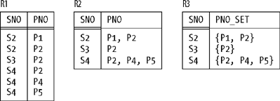
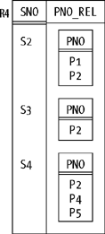

# 第二章. 关系与类型

**本章标题为"关系与类型"**，但大部分内容实际上与`类型`有关。要点在于，`关系模型`确实需要一个支持的`类型系统`，但它对该系统的本质几乎没有具体说明。为什么需要它？==因为`关系`（以及`关系变量`）是根据`类型`定义的；==也就是说，==_`每个关系的每个属性（以及每个关系变量的每个属性）都被定义为属于某种类型`_。==例如，供应商`关系变量` `S` 的`属性` `STATUS` 可能属于`类型` `INTEGER`。如果是这样，那么作为`关系变量` `S` 的可能`值`的每个`关系` _`s`_ 也必须具有`类型`为`INTEGER`的`STATUS` `属性`——这反过来意味着，在此类`关系` _`s`_ 中的每个`元组`都必须具有一个为`整数`的`STATUS` `值`。

我将在本章稍后更详细地讨论这些问题。目前，我只想说——除了某些重要的例外情况（我稍后也会讨论）——`关系属性`可以在*`任何类型`*上定义（这意味着这些`类型`可以像我们喜欢的那样复杂，稍后我们也会看到）。特别是，这些`属性`既可以在系统定义的（即内置的）`类型`上定义，也可以在用户定义的`类型`上定义。对于我们的示例，我将假设`属性`具有如下`类型`（注意，某些`属性`的名称与其所定义的`类型`名称相同，而另一些则不同）：

```
Suppliers              Parts                 Shipments

SNO    : SNO           PNO    : PNO          SNO : SNO
SNAME  : NAME          PNAME  : NAME         PNO : PNO
STATUS : INTEGER       COLOR  : COLOR        QTY : QTY
CITY   : CHAR          WEIGHT : WEIGHT
                       CITY   : CHAR
```

我还将假设，在有区别的情况下，`类型` `INTEGER`（`整数`）和`CHAR`（任意长度的字符串）是系统定义的，而其他类型是用户定义的。

顺便提一下，`SQL` 特别确实有一个名为`INTEGER`的内置`类型`，这我相信您知道。它还有一个名为`CHAR`的内置`类型`，但是 (a) 该`类型`表示固定长度的字符串，而非任意长度的字符串，并且 (b) 所涉及的长度（假设为*`n`*）通常需要与`CHAR`规范一起指定，如下所示：`CHAR`(_`n`_)。[\*](#fn1)（不带此类长度规范的`CHAR`是`CHAR(1)`的简写——可能被认为不是一个非常有用的默认值。）`SQL` 也允许用户定义自己的`类型`。

为了历史准确性，我现在应该说明，当 Codd 首次定义`关系模型`时，他说`关系`是在*`域`*上定义的，而不是`类型`。然而事实上，`域`和`类型`是*`完全相同的东西`*。现在，如果您愿意，可以将此声明视为我的立场陈述，但我希望在接下来的两节中提出论据来支持这一立场。我将从 Codd 最初定义的`关系模型`开始；因此，在另行通知之前，我将使用术语`域`[\*](#fn2)[\*](#fn2)，而不是`类型`。我想讨论两个主要主题，每节一个：

**`受域约束的比较和"域检查覆盖"`**
: 我希望这部分讨论能说服您，`域`确实就是`类型`。

**`数据值原子性与第一范式`**
: 我希望这部分能说服您，那些`类型`可以是任意复杂的。

## 受域约束的比较

每个人都知道（或者应该知道！），==在`关系模型`中，只有当两个`值`来自同一个`域`时，才能测试它们是否相等。==例如，在供应商和零件的情况下，以下比较（可能是`WHERE`子句的一部分）显然是有效的：

```
SP.SNO = S.SNO         /* OK     */
```

相比之下，以下比较则无效：

```
SP.PNO = S.SNO         /* not OK */
```

原因是零件编号和供应商编号是不同种类的事物，它们对应于不同的`域`。因此，总体思路是，`数据库管理系统`（`DBMS`）[\*](#fn3) 应该拒绝任何尝试执行任何`关系操作`——`连接`、`并集`、`除法`或其他任何操作——如果该操作显式或隐式地要求比较来自不同`域`的`值`。例如，以下是一个`SQL`查询，用户试图查找未供应任何零件的供应商：

```
SELECT S.SNO, S.SNAME, S.STATUS, S.CITY
FROM   S
WHERE  NOT EXISTS
     ( SELECT SP.PNO
       FROM   SP
       WHERE  SP.PNO = S.SNO )      /* not OK */
```

（没有终止分号，因为这是一个表达式，而不是语句。请参阅本章末尾的练习 2-24。）

正如注释所说，此查询*不*是正确的。原因是，在最后一行中，用户可能本意是想说`WHERE SP.SNO = S.SNO`，但由于错误——可能只是打字时的小失误——他或她却说成了`WHERE SP.`_`PNO`_ `= S.SNO`。而且，鉴于我们确实只是在讨论一个简单的拼写错误（可能），`DBMS` 在此时中断、突出显示错误并询问用户是否希望在继续之前更正它，将是一种友好的行为。

现在，我不知道有任何商业产品实际上按照我刚才建议的方式运行；在当今的产品中，取决于您如何设置`数据库`，该查询要么简单地失败，要么给出错误的答案。嗯……可能不完全是*错误*的答案，但却是错误问题的正确答案。（这让您感觉好点了吗？）

因此，重申一下，如果比较`SP.PNO = S.SNO`无效，`DBMS` 应该拒绝它。然而，Codd 提出，应该有一种方法让用户强制`DBMS` 无论如何都继续执行该比较，即使它无效，理由是有时用户可能比`DBMS` 知道得更多。现在，我有点难以公正地评价这个提议，因为我不同意它——但让我试试看。

假设您的工作是设计一个涉及（比如说）客户和供应商的`数据库`，因此您决定拥有一个客户编号的`域`和另一个供应商编号的`域`。您以这种方式构建`数据库`并加载数据，一切顺利运行了一两年。然后，有一天，一位用户提出了一个您从未听说过的查询，即："我们的客户中是否有任何人同时也是我们的供应商？" 请注意，这是一个完全合理的查询；同时请注意，它*可能*涉及客户编号和供应商编号之间的比较（跨域比较），以查看它们是否相等。如果确实如此，那么系统当然不能阻止您这样做；系统当然不能阻止您提出一个合理的查询。

鉴于上述情况，==Codd 提出了他称之为*`域检查覆盖`*（`DCO`）版本的某些`代数运算符`。==例如，`连接`的`DCO`版本将执行`连接`，即使连接`属性`是在不同的`域`上定义的。用`SQL`术语来说，我们可以想象这个提议通过一个新子句`IGNORE DOMAIN CHECKS`来实现，该子句可以包含在`SQL`查询中，如下所示：

```
SELECT ...
FROM   ...
WHERE  CUSTNO = SNO
IGNORE DOMAIN CHECKS
```

并且这个新子句应该是可单独授权的——大多数用户根本不允许使用它；也许只有`数据库管理员`（`DBA`）才被允许使用它。

在详细分析`DCO`想法之前，我想先看一个更简单的例子。考虑以下两个查询：

```
SELECT ...                 |   SELECT ...
FROM   P, SP               |   FROM   P, SP
WHERE  P.WEIGHT = SP.QTY   |   WHERE  P.WEIGHT - SP.QTY = 0
```

假设（合理地）重量和数量是在不同的`域`上定义的，左边的查询显然是无效的。但是右边的查询呢？根据 Codd 的说法，那个是有效的！在他的书《数据库管理的关系模型 第 2 版》（Addison-Wesley, 1990）中，他说在这种情况下"`DBMS` [仅仅] 检查基本数据类型是否相同"；在当前情况下，"基本数据类型"宽松地说都是数字，因此检查成功。

对我来说，这个结论似乎不合理。表达式的语义不应依赖于我们用来表述它的语法的任意选择！因此，我认为表达式`P.WEIGHT = SP.QTY`和`P.WEIGHT - SP.QTY = 0`必须要么都有效，要么都无效；认为它们具有不同语义的建议是不可接受的。所以在我看来，关于 Codd 风格的`域检查`本身就有些奇怪，甚至在我们讨论"`域检查覆盖`"之前。（实际上，本质上，Codd 风格的`域检查`仅适用于非常特殊的情况，即两个比较操作数都指定为`关系属性`，而不是其他任何东西，例如像`P.WEIGHT - SP.QTY`这样的运算表达式。）

让我们看一些甚至更简单的例子。考虑以下比较（每个比较都可能作为`SQL WHERE`子句的一部分出现，例如）：

```
S.SNO = 'X4'         P.PNO = 'X4'         S.SNO = P.PNO
```

我希望您同意，前两个有效而第三个无效至少是可能的。但如果是这样，那么我希望您也同意有些奇怪的事情正在发生；显然，我们可以有三个`值` _`a, b`_ 和 _`c`_，使得 _`a`_ = _`c`_ 为真且 _`b`_ = _`c`_ 为真，但至于 _`a`_ = _`b`_ ……嗯，我们甚至无法进行比较，更不用说让它为真了！那么*到底*发生了什么？

我现在回到`属性` `S.SNO`和`P.PNO`分别在`域` `SNO`和`PNO`上定义的事实，以及我的主张：`域`实际上就是`类型`；事实上，我在引言中说过，`域` `SNO`和`PNO`特别是*`用户定义的`* `类型`。现在，很可能这两种`类型`在物理上都是用内置`类型` `CHAR`来表示的——但物理表示是`实现`的一部分，而不是`模型`的一部分；它们与用户无关，事实上它们对用户是隐藏的（或者应该是），正如我们在第 1 章中看到的那样。特别是，适用于供应商编号和零件编号的`运算符`是与这些`类型`相关联定义的`运算符`，而不是恰好与`类型` `CHAR`相关联定义的`运算符`。例如，我们可以连接两个字符串，但我们可能无法连接两个供应商编号（只有当连接是作为与`类型` `SNO`相关联定义的`运算符`时，我们才能这样做）。

现在，当我们定义一个`类型`时，我们必须定义的一个`运算符`是所谓的*`选择器`*[\*](#fn4) `运算符`，它允许我们选择或指定所讨论`类型`的任意`值`。[\*](#fn5) 例如，`类型` `SNO`的`选择器`（正如我们将在第 6 章看到的，它可能也被称为`SNO`）允许我们选择具有某个指定`CHAR`表示的特定`SNO 值`。这里是一个例子：

```
SNO('S1')
```

这个表达式是`SNO 选择器`的调用，它返回某个供应商编号：即概念上由字符串`值` `'S1'`表示的那个。同样，表达式：

```
PNO('P1')
```

是`PNO 选择器`的调用，它返回某个零件编号：即概念上由字符串`值` `'P1'`表示的那个。因此，正如您所看到的，`SNO`和`PNO 选择器`实际上是通过*`转换`*某个`CHAR 值`为某个`SNO 值`和某个`PNO 值`来工作的。

现在回到比较`S.SNO = 'X4'`：这里发生的是，系统注意到左右比较操作数属于不同的`类型`（具体来说，是`SNO`和`CHAR`）。由于它们属于不同的`类型`，它们当然不可能相等。然而，系统也知道存在一个`运算符`——`SNO 选择器`——它有效地执行`CHAR`到`SNO`的转换。因此，它可以*`隐式`*调用该`运算符`将右侧比较操作数转换为供应商编号，从而有效地将原始比较替换为以下比较：

```
S.SNO = SNO('X4')
```

现在我们比较的是两个供应商编号，这是合法的。

以同样的方式，系统有效地将比较`P.PNO = 'X4'`替换为以下比较：

```
P.PNO = PNO('X4')
```

但是在比较`S.SNO = P.PNO`的情况下，系统不知道有任何转换`运算符`（至少，让我们假设没有）可以将供应商编号转换为零件编号或反之亦然，因此该比较因*`类型错误`*而失败：比较操作数属于不同的`类型`，并且没有办法使它们属于相同的`类型`。

> _`术语：`_ ==隐式转换在文献中通常被称为*`强制转换`*[\*](#fn6)。==因此，在第一个例子中，字符串`'X4'`被*`强制转换`*为`类型` `SNO`；在第二个例子中，它被强制转换为`类型` `PNO`。

继续举例，当您定义像`SNO`或`PNO`这样的`类型`时，您必须定义的另一个`运算符`是通用地称为*`THE*`_ `运算符`的东西，它有效地将给定的`SNO`或`PNO 值`转换为其用于表示的字符串（或其他任何东西）。[\*](#fn7) 为了举例起见，合理地假设`类型` `SNO`和`PNO`的`THE\_ 运算符`都称为`THE_CHAR`。那么，如果我们真的想比较`S.SNO`和`P.PNO`，我能对这个要求做出的唯一解释是，我们想看看字符串表示是否相同，我们可以这样做：

```
THE_CHAR ( S.SNO ) = THE_CHAR ( P.PNO )
```

换句话说：将供应商编号转换为字符串，将零件编号转换为字符串，然后比较这两个字符串。

正如您肯定能看到的，我上面概述的机制有效地提供了 (a) 我们首先想要的`域检查`，以及 (b) 当我们想要时覆盖该检查的方法。此外，它以干净、完全正交、非临时性的方式完成了所有这些。相比之下，"`域检查覆盖`"并没有真正完成这项工作；事实上，它根本没有意义，因为它混淆了`类型`和表示（如前所述，`类型`是`模型`概念，表示是`实现`概念）。

现在，您可能已经意识到，我真正在这里谈论的是在语言圈中被称为*`强类型`*[\*](#fn8) 的东西。不同的作者对这个术语有略微不同的定义，但基本上它意味着 (a) 一切——特别是每个`值`和每个`变量`——都有一个`类型`，并且 (b) 每当我们尝试执行某些`操作`时，系统会检查操作数是否对于所讨论的`操作`具有正确的`类型`。[\*](#fn9) 还要注意，这个机制适用于任何`操作`，而不仅仅是我们一直在讨论的比较`操作`；在`域检查`讨论中强调比较`操作`是历史用法所神圣化的，但实际上是放错了位置。例如，考虑以下表达式：

```
P.WEIGHT * SP.QTY
P.WEIGHT + SP.QTY
```

第一个可能是有效的（它产生另一个重量：即相关装运的总重量）。相比之下，第二个可能无效（将重量和数量相加可能意味着什么？）。

> NOTE：
>
> **禁止不同域的值直接相等判断**（比如供应商编号 = 零件编号直接报错）
>
> **强类型检查是保护机制**，能提前拦截拼写错误和逻辑错误
>
> **不能用语法等价绕过域检查**（重量 = 数量 和 重量 - 数量 = 0 必须同时合法 / 非法）
>
> **合法跨域比较必须显式转换**（先转成相同类型再判断，不能粗暴忽略域规则）
>
> **类型≠物理存储类型**（CHAR 只是表示，SNO/PNO 是独立类型）

## 数据值原子性

我希望上一节成功地说服您，`域`确实就是`类型`，不多也不少。现在我想转向*`数据值原子性`*问题以及相关的*`第一范式`*[\*](#fn10)（简称`1NF`）概念。在第 1 章中，我说`1NF`意味着==每个`关系`中的每个`元组`在每个`属性`位置只包含单个`值`（当然是适当`类型`的==）——并且通常会补充说，那些"单个`值`"应该是*`原子`*的。但这后一个要求提出了一个明显的问题：数据具有原子性意味着什么？

==第一范式代表什么？？？==

嗯，在前面提到的书的第 6 页，Codd 将*`原子数据`*定义为"`DBMS`（排除某些特殊函数）无法将其分解为更小部分"的数据。但是，即使我们忽略括号中的排除，这个定义也有点令人困惑，而且不太精确。例如，字符串呢？字符串是原子的吗？我知道的每个产品都提供了一些针对此类字符串的`运算符`——`LIKE`、`SUBSTR`（子串）、`"||"`（连接）等等——这些显然依赖于字符串通常*可以*被`DBMS`分解的事实。那么这些字符串是原子的吗？您怎么看？

以下是一些`值`的其他例子，它们的原子性至少是存疑的，但我们肯定希望能够将它们作为`元组`中`关系`的`属性值`包含在内：

- `整数`，可能被认为可分解为其质因数（我知道这不是我们通常在此上下文中考虑的分解类型——我只是想表明分解性概念本身就有多种解释）
- `定点数`，可能被认为可分解为整数部分和小数部分
- `日期和时间`，可能被认为可分别分解为年/月/日和时/分/秒组件

现在我想继续讨论一个可能更令人惊讶的例子。请参阅图 2-1。该图中的`关系` `R1`是我们示例中装运`关系`的简化版本；它显示某些供应商供应某些零件，并且每个合法的`SNO`-`PNO`组合包含一个`元组`。为了举例起见，让我们同意供应商编号和零件编号确实是"原子的"；那么我们可以假设至少`R1`是在`1NF`中的。

**图 2-1. 关系 R1、R2 和 R3**



现在假设我们用`R2`替换`R1`，`R2`显示某些供应商供应某些*`组`*零件（`R2`中的`属性` `PNO`是一些人所说的*`多值`*，该`属性`的`值`是零件编号的组）。那么大多数人肯定会说`R2`不在`1NF`中；事实上，它看起来像是"重复组"的例子，而重复组几乎是每个人都同意`1NF`应该禁止的唯一事物（因为这样的组显然不是原子的，对吧？）。

嗯，为了论证起见，让我们假设`R2`不在`1NF`中。但是假设我们现在用`R3`替换`R2`。那么我声称*`R3 在 1NF 中！`*[\*](#fn11) 因为请考虑：

- 首先，请注意——当然是故意地——我已将`属性`重命名为`PNO_SET`，并且我已将作为`PNO_SET 值`的零件编号组用集合括号`"{"`和`"}"`括起来显示，以强调每个这样的组确实是一个单个`值`：当然是一个集合`值`，但在某个抽象层次上，集合仍然是一个单个`值`。
- 其次（无论您对我的第一个论点有何看法），事实是，像`{P2,P4,P5}`这样的集合被`DBMS`分解的程度并不比字符串更多或更少。像字符串一样，集合确实具有一些内部结构；然而，与字符串一样，出于某些目的忽略该结构是方便的。换句话说，如果字符串与`1NF`的要求兼容——即，如果字符串是原子的——那么集合也必须如此。

我在这里要表达的真正观点是，==原子性的概念*`没有绝对的含义`*；它仅仅取决于我们想对数据做什么。==有时我们想将整个零件编号集合作为一个整体来处理，有时我们想处理该集合中的单个零件编号——但那时我们正在下降到更低的细节层次（更低的抽象层次）。以下类比可能有所帮助。在物理学中（毕竟原子性的术语来源于此），情况完全平行：有时我们想把单个物理原子视为不可分割的事物，有时我们想考虑构成这些原子的质子、中子和电子。而且，至少质子和中子实际上也不是真正不可分割的——它们包含各种被称为*`夸克`*的"亚亚原子"粒子。以此类推，可能还有更多。

让我们暂时回到`关系` `R3`。在图 2-1 中，我将`PNO_SET 值`显示为一般集合。但在实践中，如果它们更具体地是`关系`（见图 2-2，我已将`属性`名称更改为`PNO_REL`），将会更有用。为什么会更有用？因为`关系模型`的核心是`关系`，而不是一般集合。[\*](#fn12) 因此，`关系代数`的全部功能立即可用于所讨论的`关系`——它们可以被`限制`、`投影`、`连接`等等。相比之下，如果我们使用一般集合而不是`关系`，那么我们需要引入新的`运算符`（集合并集、集合交集等等）来处理这些集合。尽可能充分利用我们已经拥有的`运算符`要好得多！

**图 2-2. 关系 R4（R3 的修订版本）**



图 2-2 中的`属性` `PNO_REL`是*`关系值属性`*（`RVA`）的一个例子。当然，底层`域`也是`关系值`的（也就是说，它由`关系`组成）。我将在第 5 章和第 7 章中更多地讨论`RVA`；这里我只需注意`SQL`不支持它们。（更准确地说，它不支持`RVA`的类比物，_`表值列`_——尽管奇怪的是，它确实支持 (a) `值`为数组的列和 (b) `值`为"行的多重集"的列。_`多重集`_[\*](#fn13)，也称为*`包`*[\*](#fn14)，类似于集合，但允许重复。因此，`值`为行的多重集的列在某些方面看起来确实有点像"`表值列`"；然而，它们不是`表值列`，因为它们包含的`值`不能通过`SQL`的常规`表运算符`进行操作。）

现在，我故意选择了上述例子，因为它具有冲击力。毕竟，带有`RVA`的`关系`看起来确实很像带有重复组的`关系`，而您可能一直听说重复组在`关系`世界中是禁忌。但我本可以使用任何数量的不同例子来说明我的观点：我可以展示包含数组的`属性`（因此`域`）；或包；或列表；或照片；或音频或视频录音；或 X 光片；或指纹；或`XML`文档；或您可能想到的任何其他种类的`值`，"原子"或"非原子"。`属性`，因此`域`，可以包含*`任何事物`*（即任何`值`）。顺便说一句，所有这些在很大程度上解释了为什么真正的"`对象/关系`"[\*](#fn15) 系统不过就是一个真正的`关系系统`——也就是说，一个支持`关系模型`的系统，包括这种支持所蕴含的一切。毕竟，"`对象/关系`"系统的要点恰恰是我们可以在`关系`中具有任意复杂度的`属性值`。也许更好的说法是：一个适当的对象/关系系统只是一个具有适当`类型`[\*](#fn16) 支持的`关系系统`——这仅仅意味着它是一个适当的*`关系`*系统，不多也不少。

## 那么什么是类型？

从这一点开始，我将优先使用术语*`类型`*而不是*`域`*。`类型`究竟是什么？==本质上，它是*`一个命名的、有限的值的集合`*[\*](#fn17)——某种特定类型的所有可能`值`：例如，所有可能的`整数`，或所有可能的`字符串`，或所有可能的`供应商编号`，或所有可能的`XML 文档`，或所有具有某个`标题`的`关系`（等等）。==此外：

- ==每个`值`都属于某个`类型`==——事实上，恰好属于一个`类型`，除非可能支持`类型继承`，这是一个超出本书范围的概念。因此请注意，`类型`是*`互斥`*或*`不重叠`*的。（简要阐述：正如一位审稿人所说，`类型` `WarmBloodedAnimal`和`FourLeggedAnimal`难道不重叠吗？它们确实重叠；但我要说的是，如果`类型`重叠，那么由于各种原因，我们就进入了`类型继承`的领域——实际上是*`多重`* `继承`。由于这些原因，以及整个`继承`主题，都独立于我们所处的上下文（无论是`关系`还是其他什么），我将在本书中不讨论它们。）
- ==每个`变量`、每个`属性`、每个返回结果的`运算符`，以及每个`运算符`的每个`参数`都被声明为属于某个`类型`。==而说（例如）`变量` _`V`_ 被声明为属于`类型` _`T`_，精确地意味着可以合法赋值给*`V`*的每个`值` _`v`_ 本身属于`类型` _`T`_。
- ==每个`表达式`都表示某个`值`，因此属于某个`类型`：即所讨论`值`的`类型`，也就是`表达式`中最外层`运算符`（我所说的"最外层"是指最后执行的`运算符`）返回的`值`的`类型`。==例如，`表达式` (_`A`_+_`B`_)_(_`X`_-_`Y`_) 的`类型`是`运算符` `"_"`的声明`类型`，不管它碰巧是什么。

特别是`参数`被声明为属于某个`类型`这一事实，触及了我已经提到但尚未适当讨论的一个问题：即每个`类型`都有一组相关联的`运算符`，用于操作该`类型`的`值`和`变量`。例如，`整数`有通常的算术`运算符`；`日期和时间`有特殊的日历算术`运算符`；`XML 文档`有所谓的"`XPath`" `运算符`；`关系`有`关系代数`的`运算符`；而*`每个`* `类型`都有赋值（`":="`）和相等比较（`"="`）的`运算符`。因此，任何提供适当`类型支持`的系统——而"`适当的类型支持`"在这里当然包括允许用户定义自己的`类型`——也必须提供一种让用户定义自己的`运算符`的方法，因为没有`运算符`的`类型`是无用的。

同样重要的是要理解，给定`类型`的`值`和`变量`只能*`完全`*通过为该`类型`定义的`运算符`来操作。例如，对于系统定义的`类型` `INTEGER`：

- 系统提供赋值`运算符` `":="`用于将`整数值`赋给`整数变量`。
- 它还提供比较`运算符` `"="`、`"<"`等等，用于比较`整数值`。
- 它还提供算术`运算符` `"+"`、`"*"`等等，用于对`整数值`执行算术运算。
- 它*`不`*提供字符串`运算符` `"||"`（连接）、`SUBSTR`（子串）等等，用于对`整数值`执行字符串操作；换句话说，不支持对`整数值`进行字符串操作。

相比之下，对于用户定义的`类型`[\*](#fn18) `SNO`，我们当然会定义赋值和比较`运算符`（`":="`、`"="`、`"≠"`、可能`">"`等等）；然而，我们可能不会定义`运算符` `"+"`、`"*"`等等，这意味着不支持对供应商编号进行算术运算（我们为什么要将两个供应商编号相加或相乘呢？）。

因此，从我到目前为止所说的一切来看，定义一个新`类型`至少涉及以下所有内容应该是明确的：

1. 为该`类型`指定一个名称（显然）。
2. 指定构成该`类型`的`值`。我将在第 6 章更详细地讨论这个方面。
3. 指定该`类型` `值`的隐藏物理表示。如前所述，这是一个`实现`问题，而不是`模型`问题，我将在本书中不再进一步讨论。
4. 指定适用于该`类型`的`值`和`变量`的`运算符`（见下文）。
5. 对于那些返回结果的`运算符`，指定该结果的`类型`（同样，见下文）。

请注意，第 4 点和第 5 点合在一起意味着系统精确地知道哪些`表达式`是合法的，以及每个此类合法`表达式`的结果的`类型`。

举例来说，假设我们有一个用户定义的`类型` `POINT`，表示二维空间中的几何点。那么以下是`运算符` `REFLECT`的**`Tutorial D`**定义[\*](#fn19)，给定一个具有笛卡尔坐标 (_`x,y`_) 的点`P`，返回具有笛卡尔坐标 (_`-x,-y`_) 的"反射"或"逆"点：

```
1 OPERATOR REFLECT ( P POINT ) RETURNS POINT ;
2    RETURN ( POINT ( - THE_X ( P ) , - THE_Y ( P ) ) ) ;
3 END OPERATOR ;
```

_`解释`_：

- 第 1 行显示`运算符`名为`REFLECT`，接受单个`参数` `P`，类型为`POINT`，并返回同样类型为`POINT`的结果（因此`运算符`的声明`类型`是`POINT`）。
- 第 2 行是`运算符实现`代码。它由单个`RETURN`语句组成。要返回的`值`当然是一个点，它是通过调用`POINT 选择器运算符`获得的；该调用有两个参数，对应于所讨论点的`X`和`Y`坐标。每个参数都涉及一个*`THE* 运算符`_调用；这些调用产生对应于`参数` `P`的点参数的`X`和`Y`坐标，对这些坐标取负值得到我们想要的结果。
- 第 3 行标记定义结束。

现在，到目前为止，我主要谈论的是用户定义的`类型`。对于系统定义或内置的`类型`，当然适用类似的考虑，但在这种情况下，定义由系统提供，而不是由某个用户提供。例如，如果`INTEGER`是内置`类型`，那么就是系统定义名称、指定合法的`整数`、定义隐藏表示，并定义相应的`运算符`。当然，对于仅仅使用由其他人定义的某个用户定义`类型`的人来说，该`类型`看起来就像系统定义的`类型`；事实上，在许多方面，这正是练习的全部目的。

我不打算在`类型`和`运算符`定义方面深入更多细节，因为它们大多不是特定的`关系`主题。

## 标量与非标量类型

通常认为`类型`要么是*`标量`*要么是*`非标量`*。粗略地说，如果==一个`类型`没有用户可见的组件，则它是`标量`，否则就是`非标量`==——并且某个`类型` _`T`_ 的`值`、`变量`、`属性`、`运算符`、`参数`和`表达式`是`标量`还是`非标量`，取决于`类型` _`T`_ 本身是`标量`还是`非标量`。例如：

- `类型` `INTEGER`是一个`标量类型`；因此，`类型`为`INTEGER`的`值`、`变量`等等也都是`标量`，意味着它们没有用户可见的组件。
- `元组`和`关系类型`是`非标量`——相关的用户可见组件当然是相应的`属性`——因此`元组`[\*](#fn20)[\*](#fn21) 和`关系值`、`变量`等等也都是`非标量`。

话虽如此，我现在必须强调一点，这些概念是相当非正式的。事实上，我们已经看到*`原子性`*的概念没有绝对的含义，而"`标量性`"只是原子性概念的另一个名称。因此，`关系模型`在任何地方都*`不正式`*依赖于`标量`与`非标量`的区别。然而，在本书中，我确实非正式地依赖它；具体来说，我将术语*`标量`*用于既不是`元组`也不是`关系类型`的`类型`，而将术语*`非标量`*用于*`是`* `元组`或`关系类型`的`类型`。

让我们看一个例子。以下是`基关系变量`[\*](#fn22) `S`（供应商）的**`Tutorial D`**定义：

```
1 VAR S BASE
2     RELATION[*](#fn23) { SNO SNO, SNAME NAME, STATUS INTEGER, CITY CHAR }
3     KEY[*](#fn24) { SNO } ;
```

_`解释`_：

- 第 1 行中的关键字`VAR`表示这是一个`变量定义`；关键字`BASE`表示该`变量`特别是一个`基关系变量`。
- 第 2 行指定此`变量`的`类型`。关键字`RELATION`表明它是一个`关系类型`；该行的其余部分指定构成相应`标题`的`属性`集合（正如您在第 1 章回忆起的，`属性`是一个`属性名:类型名`对）。该`类型`当然是一个`非标量类型`。指定`属性`的顺序不重要。
- 第 3 行定义`{SNO}`为此`关系变量`的`候选键`。

事实上，这个例子也说明了另一点——即`类型`：

```
RELATION { SNO SNO, SNAME NAME, STATUS INTEGER, CITY CHAR }
```

是*`生成类型`*的一个例子。通常，`生成类型`[\*](#fn25) 是通过调用某个*`类型生成器`*[\*](#fn26)（在示例中，`类型生成器`是`RELATION`）获得的。您可以将`类型生成器`视为一种特殊类型的`运算符`；它之所以特殊，是因为 (a) 它返回一个`类型`而不是（例如）一个`标量值`，并且 (b) 它在编译时而不是运行时被调用。例如，大多数编程语言支持一个名为`ARRAY`的`类型生成器`，它允许用户定义各种特定的`数组类型`。然而，就本书而言，我们只需要考虑`TUPLE`和，当然，`RELATION`这两个`类型生成器`。以下是一个涉及`TUPLE 类型生成器`的例子：

```
VAR SINGLE_SUPPLIER
    TUPLE { STATUS INTEGER, SNO SNO, CITY CHAR, SNAME NAME } ;
```

`变量` `SINGLE_SUPPLIER`在任何给定时间的`值`是一个`元组`[\*](#fn27)，具有与`关系变量` `S`相同的`标题`。（我故意以不同的顺序指定`属性`，只是为了表明顺序不重要。）因此，我们可以想象一个代码片段，首先，从`关系变量` `S`的当前`值`中提取一个单`元组关系`（可能只包含供应商`S1`的`元组`的`关系`）；然后从该单`元组关系`中提取单个`元组`；最后，将该`元组`赋值给`变量` `SINGLE_SUPPLIER`。在**`Tutorial D`**中：

```
SINGLE_SUPPLIER := TUPLE FROM ( S WHERE SNO = SNO('S1') ) ;
```

顺便提一下，请仔细注意，`元组` _`t`_ 和仅包含该`元组` _`t`_ 的`关系` _`r`_ 不是同一件事。特别是，它们属于不同的`类型`——*`t`*属于某个`元组类型`，而*`r`*属于某个`关系类型`（尽管当然它们确实具有相同的`标题`）。

> **注意**
>
> 我不希望您在这里误解我。虽然像`SINGLE_SUPPLIER`这样的`变量`在访问供应商和零件`数据库`的某些应用程序中可能很有用，但我*`没有`*说这样的`变量`可以出现在`数据库`本身内部。`关系数据库`只包含一种`变量`——即*`关系变量`*（`relvars`）；也就是说，`关系变量`是`关系数据库`中允许的*`唯一`* `变量`类型。我将在第 8 章中重新讨论这一点，与所谓的*`信息原则`*相关。

关于`元组`和`关系类型`，我只想说最后一件事：即使这些`类型`显然具有用户可见的组件（即它们的`属性`），但并没有暗示这些组件必须物理上如此存储。事实上，此类`类型`的`值`的物理表示应该对用户隐藏，就像`标量类型`一样。

## 总结

一个非常普遍的误解是，`关系模型`只处理相当简单的`类型`：数字、字符串、可能还有日期和时间，仅此而已。在本章中，我试图表明这确实是一个误解。相反，`关系`可以具有*`任何类型`*的`属性`——`关系模型`在任何地方都没有规定这些`类型`必须是什么，事实上它们可以像我们喜欢的那样复杂（除了稍后提到的例外）。换句话说，支持哪些`类型`的问题与支持`关系模型`本身的问题是正交的。或者（不太精确但更吸引人）：_`类型与表是正交的`_。

我还提醒您，上述情况绝不违反`第一范式`的要求。`第一范式`仅仅意味着每个`关系`中的每个`元组`在每个`属性`位置包含单个`值`，具有适当的`类型`。现在我们知道那些`类型`可以是任何东西，我们也知道所有`关系`根据定义都在`第一范式`中。

最后，我在本章引言中提到，`关系属性`可以是任何`类型`这一规则存在某些重要的例外。事实上，有两个。第一个——为了当前目的我稍微简化一下——是如果`关系` _`r`_ 属于`类型` _`T`_，那么*`r`*的任何`属性`本身都不能属于`类型` _`T`_（想一想！）。第二个是`数据库`中的任何`关系`都不能具有任何*`指针类型`*的`属性`。正如您可能知道的，前关系`数据库`充满了指针，访问此类`数据库`涉及大量的指针追踪：这一事实使得应用程序编程容易出错，并且直接终端用户访问成为不可能。Codd 希望在他的`关系模型`中摆脱这些问题，当然他成功了。

## 练习

如前言所述，您当然不必做任何练习，但我认为尝试至少其中一些是个好主意。答案通常提供有关所讨论主题的更多信息，可以在网上找到：[http://oreilly.com/catalog/databaseid](http://oreilly.com/catalog/databaseid)。

### 练习 2-1

什么是`类型`？`域`和`类型`之间有什么区别？

### 练习 2-2

您如何理解术语*`选择器`*？

### 练习 2-3

什么是*`THE* 运算符`\_？

### 练习 2-4

物理表示总是对用户隐藏的：对还是错？

### 练习 2-5

详细阐述以下内容：参数与形参；`数据库`与`DBMS`；`生成类型`与非生成`类型`；`标量`与`非标量`；`类型`与表示；用户定义`类型`与系统定义`类型`；用户定义`运算符`与系统定义`运算符`。

### 练习 2-6

您如何理解术语*`强制转换`*？为什么`强制转换`是个坏主意？

### 练习 2-7

为什么"`域检查覆盖`"没有意义？

### 练习 2-8

什么是`类型生成器`？

### 练习 2-9

定义*`第一范式`*。

### 练习 2-10

设*`X`*是一个`表达式`。*`X`*的`类型`是什么？*`X 属于`*某个`类型`这一事实的意义是什么？

### 练习 2-11

使用本章正文中`REFLECT 运算符`的定义作为模式，定义一个**`Tutorial D`** `运算符`，给定一个`整数`，返回该`整数`的立方。

### 练习 2-12

使用**`Tutorial D`**定义一个`运算符`，给定一个具有笛卡尔坐标*`x`*和*`y`*的点，返回具有笛卡尔坐标*`f`*(_`x`_) 和*`g`*(_`y`_) 的点，其中*`f`*和*`g`*是预定义的`运算符`。

### 练习 2-13

给出一个`关系类型`的例子。区分`关系类型`、`关系值`和`关系变量`。

### 练习 2-14

使用`SQL`或**`Tutorial D`**（或两者）定义供应商和零件`数据库`中的`关系变量` `P`和`SP`。如果您同时给出`SQL`和**`Tutorial D`**定义，请尽可能多地指出它们之间的差异。`关系变量` `P`（例如）属于某个`关系类型`这一事实的意义是什么？

### 练习 2-15

给定引言部分为供应商和零件`数据库`中的`属性`指定的`类型`，以下哪些`标量表达式`是有效的？对于那些有效的，说明结果的`类型`；对于其他，展示一个能够实现看似期望效果的`表达式`。

```
a. CITY = 'London'
b. SNAME || PNAME
c. QTY * 100
d. QTY + 100
e. STATUS + 5
f. 'ABC' < CITY
g. COLOR = CITY
h. CITY || 'burg'
```

### 练习 2-16

有时有人建议`类型`在某种意义上实际上是`变量`。例如，随着业务扩展，员工编号可能从三位数增长到四位数，因此我们可能需要更新"所有可能员工编号的集合"。请讨论。

### 练习 2-17

`类型`是一组`值`，而空集是一个合法的集合；因此，我们可以定义一个*`空类型`*为所讨论集合为空的`类型`。您能想到这种`类型`的任何用途吗？

### 练习 2-18

在本章正文中，我说相等比较`运算符` `"="`适用于每个`类型`（尽管我没有详细说明语义，即如果*`v1`*和*`v2`*是相同`类型`的`值`，那么*`v1`* = _`v2`_ 求值为`TRUE`当且仅当*`v1`*和*`v2`*是完全相同的`值`）。然而，如第 8 章更详细解释的那样，`SQL`不要求`"="`适用于每个`类型`，也不规定它在所有适用情况下的语义。这种状况的含义是什么？

### 练习 2-19

继上一个练习之后，我们可以说*`v1`* = _`v2`_ 求值为`TRUE`当且仅当对*`v1`*执行某个`运算符` _`Op`_ 与对*`v2`*执行同一个`运算符` _`Op`_ 总是具有完全相同的效果，对于所有可能的`运算符` _`Op`_。但这又是`SQL`违反的另一个原则。您能想到任何此类违反的例子吗？含义是什么？

### 练习 2-20

为什么指针被排除在`关系模型`之外？

### 练习 2-21

_`赋值原则`_——非常简单但基本——指出，在将`值` _`v`_ 赋值给`变量` _`V`_ 之后，比较*`V`* = _`v`_ 求值为`TRUE`。然而，这又是`SQL`违反的原则（实际上相当普遍）。您能想到任何此类违反的例子吗？含义是什么？

### 练习 2-22

您认为`类型`"属于"`数据库`"吗，就像`关系变量`那样？

### 练习 2-23

在"`受域约束的比较`"一节中，我展示了一个包含另一个嵌套`表达式`（"`子查询`"）的`SQL SELECT - FROM - WHERE 表达式`。现在，整体`表达式`中的每个`SELECT`子句都可以被可能更简单的形式`SELECT*`（"`SELECT 星号`"）替换。但"`SELECT *`"存在某些问题，这就是为什么我通常——并非总是——在本书中避免使用它。请尽可能多地指出这些问题。您能想到`SQL`中任何其他具有类似问题的构造吗？

### 练习 2-24

在本章第一个`SQL SELECT 表达式`示例中，我指出没有终止分号，因为该`SELECT 表达式`是一个`表达式`而不是一个`语句`。但是区别是什么？

---

<a name="fn1">*</a> `SQL` 确实有一个可变长度的字符串`类型`，称为`VARCHAR`，但即使在那里也必须指定一个_`最大`\_长度。

<a name="fn2">*</a> 顺便问一下，`DBMS`和`数据库`之间有什么区别？（这不是一个无聊的问题，因为业界非常普遍地在指代某个`DBMS`产品（如`Oracle`）或恰好安装在特定计算机上的此类产品的特定副本时使用术语_`数据库`\_。问题是，如果您称`DBMS`为`数据库`，那么您称`数据库`为什么呢？）

<a name="fn3">\*</a> 无论我们是在`SQL`上下文中（如当前讨论）还是其他上下文中，此观察都是有效的。我省略了在`SQL`中定义`选择器`所涉及细节，因为它们有点复杂——但我在本书中此处及全文都假设此类`运算符`确实已被定义。

<a name="fn4">\*</a> 同样，无论我们是在`SQL`上下文还是其他上下文中，此观察都是有效的，尽管`SQL`本身并不使用"`THE_ 运算符`"这样的术语。（实际上，它也不使用"`选择器`"这样的术语。）

<a name="fn5">\*</a> 或者，可能可以强制转换为那些正确的`类型`。然而，由于与当前主题不直接相关的原因，我认为所有`类型`转换都应该是显式的。`强制转换`是众所周知的错误来源。

<a name="fn6">\*</a> 我不声称它设计得很好——事实上，可能并非如此——但那是另一个问题。我这里关注的是什么是合法的，而不是良好设计的问题。`R3`的设计是合法的。

<a name="fn7">\*</a> 如果您想知道，关键区别在于一般集合可以包含任何事物，而`关系`特别包含`元组`。然而请注意，`关系`当然类似于一般集合，因为它也可以被视为单个`值`。

<a name="fn8">*</a> 有限，因为我们处理的是计算机，而计算机根据定义是有限的。另外，请注意限定词_`命名的`\_；具有不同名称的`类型`是不同的`类型`。

<a name="fn9">\*</a> 我本可以使用`SQL`，但`SQL`中的`运算符`定义涉及许多细节，我不想在这里深入讨论。
